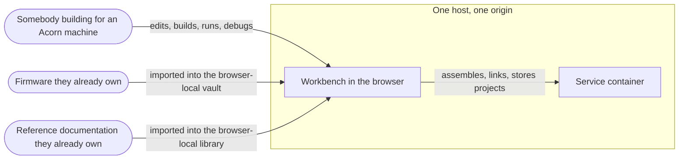
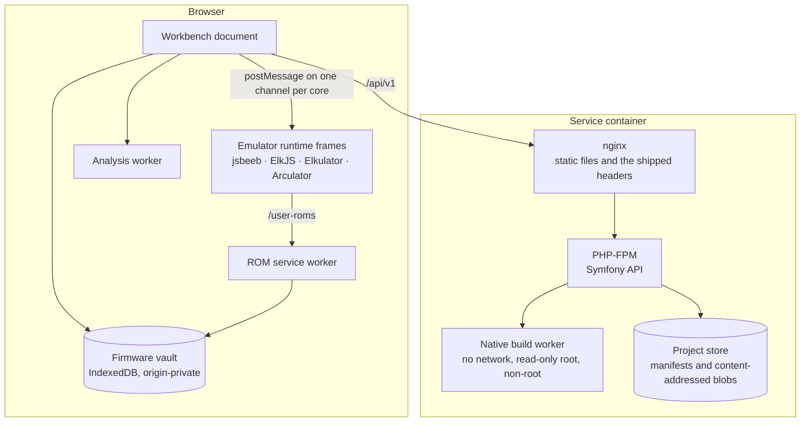

# Architecture

This describes how the product is put together and, more usefully, why it is
put together that way. Where a decision was contested or has a cost, the cost
is stated. A document that only lists what exists is a directory listing with
prose around it.

## Shape

The workbench is a single-page React application with no server of its own for
anything a browser can do. Source is edited, assembled, analysed and run in the
tab. One service sits behind it — an isolated container that runs the native
toolchains, because ca65, BeebAsm and GNU binutils are real programs and cannot
be honestly reimplemented in JavaScript.

That split is the central architectural decision and it is deliberate:

- Everything that can work offline does. Opening a project, editing it,
  assembling it with the browser-local assembler, running it on an emulated
  machine and debugging it all work with the network unplugged.
- The one thing that cannot is isolated rather than trusted. The native builder
  has no network route at all, drops every capability, runs read-only as an
  unprivileged user, and is bounded on memory, processes, CPU and stage time.

Firmware is the one input this product asks a person for and cannot supply, so
what each machine needs, what lengths are accepted, where an image is kept and
what is never done with it are generated into one place: `docs/firmware.md`.

The store this service holds is the only thing in it nobody else has a copy of,
so backing it up, verifying it and restoring it are written down as a procedure
to be performed rather than as intentions: `docs/operations.md`.

## System context

Who and what this product talks to. Everything inside the box runs on one host;
nothing outside it is contacted at all.



There is no fourth arrow. Nothing is uploaded, no analytics leave the machine,
and no network path exists from the build sandbox at all — which is why the
absence is drawn rather than left to be inferred.

## Containers

What actually runs, and what does not exist yet.



Four things this diagram deliberately does not contain, because they do not
exist: there is **no job orchestration** — a build is a request that returns a
result, and per-tenant fairness and a queue are open work; there is **no object
storage** separate from the store's own blobs; there is **no reference index
service**, because reference packs are imported into the browser and searched
there; and there is **no shared administration**, because there is one local
identity and nothing that proves it. Drawing them as empty boxes would suggest
they are wired and idle rather than absent.

## Modules

| Directory | What lives there |
| --- | --- |
| `src/api` | The typed client contracts, generated from `api/openapi.json` and never edited by hand. Every caller builds its request from the route table here rather than spelling a path, so a route that moves in the description fails to compile. |
| `src/analysis` | Disassembly, annotation, coverage correlation and export. Reads bytes; never executes them. |
| `src/benchmark` | What is measured, what is deliberately not, and the operations a benchmark run performs. It is built only when the benchmark asks for it and never ships. |
| `src/assets` | The editable asset documents — pixels, palettes, fonts, tile maps, screens, songs — and their generators. |
| `src/build` | The toolchain registry, the browser-local 6502 assembler and BASIC tokeniser, the build graph and the native adapter. |
| `src/cloud` | Talking to the project store, and reporting honestly when there is none. Local mode does not depend on any of it. |
| `src/components` | The workbench surfaces. Presentation and interaction; the rules they present live in the modules above. |
| `src/data` | Machine profiles, and the generated compatibility and conformance documents. |
| `src/editor` | Editing operations, document lifecycle, preferences, encodings and line endings. |
| `src/emulator` | Adapter contract, debug models, and everything that talks to a running machine. |
| `src/language` | The language adapter API, the project language index, completion, and the maintained first-party knowledge — opcodes, OS calls, hardware registers — that ships with the build. |
| `src/media` | Disk, tape and ROM image readers and writers. |
| `src/profiles` | Machine and configuration resolution, and portability comparison. |
| `src/project` | The project document, its schema and migrations, import, bundles, trash and limits. |
| `src/rom` | Firmware manifests and adapter support, which decides what this build can actually run. |
| `src/research` | Imported reference packs: their schema, the library that holds them, search, cross-linking and licensed insertion. Separate from `src/language` because the two answer for different things — what this build maintains, and what somebody brought to it. |
| `src/settings` | Layered settings: defaults, then the person's, then the project's. |
| `src/testing` | Hardware test plans and their execution model. |
| `src/commands` | The workbench command set and the one key-binding table every chord resolves from. |
| `src/help` | The in-app help topics and their integrity checks. |
| `src/platform` | The few places a browser capability is wrapped rather than used directly. |
| `src/runtime` | The 6502 core used for hardware test execution, separate from the emulator adapters. |
| `src/samples` | The worked sample projects, which open through the ordinary project parser. |

## The rules the code follows

These are not style preferences. Each was introduced because its absence caused
a defect that is recorded in the backlog.

**Nothing invents runtime state.** If a value cannot be read from the running
machine, the interface says it is unavailable and why. There is no placeholder
register, no assumed memory content and no fabricated cycle count anywhere. The
Electron adapter declares twenty-four capabilities it does not have, each with
the reason, rather than approximating them.

**A refusal names what was refused and what to do.** Every error path in this
codebase states the thing, the reason and the remedy. "Failed" on its own is
treated as a defect, and the limits register refuses an entry written that way.

**Two declarations of one fact are a defect.** Where the same thing was stated
twice — accepted project formats, commit characters, security policy directives,
compatibility claims — one of the two is now derived from the other and a
contract proves they cannot drift. Several of those pairs had already drifted
when they were found.

**A check that cannot fail is not a check.** The release gate refuses to pass
when a rule found nothing to examine, and every browser-level check in it has
been verified by deliberately breaking the thing it checks and confirming the
gate goes red.

**A skipped test is not a passing test.** The gate fails on any skipped test or
stage. Where a test needed a toolchain, the toolchain is built rather than the
test made conditional.

## Emulator adapters

An adapter declares the API version it implements, every operation it supports,
and its limitations. An adapter declaring a different API version is not loaded,
because a partially-matching adapter is the one failure mode that produces wrong
answers rather than no answers.

Three cores are integrated: jsbeeb for the BBC family, Arculator compiled to
WebAssembly for the A310 class, and a vendored ElkJS for the Electron. What each
can and cannot do is in `docs/compatibility.md`, generated from the adapters
themselves.

See `docs/adr/0001-emulator-integration-boundary.md` for the boundary, and
`0006-archimedes-wasm-runtime.md` and `0008-elkjs-electron-adapter-and-gpl-position.md`
for the two cores with licence positions worth reading before changing them.

## Language adapters

A language adapter is the single declaration of what a language offers:
classification, outline, and diagnostics that one file can support on its own.
The boundary is the point of the API — an adapter sees one file, so it reports
a duplicate label but never an unresolved symbol, because an included file it
cannot see may declare it. Whole-project questions belong to the project
language service, which has the include graph.

A language with no adapter gets nothing rather than a stub, because a stub
returning an empty outline looks like a working adapter and is believed.

## Schemas and migration

Every document this product has ever written stays readable. The accepted
versions are derived from one version number rather than restated as a list,
and a document from a newer build is refused by name rather than half-parsed.
The full policy, with every versioned surface and what it promises, is in
`docs/versioning-policy.md`, generated from the constants it describes.

## Testing

Three layers, and each exists because the other two cannot answer its question.

- **Contracts** — pure functions and models, run under Vitest. These state what
  the code must do in the words of the problem, not the implementation.
- **Component contracts** — the real surfaces under jsdom, driven the way a
  person drives them.
- **The release gate** — `npm run ci`. Types, help integrity, the whole test
  suite with its coverage floors, the backend suite, PHPStan and the PHP
  formatter, a dependency vulnerability scan of both halves, the production
  build, vendored-file provenance, repository hygiene, and a headless Chromium
  run against the built artefact under the shipped security headers.

The browser stage is where layout, policy and accessibility are settled, because
none of them is decidable without a rendering engine.

## Developer setup

```bash
npm install
npm run dev          # the workbench, with hot reload
npm run typecheck    # everything, tests included
npm test             # the suite
npm run ci           # the full release gate
npm run ci types     # one stage, by name
npm run benchmark    # measure the workbench in every browser this machine has
```

`npm run benchmark` rewrites `docs/benchmarks.json` and `docs/benchmarks.md`.
It needs browsers, so it is run deliberately rather than in the gate; what the
gate runs is the contract on the checked-in report, which fails if any figure
is outside its ceiling or any declared browser is unaccounted for.

The backend's own tools are `composer analyse` for PHPStan and
`composer format` to apply the formatting the gate checks.

The container path is in the README. Running the native toolchains locally needs
`scripts/toolchains.mjs`, which clones and builds the pinned BeebAsm commit and
locates cc65 and the ARM binutils; the backend tests fail rather than skip when
it has not been run.

### Reaching the build service from the development server

In production nginx puts the PHP build service behind `/api/v1`. The Vite
development server proxies the same prefix to `http://127.0.0.1:8000`, or to
`BACKEND_ORIGIN` when it is set. Without that proxy every toolchain manifest
request is answered with the workbench's own `index.html`, and the workbench
reports the native toolchains as unavailable while the assembler sits installed
on the machine — which is exactly what happened before the proxy existed.

A toolchain that cannot be used now says why: the build service did not answer,
answered a page rather than a manifest, runs a different adapter version, or
reported a specific readiness check as failed. The readiness detail comes
straight from the manifest, so a missing binary names the path it was looked
for at.

The store needs somewhere to write. In the container that is the mounted
volume; outside it, `PROJECT_STORE_ROOT` has to name a directory the backend may
create, or every write is refused with `PROJECT_UNWRITABLE` naming the path it
tried. `backend/var/store` is the usual choice locally and is ignored by git.

The backend finds each executable rather than assuming one absolute path.
`BEEBASM_PATH`, `CA65_PATH`, `LD65_PATH`, `CC65_PATH` and `ARM_*_PATH` are used
exactly as given when they are set; otherwise `PATH` is searched, then
`/usr/local/bin`, `/usr/bin`, `/bin`, `/snap/bin`, `/opt/homebrew/bin` and
`/opt/local/bin`. That covers a distribution package, a snap and Homebrew,
which is how these tools arrive outside the container.

## Adding things

**A machine profile** — add it to `src/data/machines.ts` with its variants, ROM
sets and capabilities, each capability marked `supported`, `preview` or
`planned`. Then add an adapter support record in `src/rom/adapterSupport.ts`
saying which engine runs it or why none does. The compatibility matrix and its
contracts pick both up automatically. Marking a capability `supported` that the
build cannot drive will fail the machine catalogue contract.

**A toolchain** — add a manifest to `src/build/buildTarget.ts` and bump the
registry version, so an artifact can still be traced to what produced it.

**A language adapter** — implement the interface in
`src/language/languageAdapter.ts` and register it. The validator contract will
require an identifier, a label, the dialects it actually implements, and all
three methods.

**A limit** — add it to `src/project/limits.ts` importing the constant from the
module that enforces it. The validator requires the reason the limit exists and
what happens on reaching it, and refuses an entry that says only that something
fails.

## Dependency updates

Vendored third-party code is checksummed and its upstream revision recorded in
`docs/third-party-components.md`; the release gate verifies the checksums. A
vendored file that is patched carries its patch in `docker/` and the reason in
its `PROVENANCE.md`, so a future update knows what to reapply and why.

Runtime dependencies are deliberately few — React, Vite, jsbeeb and fflate. Each
addition is a licence position and a supply-chain surface, and is worth the
argument.

## Contributing

The backlog in `docs/todo.md` is the source of truth for what is done. A
checkbox is not complete until it records how it was verified; the traceability
report counts that directly and names anything that does not.
