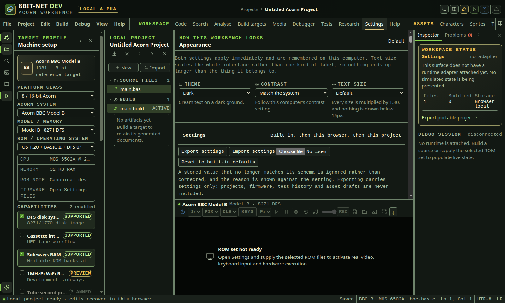

# Accessibility

<!-- Generated by scripts/generateGuides.mjs from src/help/helpTopics.ts. Edit the topics, not this file. -->

## 1. Keyboard and accessibility operation

Operate the IDE without a pointer and preserve readable state at zoom, high contrast and reduced motion settings.

**Before you start**

- Browser focus is in the IDE, not captured by the emulator canvas

**Procedure**

1. Use Tab and Shift+Tab to move through visible controls.
2. Use Enter or Space to activate buttons, tabs, tree items and checkboxes.
3. Use F1 or Ctrl+Shift+P for the command palette.
4. Use Ctrl+Space for completion and Ctrl+Shift+Space for signature help.
5. Use Ctrl+Backslash to open a secondary editor or close it while that pane has focus.
6. Use Ctrl+F or Ctrl+H for source search and replace.
7. Use F12 for definition navigation.
8. Use Ctrl+F12 for a declaration, Ctrl+Shift+F12 for an implementation and Alt+F12 for a type definition.
9. Use Alt+Shift+H for the parsed call hierarchy.
10. Use Ctrl+Alt+B and Ctrl+Alt+PageUp or PageDown for bookmarks.
11. Use the emulator focus release control before returning to workbench shortcuts.
12. Open Settings and use Keyboard shortcuts to see every dispatched chord and change any of them.

**What should happen**

- Focus remains visible and follows the displayed layout.
- Status and error changes use live regions without moving focus unexpectedly.
- Screenshots in Help have captions and text equivalents.

**Limits**

- Browser, operating-system and assistive-technology shortcuts can override application keys.
- Complete WCAG 2.2 AA and cross-browser audits remain a release gate.

**If it goes wrong**

- Press Escape to close transient menus or return from the command palette.
- Use the visible equivalent if a shortcut is reserved by the browser.

In the IDE: Help → `#help/keyboard-accessibility`

## 2. Theme, contrast and text size

Change how the workbench looks and how large its text is, and have that choice remembered on this computer.

**Before you start**

- The IDE is open in a browser that is allowed to store a preference for this site

**Procedure**

1. Open Settings and find the Appearance panel.
2. Choose a Theme: Match the system, Dark or Light.
3. Choose a Contrast: Match the system, Standard or High contrast.
4. Choose a Text size: Small, Medium, Default, Large, Larger or Largest.

**What should happen**

- Each choice applies as it is made. There is no Save step, because the only way to judge legibility is to look at it.
- Text size scales the whole interface together, so nothing ends up larger than the thing it belongs to.
- Standard contrast holds text at 4.5:1 and control borders at 3:1. High contrast holds text at 7:1 and borders at 4.5:1.
- The choice is kept on this computer and is applied again the next time the IDE opens.

**Limits**

- Text size stops at double. Past that the fixed rails, strips and status bar crowd the work rather than the text becoming easier to read.
- Match the system follows what the browser reports, so a computer that reports no preference gets the shipped default.
- A stored choice this build no longer offers is discarded rather than approximated, because honouring half of it would apply a size this build does not have.

**If it goes wrong**

- Set Theme and Contrast back to Match the system, and Text size back to Default, to return to the shipped appearance.
- Clearing site data for this address removes the stored choice along with the rest of the local state.

*Appearance sits in Settings. Each selector says what its current choice does, and the choice takes effect as it is made.*

In the IDE: Help → `#help/appearance`

## 3. Review and remap keyboard shortcuts

Read the complete dispatched shortcut inventory, change any chord, unbind one, and restore declared defaults. The listed chords are the chords the workbench and editor actually handle.

**Before you start**

- Browser focus is in the IDE, not captured by the emulator canvas
- Browser local storage is available if a customised chord should survive a reload

**Procedure**

1. Open Settings from the activity bar and find Keyboard shortcuts.
2. Filter by command, category or chord to locate a binding.
3. Read the scope: workbench chords are dispatched from the window, source-editor chords are dispatched by the focused editor first.
4. Choose Change, press the replacement chord, then choose Apply.
5. Choose Unbind to stop dispatching a command, or Reset to restore its declared default.
6. Choose Reset all to defaults to discard every customisation at once.

**What should happen**

- The command palette, the editor's advertised shortcut list and real key dispatch all follow the effective chord immediately.
- A chord claimed by two commands in one scope is highlighted and names the other command.
- An editor chord that hides a workbench chord says so.
- A chord a browser normally consumes first is labelled with the host that usually wins.
- Customised bindings are stored locally and restored on the next visit.

**Limits**

- A chord must include Ctrl, Alt or a function key so it cannot capture ordinary typing.
- Tab chords stay reserved for focus movement.
- The product cannot guarantee delivery of a chord the browser or operating system claims first; the interface names the likely owner instead of promising capture.
- Command on macOS and Control elsewhere share one role and cannot be bound separately.
- Single-key sequences such as press-then-press chords are not supported.

**If it goes wrong**

- Press Escape while recording to abandon an unwanted chord.
- Use Reset on the binding, or Reset all to defaults, to return to the shipped chords.
- Use the command palette or the visible control if a customised chord is intercepted by the host.

In the IDE: Help → `#help/shortcut-remapping`
