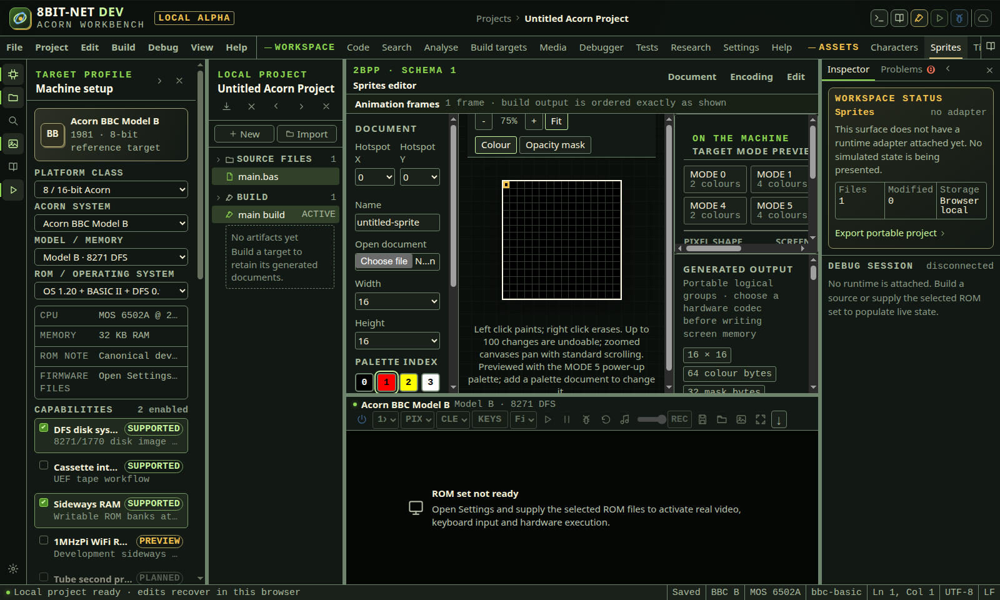

# The asset editors

<!-- Generated by scripts/generateGuides.mjs from src/help/helpTopics.ts. Edit the topics, not this file. -->

## 1. Edit characters, sprites and tiles

Create versioned pixel documents, edit frames and selections, then generate deterministic target-specific source or binary output.

**Before you start**

- A selected target with known pixel format

**Procedure**

1. Open Characters, Sprites or Tiles.
2. Create or open an asset document.
3. Set dimensions, palette and hotspot beside the canvas, and the generated byte encoding from the Encoding menu.
4. Draw with pointer or keyboard controls.
5. Select, copy, paste, fill, flip or move a bounded region.
6. For sprites, add, reorder or remove frames.
7. Preview generated bytes and target packing.
8. Use the editor's Document menu to add the asset document, its EQUB source or a live build target to the project, and build it.

**What should happen**

- Editable asset JSON retains dimensions, frames, palette and generation settings.
- Generated output is deterministic for the selected format.
- Undo and redo cover document mutations.

**Limits**

- Palette and transparency choices differ across Acorn machines and modes.

**If it goes wrong**

- Undo an accidental transform.
- Keep the editable asset document when regenerating code or binary output.

*The editable asset, target encoding and generated bytes are visible together. Source and binary exports come from the same document state.*

In the IDE: Help → `#help/assets`

## 2. Draw a tile map and build it into a program

Paint a level from tiles that already exist in the project, add objects, and generate its data, tile pointer table and object table into a real build.

**Before you start**

- At least one pixel asset document in the project to use as tile artwork
- A 6502 build target, or use the workspace action that creates one

**Procedure**

1. Open Maps from the activity bar.
2. Set the map name and its size in tiles.
3. Choose Declare tile to add an index, then choose the project pixel asset that draws it.
4. Select a brush, then paint with the pointer, or focus the map and use the arrow keys and Enter.
5. Add layers for background and detail, and hide a layer while you work on another.
6. Choose Add object at cursor for spawn points, doors or trigger regions, and give each one byte properties your code reads.
7. Choose Add live map build target to create the document and a build target that includes it with INCLUDEMAP.

**What should happen**

- The map stores indices, layers and objects only; the artwork stays in the pixel asset documents.
- Editing a tile in the Tiles workspace changes this map's preview and its generated output.
- The generated source contains a header, one block per layer, a tile pointer table and an object table.
- Editing the map or any tile it names stales the build artifact.
- The cell under the keyboard cursor and the whole current row are readable as text.

**Limits**

- A cell may only use an index the tileset declares; removing an index clears the cells that used it and says so.
- An index with no artwork chosen generates a zero pointer and a build diagnostic naming it, rather than a made-up address.
- Maps are bounded to 128 by 128 tiles, 16,384 tiles in total, 4 layers, 256 tileset entries and 256 objects.
- Run-length layer compression is a request rather than a guarantee: a layer that would grow under it is stored raw, and the workspace says so.
- Importing an image counts what the conversion lost, rather than absorbing it: approximated colours, image outside the grid, and tiles the tileset could not hold.
- The picture is drawn on a canvas; environments without a 2D context still expose the cursor and row as text.

**If it goes wrong**

- Use Undo and Redo for any editing step, including fill and resize.
- A refused edit reports why on the status line and changes nothing.
- The working map is recovered from browser storage; a document that no longer validates starts a new empty map.

In the IDE: Help → `#help/tile-maps`

## 3. Design a character set in the font editor

Draw the characters a program prints, preview them as running text, and emit them as assembler source, BASIC statements or a live build target.

**Before you start**

- A project is open
- Media is not required: a character set is source, not an image file

**Procedure**

1. Open Assets from the activity bar and choose the Fonts tab.
2. Name the set in Font name. The name becomes the label the generated source is emitted under.
3. Enter a code in Character code to add and use Add character. Codes are the values a program passes to the routine that draws them.
4. Select a code in Character being edited and draw in Character grid. Each row of the grid is one byte, shown in Row bytes of the current character.
5. Type into Sample text to see the set drawn as running text rather than as isolated glyphs.
6. Use Undo to step back a change, Clear to empty the current character and Remove character to drop a code from the set.
7. Read Generated font assembler source or Generated font BASIC statements, then use Add generated source to write it into the project, or Add live font build target to have it regenerated on every build.

**What should happen**

- The grid, the row bytes and the text preview are three views of one character and change together.
- Generated output names the set and lists one row byte per grid row, in the order the drawing routine reads them.
- A live target regenerates from the document, so editing the character updates the built bytes without a second edit to the source.

**Limits**

- A set holds at most 224 characters, which is the range left once the control codes below 32 are excluded.
- The editor emits the character data and the INCLUDEFONT directive. It does not write the routine that draws them; that belongs to the program.
- The preview draws with the project palette and the mode chosen in the palette editor, so it shows the colours that editor is previewing rather than a measured frame from a machine.

**If it goes wrong**

- Undo reverses the last grid, row-byte or character-list change.
- If generated source does not appear in the project, confirm a file name was accepted; Add generated source refuses a name that would overwrite an unrelated file.

In the IDE: Help → `#help/asset-fonts`

## 4. Compose a screen in the screen editor

Draw or import a full screen for a chosen display mode, edit it with a rectangular selection, and emit it as source or as a live build target.

**Before you start**

- A project is open
- An image file, if one is to be imported rather than drawn

**Procedure**

1. Open Assets and choose the Screens tab.
2. Choose Display mode first. The mode fixes the pixel dimensions and the number of logical colours, so changing it later reinterprets what is already drawn.
3. Name the screen in Screen name.
4. Draw with the pointer, choosing the pen from Logical colour. Screen zoom changes the size the pixels are drawn at and not the size of the screen.
5. Use Import an image to bring in a picture. It is reduced to the logical colours the mode has.
6. Drag Rectangular selection to mark an area, then Copy area, Cut area or Paste at cursor. Clear selection drops the marks without changing pixels.
7. Fill screen sets every pixel to the current logical colour. Undo steps back one change.
8. Use Add generated source for a one-off, or Add live screen build target so the screen is regenerated on every build.

**What should happen**

- Logical colours are indices, not fixed colours: what each one looks like comes from the palette, so changing the palette changes the screen without redrawing it.
- Generated output is the packed bytes for the chosen mode, in the order the display hardware reads them.
- An imported image is reduced to the mode's colour count rather than refused.

**Limits**

- Importing reduces colours and cannot invent detail the mode cannot hold; a photograph in a two-colour mode will look like a two-colour picture.
- The editor produces screen data and the INCLUDESCREEN directive. Setting the mode and displaying the data is the program's job.
- The preview uses the project palette. It is not a frame captured from a running machine, and only the emulator's own capture is that.

**If it goes wrong**

- Undo reverses drawing, filling, pasting and importing alike.
- If an import looks wrong, check that Display mode was chosen before the import rather than after it.

In the IDE: Help → `#help/asset-screens`

## 5. Set the palette the editors preview with

Choose which physical colour each logical colour shows, for a chosen display mode, and make that the palette every other asset editor previews with.

**Before you start**

- A project is open

**Procedure**

1. Open Assets and choose the Palettes tab.
2. Choose Display mode. The mode decides how many logical colours there are to assign.
3. Name the palette in Palette name.
4. For each entry under Logical colours, choose the physical colour it shows.
5. Reset to power-up restores the assignment the machine makes for that mode at switch-on.
6. Check Colours the editors currently preview with. Setting this palette as the Project palette makes the pixel, font, screen and tile-map editors preview with it.
7. Use Add generated source, or Add live palette build target to regenerate on every build.

**What should happen**

- Every other asset editor's preview changes when the project palette changes; no artwork is redrawn.
- Generated output writes the assignment as assembler source or BASIC statements the program can send to the hardware.
- The physical colours offered are the steady ones the hardware can produce.

**Limits**

- Only steady colours are offered. Flashing colours are a pair alternating on the hardware, and previewing artwork against one half of the pair would show a colour the screen never holds.
- The palette here is what the editors preview with and what the generated source sets. It does not change a machine that is already running; the program has to send it.
- The project palette is one palette. A program that changes palette part-way down the screen is doing something the previews do not model.

**If it goes wrong**

- Undo reverses the last assignment.
- Reset to power-up returns to a known state when an assignment has become hard to read.

In the IDE: Help → `#help/asset-palettes`

## 6. Write a tune in the song editor

Enter a pattern of pitches and volumes for the selected sound hardware, and emit the data together with a player the program can call.

**Before you start**

- A project is open
- The machine whose sound hardware the tune targets

**Procedure**

1. Open Assets and choose the Sound tab.
2. Choose Sound hardware. BBC · SN76489 has three tone channels and sixteen volume levels; Atom · 1-bit speaker has one channel and a volume that is only on or off.
3. Name the tune in Song name.
4. Set Song rows to the length of the pattern, and Row duration in twentieths of a second to how long each row is held.
5. Enter pitch and volume for each channel in Pattern, one row at a time.
6. Set Player zero-page base to an address range the program is not already using; the player keeps its position there.
7. Use Undo to step back and Clear to empty the pattern.
8. Read Generated song data and player or Generated song BASIC statements, then Add generated source, or Add live song build target to regenerate on every build.

**What should happen**

- The limits offered change with the hardware: choosing the Atom reduces the channels and the volume range to what its speaker can actually produce.
- The generated output is the pattern data and a player routine, so the program advances the tune by calling the player once per row rather than writing its own.
- The player reads and writes only the zero page declared, which is stated in the generated source.

**Limits**

- A BBC tune holds up to 256 rows and an Atom tune up to 128, because the Atom player counts rows in a single byte alongside its other state.
- Row duration is in twentieths of a second, from 1 to 254. It is a whole number of ticks and not an arbitrary tempo.
- The editor produces data and a player. It does not schedule the player; the program has to call it, usually from its own frame loop.
- The preview here is the pattern as written. Hearing it as the machine plays it means running the built program in the emulator.

**If it goes wrong**

- Undo reverses the last pattern, length or duration change.
- If the player misbehaves, confirm the zero-page base does not overlap what the program uses; the generated source states the range it claims.

In the IDE: Help → `#help/asset-sound`

## 7. Prepare a sound sample for the Archimedes

Import or synthesise sampled audio, trim it, place it across the stereo image, and emit it with the VIDC and MEMC register writes that play it.

**Before you start**

- A project is open
- An Archimedes target, because sound DMA is a VIDC and MEMC facility
- A WAVE file, if one is to be imported rather than synthesised

**Procedure**

1. Open Assets and choose the Samples tab.
2. Name it in Sample name.
3. Use Import a WAVE file, or set Tone waveform, Tone frequency in hertz and Tone length in milliseconds and use Generate tone.
4. Choose Channel mode. This is how many channels the hardware interleaves the data across, and it must match how the program set the hardware up.
5. Set Stereo placement for each channel. This is the stereo image register, not a mix level.
6. Set Sound frequency register period in microseconds. This is what decides the playback rate.
7. Set Physical buffer address to where the data will be in physical memory. Sound DMA reads physical addresses, not the addresses the program sees.
8. Set Trim from frame and Trim to frame and use Trim to shorten the sample. Undo steps back.
9. Read Generated sample data and player, then Add generated source.

**What should happen**

- The generated output includes the register writes that arm sound DMA, so the sample is playable rather than only present.
- The data is padded to a whole number of 16-byte DMA blocks, because DMA transfers a block at a time.
- Trimming reports the frames kept, so a mistaken trim is visible rather than silent.

**Limits**

- A sample is at most 256 KB, and the DMA buffer the hardware can address is bounded by MEMC's sound pointer arithmetic; the editor refuses a placement outside it rather than emitting one that would read the wrong memory.
- The physical buffer address is the program's responsibility to honour. The editor cannot know where the program will load the data, so it emits what it was told and states it.
- Stereo placement is the hardware's image register and has the positions the hardware has, which are not a continuous pan.
- The editor does not play the sample through the host's speakers as the machine would; hearing it means running the built program.

**If it goes wrong**

- Undo reverses a trim, an import or a generated tone.
- If nothing is heard, confirm the channel mode used by the program matches the one the data was interleaved for, and that the buffer really is at the physical address declared.

In the IDE: Help → `#help/asset-samples`
