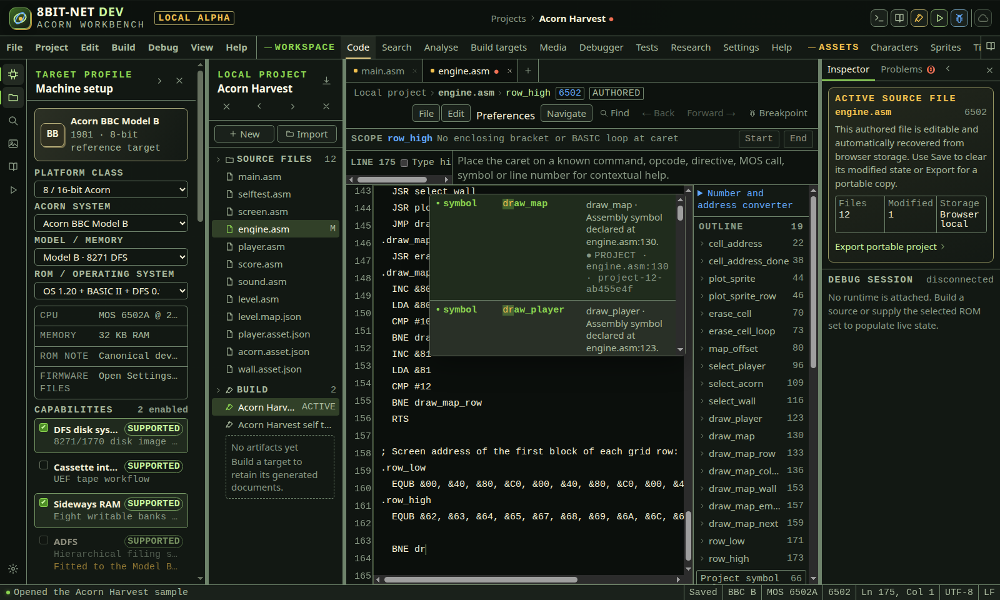
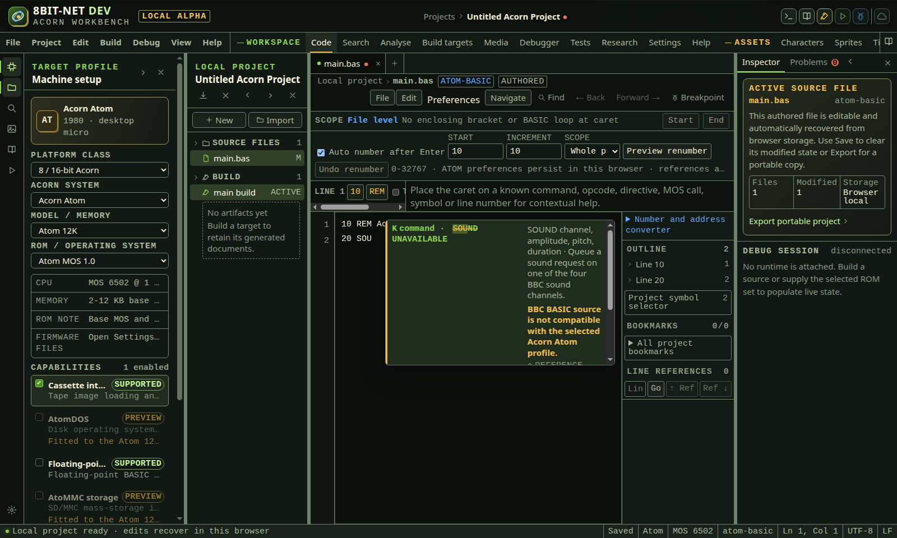
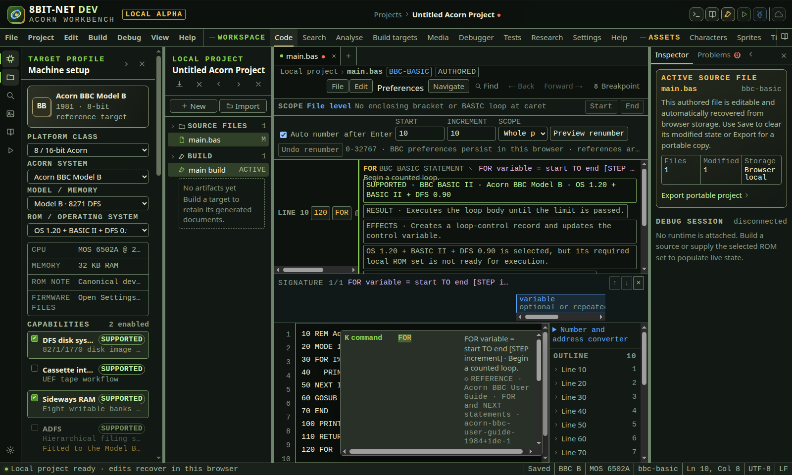
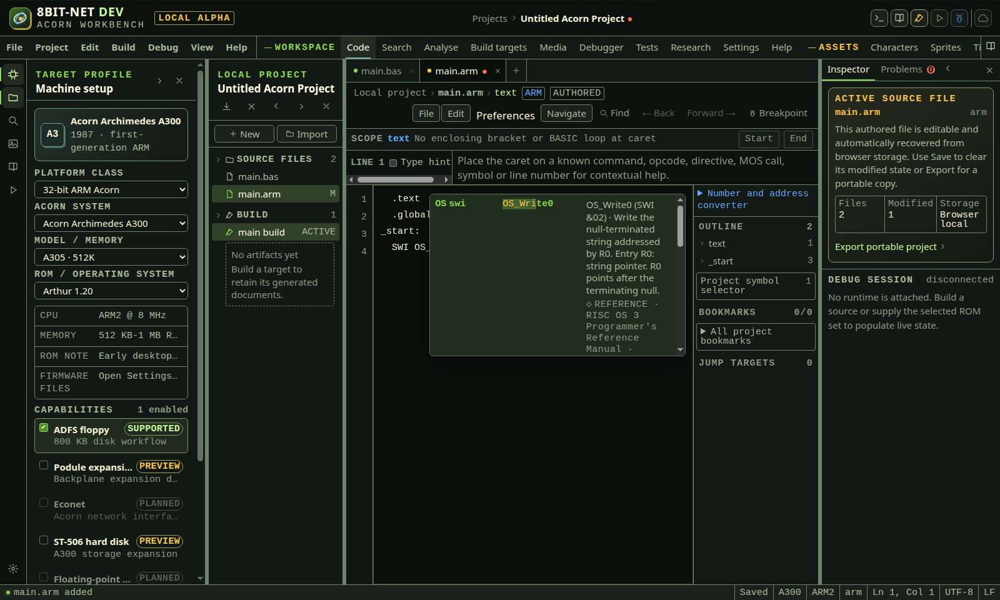
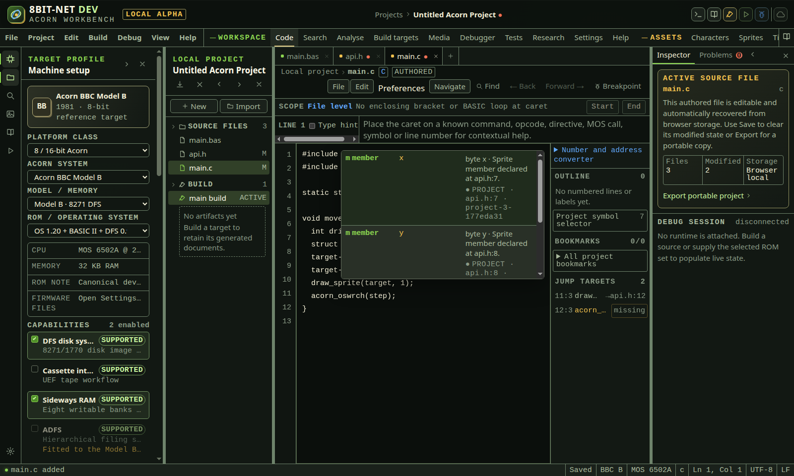
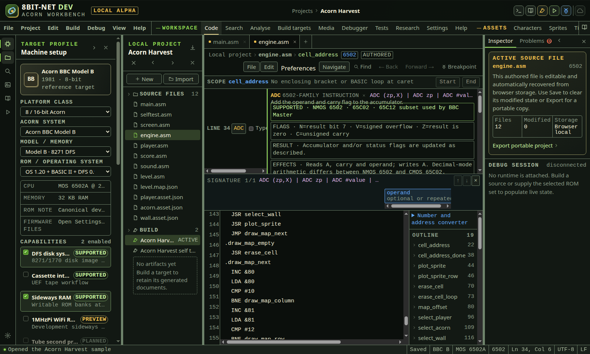
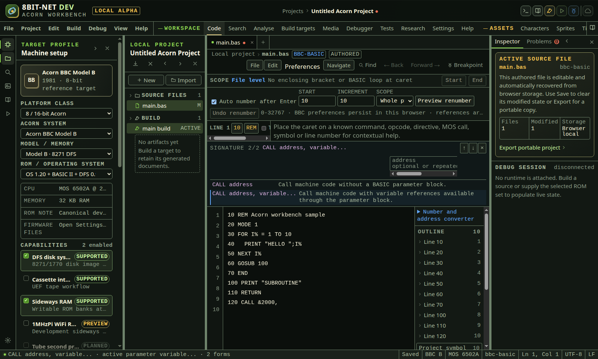
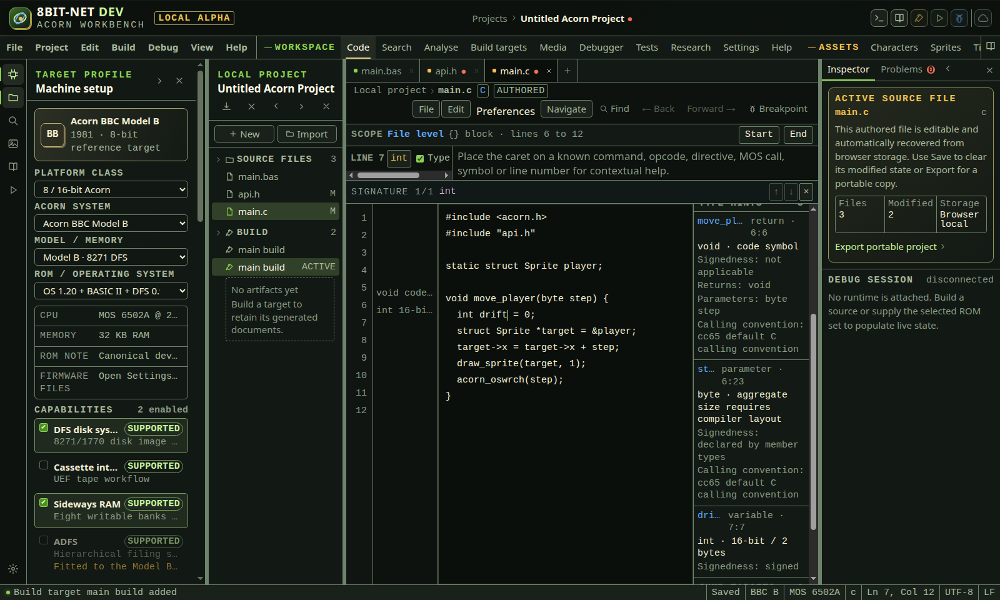
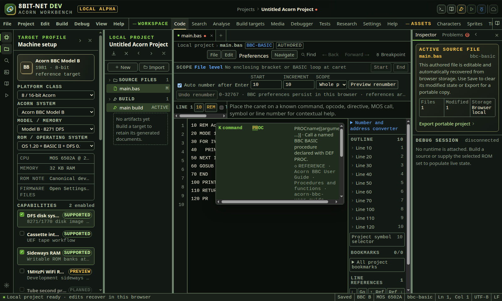

# Completion, signatures and type hints

<!-- Generated by scripts/generateGuides.mjs from src/help/helpTopics.ts. Edit the topics, not this file. -->

## 1. Use syntax-aware completion

Request candidates that are valid for the current language position, connected project scope, processor, machine, ROM, toolchain and active build target.

**Before you start**

- An editable source file is active
- The project target selects the intended processor, machine, ROM and toolchain
- Included assembly files and build defines are declared in the current project

**Procedure**

1. Place the caret after a 6502 branch, JMP or JSR operand and press Ctrl+Space. Choose a reachable project label, current build symbol, target define or compatible MOS entry point.
2. In an assembly mnemonic position, choose an instruction, directive or macro declared in the connected include graph. In an operand, choose a label, source constant, current build symbol, target define, machine hardware address or compatible MOS entry point.
3. In BBC BASIC, type at least two digits after GOTO, GOSUB, RESTORE, RESUME, THEN or ELSE. Choose one declared line number. Atom line labels are offered for an Atom target.
4. In ordinary BASIC expressions, choose an assigned variable. Read its suffix-derived type and first declaration location before accepting it.
5. In ARM source, invoke completion in an instruction operand. Choose a connected symbol, current linker symbol, R0 to R15, SP, LR, PC, hardware address or active target define. After SWI, choose a RISC OS operation from the dedicated list.
6. In C source, choose functions, variables, object macros and function macros from the current file or a quoted project header connected by #include. After a dot or arrow, choose a member of the receiver structure only.
7. Inside INCLUDE or INCLUDEASSET quotes, choose a compatible project source or versioned asset. The closing quote is inserted with the selected path.
8. Inside a C #include operand, choose a project header or a header from the active cc65 BBC SDK. The closing quote or angle bracket follows the opener.
9. Read the candidate kind, signature, detail and PROJECT or REFERENCE source before accepting with Enter, Tab or pointer activation.

**What should happen**

- A 6502 or ARM mnemonic position offers instructions, directives, source macros and compatible snippets, while a branch target position excludes unrelated opcodes, macros and snippets.
- A BASIC numeric target position offers only declared line targets, sorted numerically.
- 65C02-only opcodes remain absent on a 6502 target. ROM and machine-incompatible BASIC, MOS and SWI entries remain absent.
- Build defines identify the active target and carry a version derived from the exact configured define set.
- Assembly and C declarations are limited to their connected include graph. C parameters and preceding local declarations appear only inside their enclosing function.
- Hardware candidates identify the selected machine and insert the numeric notation required by the active assembler or C dialect.
- RISC OS SWI candidates show register parameters and results, then insert a GNU as numeric operand that builds without an external header.
- Every candidate remains bound to the versioned language request and expires after source, project, target or build identity changes.

**Limits**

- C scope completion handles function parameters, declaration order, nested brace lifetime and named or typedef structure members. Complex declarators, anonymous aggregates, unions, preprocessor branches and macro-expanded declarations remain open.
- Hardware catalogues deliberately contain only addresses checked against maintained machine documentation. Controller-specific registers remain absent until target capability and access semantics are authoritative.
- RISC OS completion currently covers the kernel and FileSwitch SWIs from OS_WriteC through OS_Exit. Module SWIs and X-bit variants remain open.
- Generated addresses are exposed only from an exact current successful machine-code build. Debug types, storage classes and symbols without retained toolchain output are not guessed.
- An INCLUDE is resolved beside the file that wrote it, then from the top of the project, then by filename anywhere in it. The last of those answers only when exactly one file carries that name, because guessing between two would build a different program without saying so.

**If it goes wrong**

- Check that the required assembly file is connected by INCLUDE when a label is absent.
- Open Build targets and confirm the selected target, toolchain, defines and include paths.
- Switch to the correct processor or machine profile when a valid platform-specific candidate is intentionally filtered.
- Press Escape to dismiss a list without editing, then move the caret to the intended syntax position and invoke it again.

*A JSR operand excludes unrelated opcodes and identifies each reachable project, build-target or reference candidate.*

In the IDE: Help → `#help/context-completion`

## 2. Operate completion and understand unavailable candidates

Invoke, filter, inspect, accept or dismiss completion without allowing incompatible or stale text to enter the source.

**Before you start**

- An editable source file is active
- The intended machine, ROM, processor and toolchain are selected

**Procedure**

1. Type at least two valid token characters to allow automatic completion, or press Ctrl+Space for an explicit request at any valid source position.
2. Read the kind glyph and text, token, signature, summary, source class, source label and source version.
3. Use Up Arrow and Down Arrow to move through the wrapping list. The active option reports its position and total list size to assistive technology.
4. Press Enter or Tab when the candidate supports that commit key, or choose it with a pointer.
5. Press Escape to close the list without editing.
6. When explicit completion shows UNAVAILABLE, read the warning. The warning names the incompatible machine, ROM, CPU or toolchain condition.
7. Activate an unavailable entry only to announce its reason. It remains in the list and does not change source.
8. If source, project, target or build identity changes while the list is open, invoke completion again. The old response cannot be accepted.

**What should happen**

- Automatic completion excludes incompatible candidates so ordinary typing is not cluttered.
- Explicit completion may expose a matching incompatible reference as UNAVAILABLE for diagnosis.
- Unavailable candidates have a warning border, warning-coloured struck token, textual UNAVAILABLE state and aria-disabled state. Colour is not the only indicator.
- Project and reference sources have distinct glyphs plus PROJECT or REFERENCE text.
- Candidate kind glyphs differ for opcodes, commands, directives, variables, members, macros, hardware, SWIs, snippets, files and other supported kinds.
- An incompatible candidate never inserts text, even through Enter, Tab or pointer activation.
- Late results and acceptance attempts from a prior language revision are rejected.

**Limits**

- Completion retains editor focus, so list options are read through the active-descendant relationship rather than receiving DOM focus.
- Fuzzy and subsequence matching are not enabled. Ranking uses prefix, case, current-file and source precedence.
- Unavailable discovery is limited to maintained reference entries that can be evaluated against the selected target.
- Commit punctuation such as comma, period or closing parenthesis is not yet registered. Current candidates use Enter and Tab.

**If it goes wrong**

- Select the compatible machine, ROM, processor or toolchain named by the warning, then invoke completion again.
- Use Escape if the list obscures the source location you need to inspect.
- Continue typing to narrow a large list.
- If a current candidate disappears after a build or edit, confirm that its project declaration or exact current build symbol still exists.

*Explicit completion explains incompatible syntax but cannot insert it into the Atom source.*

In the IDE: Help → `#help/completion-interaction`

## 3. Insert target-aware code snippets

Insert compact, buildable BASIC, 6502, ARM or C source patterns selected for the active machine and toolchain.

**Before you start**

- An editable supported source file is active
- The correct machine and build toolchain are selected
- The caret is at a statement or assembly mnemonic position

**Procedure**

1. Type a snippet prefix, such as FOR_, MOS_, RISCOS_ or MAIN_, then press Ctrl+Space.
2. Confirm that the candidate kind is snippet and read its full signature, side effects, compatibility and source.
3. Press Enter, Tab or choose the candidate. The editor replaces the complete identifier prefix, including underscores.
4. Review every inserted literal and identifier. Snippets use safe demonstration values, such as character 65, and do not guess project names.
5. For BBC BASIC, invoke FOR_LOOP after the current line number. It inserts a single-line FOR, PRINT and NEXT sequence so automatic numbering remains valid.
6. For 6502 assembly, MOS_WRITE_CHAR uses dollar hexadecimal for ca65 and ampersand hexadecimal for the BBC-style assembler.
7. For ARM, RISCOS_WRITE_CHAR uses a numeric GNU as SWI operand. ARM_LEAF_RETURN is valid only when the routine has not overwritten LR.
8. For C, MAIN_FUNCTION inserts a complete returning entry function. MOS_WRITE_CHAR requires the documented acorn.h include.

**What should happen**

- The inserted text is real editable source, not a dialog preview or generated image.
- The full typed prefix is replaced. No prefix fragment remains before the inserted text.
- Atom assembly does not offer the BBC MOS character snippet.
- C snippets appear only for the selected cc65 BBC adapter.
- Multi-line snippets preserve the current first-line indentation and supply explicit indentation on following lines.
- Undo command reverses the insertion as one editor operation.

**Limits**

- Snippet fields are ordinary source after insertion. Linked placeholder navigation and mirrored edits are not yet implemented.
- The initial library is deliberately small and reviewed for current adapters. It does not attempt to generate a complete game loop, interrupt handler or application framework.
- A valid source pattern can still be wrong for the surrounding program state. Check register ownership, memory layout, MOS availability and include requirements.
- BBC BASIC multi-line templates remain absent until numbering, renumber preview and indentation can be applied as one validated transaction.

**If it goes wrong**

- Use Undo command immediately if the snippet was inserted at the wrong location.
- Select the correct machine or toolchain if a compatible snippet is absent.
- Fix the required include or ROM configuration named by the candidate warning.
- Use ordinary completion for individual commands, symbols or registers when a snippet is too broad.

*Snippet candidates are marked by kind and insert editable source selected for the active language and target.*

In the IDE: Help → `#help/completion-snippets`

## 4. Complete hardware addresses and RISC OS SWIs

Insert documented machine addresses and RISC OS software interrupts in the exact numeric syntax accepted by the selected toolchain.

**Before you start**

- An editable 6502, ARM or C file is active
- The intended Acorn machine and ROM are selected
- The RISC OS ROM is required for emulator testing but not for authoring an ARM SWI

**Procedure**

1. Place the caret in an instruction or expression operand and press Ctrl+Space.
2. Filter a hardware address by chip or register name, such as VIDEO_ULA_CONTROL, SYSVIA_ORB, ACCCON, IOC_BASE or VIDC_WRITE.
3. Read the candidate detail and side-effect warning. Follow its maintained machine-manual citation before reading access-sensitive hardware.
4. Accept the address. BeebAsm and BBC BASIC receive ampersand hexadecimal, ca65 receives dollar hexadecimal, and C or GNU ARM assembly receives 0x hexadecimal.
5. For ARM RISC OS code, enter SWI followed by a name prefix, then press Ctrl+Space.
6. Read the SWI number, entry registers, result registers, ROM compatibility and Programmer’s Reference Manual citation.
7. Accept the SWI. The editor inserts its numeric GNU as operand and leaves the descriptive name available in completion and help.

**What should happen**

- Only hardware mapped by the selected machine appears. ACCCON is absent on a BBC B and Atom hardware is absent on an Electron.
- Every hardware entry names the selected machine as its source and warns that mapped access can change device state.
- A SWI operand list contains SWIs only, not registers, opcodes or unrelated project symbols.
- A missing RISC OS ROM preserves authoring completion while candidate help explains that emulator testing is unavailable.
- The inserted literal is accepted by the active language adapter without requiring an undeclared symbolic constant.

**Limits**

- A hardware address is not permission to access it. Read and write behavior, mirroring, controller variants and side effects still depend on the selected machine and capability.
- Electron and Atom catalogues currently expose conservative block bases until each access-sensitive register has a reviewed description.
- The SWI catalogue is a maintained initial kernel set. It is not yet a complete module enumeration from the active ROM image.
- Named SWIs are converted to numbers on acceptance because the current GNU assembler target does not inject a RISC OS symbolic header.

**If it goes wrong**

- Confirm the machine profile if an expected register is absent.
- Import the selected RISC OS ROM set before attempting to test SWI code in the emulator.
- Use the hardware inspector to observe live state before and after an access.
- Open the cited manual from token help when a register or SWI parameter contract is uncertain.

*The SWI operand list is machine and ROM aware, documents the register contract and inserts syntax accepted by GNU as.*

In the IDE: Help → `#help/target-reference-completion`

## 5. Complete C locals and structure members

Use declaration-order, block-lifetime and receiver-type information to avoid unrelated C names in completion.

**Before you start**

- A C source file is active
- Quoted project headers are present in the project and connected by #include
- The caret is inside a function or after a structure dot or pointer arrow

**Procedure**

1. Inside a function, type a parameter or local prefix and invoke completion.
2. Read the variable signature and declaration line. Only parameters and locals declared before the caret in the active block or a containing block are eligible.
3. Move the caret beyond a closing brace and invoke completion again. Locals owned by that closed block are absent.
4. For structure completion, type a declared receiver followed by a dot or arrow and an optional member prefix.
5. Invoke completion and read each member type, declaring header, physical line and project-index version.
6. Accept the member with Enter, Tab or pointer activation. The editor replaces only the member prefix after the access operator.
7. Use Go to line or project symbol to inspect the type declaration when the member contract requires more context.

**What should happen**

- A local declared later in the same function is absent before its declaration.
- A local from another function or a closed nested block is absent.
- Parameters remain available throughout their function body unless a supported inner declaration shadows the same name.
- A Sprite receiver offers Sprite members and does not offer members from an unrelated Sound type.
- Members from a quoted connected header carry that header filename and exact declaration line.
- If the receiver type cannot be resolved, the member list is empty rather than falling back to every project command.

**Limits**

- The scanner supports ordinary named and typedef structures with ordinary field declarations.
- Function pointers, bitfields, anonymous structures and unions, typedef chains, conditional compilation and macro-produced fields are not yet resolved.
- Member completion is source-derived. It does not yet consume compiler debug type records.
- Static semantic diagnostics for invalid member access remain separate future work.

**If it goes wrong**

- Confirm that the receiver has a visible declaration before the caret.
- Confirm that its type definition is in the current file or a quoted header connected by #include.
- Replace a complex macro type with an explicit reviewed declaration when source completion cannot resolve it.
- Build the file and inspect compiler diagnostics for the authoritative result.

*Receiver-aware completion lists member type and exact header provenance without mixing unrelated structures or commands.*

In the IDE: Help → `#help/c-scope-completion`

## 6. Read contextual token documentation

Inspect syntax, behavior, parameters, examples, effects, flags, timing, compatibility and maintained sources with equal pointer and keyboard access.

**Before you start**

- A supported source file is active
- The source line contains a token known to the selected language and target provider

**Procedure**

1. Place the source caret on the line you need to inspect. Recognized tokens appear in the inline language help strip.
2. Point at a token button to open its documentation without changing source.
3. For keyboard use, press Tab until the token button is focused. The same documentation opens on focus.
4. Read the token category, accepted syntax, concise definition and selected-target compatibility.
5. Read each parameter name, meaning and range. Read Result and Effects separately so a returned value is not confused with machine state changes.
6. For a 6502 instruction, inspect Flags and the Instruction cycles table. Each addressing form has its own minimum, maximum and variability rule.
7. Read Examples as source patterns, not as values guaranteed to suit the current program.
8. When a DEPRECATED warning is present, read its reason and replacement before editing. No warning is shown when the maintained provider does not declare deprecation.
9. Choose a RELATED token to replace the panel with that token documentation. This navigation does not insert text or move the source caret.
10. Open a cited manual or datasheet link for the detailed contract. The link identifies the maintained section and version where available.
11. Choose Dismiss to close persistent caret or related-token help. Moving the pointer away or moving keyboard focus closes transient help.

**What should happen**

- Pointer hover and keyboard focus display the same semantic documentation fields.
- Compatibility names the processor, machine, ROM or toolchain scope and gives an explicit warning when the token is unavailable.
- The cycle table preserves addressing-form names and reports page-crossing or branch-dependent timing per form.
- Flags state which status bits change and may include the condition that determines each value.
- Related items are real buttons with visible focus and do not steal or edit source.
- Citations open in a new browser context and include a readable source title.
- The documentation region announces updates through a polite live region. Incompatibility and deprecation warnings use alert semantics.

**Limits**

- Only fields supplied by a maintained language provider are displayed. Missing data is omitted rather than inferred.
- Project labels, variables and macros usually provide declaration provenance but not architecture-manual effects or timing.
- The 6502 timing table represents the selected processor model and the addressing forms available to it. Actual peripheral wait states are outside instruction timing.
- The ARM reference currently covers the supported ARM2 instruction subset. It does not claim later ARM or Thumb behavior.
- A citation can identify external material that is unavailable while offline. Core summaries remain bundled with the IDE.
- No maintained built-in entry is marked deprecated merely to demonstrate the visual state. The field appears only when a provider has an authoritative deprecation notice.

**If it goes wrong**

- Confirm the source language and target processor if an expected token is absent.
- Move the caret to the correct physical line if the inline token strip describes a different line.
- Select the compatible processor, machine or ROM named by an incompatibility warning.
- Use Research to search the offline reference when a token is known but does not appear on the active line.
- Dismiss the panel and focus the token again if a target change invalidated its previous result.

*Keyboard focus and pointer hover share one structured documentation panel. Timing remains separated by addressing form and links retain their source provenance.*

In the IDE: Help → `#help/token-help`

## 7. Inspect parameters and alternative signatures

Keep the source editor focused while inspecting the active argument, optional or repeated parameters, and every maintained call form.

**Before you start**

- The caret is inside or immediately after a supported command, instruction, function, procedure or macro invocation
- The active language provider supplies a signature for that token

**Procedure**

1. Place the caret after the argument you are entering. Signature help updates from the current source position.
2. Press Ctrl+Shift+Space for an explicit request. The editor retains keyboard focus.
3. Alternatively choose Signature help from the editor's Edit menu. Pointer activation moves focus to the chosen control as normal.
4. Read SIGNATURE n/total and the complete active syntax.
5. Read Active parameter n of total. The active parameter has a bordered highlight and aria-current state; colour is not the only indicator.
6. Treat optional or repeated as a semantic note. It is shown for a bracketed optional parameter or an ellipsis parameter.
7. When more than one maintained form exists, inspect the alternative forms list. The currently selected form has aria-current state.
8. Choose Previous signature form or Next signature form to compare overloads. The active-parameter position is clamped safely when the selected form accepts fewer arguments.
9. Press Escape from the editor, or choose Dismiss signature help, to close the surface. Dismiss returns focus to the editor.

**What should happen**

- Automatic and explicit requests use the same versioned language provider and active source position.
- The status region announces the full current signature, active parameter and form count without requiring focus to enter the panel.
- BBC BASIC CALL distinguishes the address-only form from the address plus repeated variable form.
- BBC BASIC VDU and PRINT expose maintained alternative forms where their punctuation changes semantics.
- Project C and BASIC routine signatures use parsed declaration parameters when the declaration is uniquely visible.
- A stale source, project, target or build revision clears the surface before old data can be acted upon.

**Limits**

- Signature selection changes only the documentation view. It does not rewrite source or select an overload for the compiler.
- Optional and repeated labelling is based on explicit bracket or ellipsis notation supplied by the maintained signature.
- Complex C overloads do not exist in C itself. Macro-expanded declarations, function pointers and conditional prototypes require compiler language data.
- The current provider does not offer parameter value validation. Build diagnostics remain authoritative for type and range errors.
- A token without a maintained signature produces a clear no-signature notice and no empty panel.

**If it goes wrong**

- Move the caret inside the intended invocation and press Ctrl+Shift+Space again.
- Check the active source language and connected include graph when a project function is absent.
- Use Previous or Next signature form if the automatically selected form does not match the syntax being entered.
- Press Escape and invoke again after changing machine, ROM, processor, toolchain or build target.
- Open contextual token documentation for parameter ranges and side effects that do not fit in the compact signature surface.

*The compact live region identifies the active argument and exposes maintained call forms while the source editor keeps keyboard focus.*

In the IDE: Help → `#help/signature-help`

## 8. Inspect authoritative source type hints

Inspect declared BASIC and cc65 C types, object sizes, signedness, pointer address space, function parameters, return types and calling conventions without inferred compiler claims.

**Before you start**

- An editable BBC BASIC, Atom BASIC or C source file is active
- For C byte sizes and pointer widths, the active build target uses the cc65 BBC C toolchain

**Procedure**

1. Open the source file that contains the declaration you need to inspect.
2. Select Type hints in the inline language help strip above the editor.
3. Read the TYPE HINTS count in the source outline.
4. Choose a hint to move the editor caret to its exact physical line and column.
5. For a variable, parameter or structure member, read the declared type and storage size. Read Signedness separately because plain char signedness can depend on compiler options.
6. For a pointer, read Address space. The cc65 BBC target reports its 16-bit CPU pointer contract.
7. For a function, read Returns, Parameters and Calling convention. An explicitly declared __fastcall__ convention is distinguished from the cc65 default C convention.
8. Treat an unavailable size or aggregate layout message as a boundary. Build with debug type records or consult the compiler output instead of calculating a guessed layout.

**What should happen**

- BBC BASIC types come only from documented suffix rules. Atom BASIC integer and floating-point extension types follow the selected ROM capability.
- A cc65 char occupies one byte, int and short occupy two bytes, long occupies four bytes, and a near pointer occupies two bytes.
- A fixed-size array reports its declared element count and total size only when its element size is known for the active target.
- C entries identify variable, parameter, member or return role and retain their physical source location.
- Explicit unsigned and signed declarations report that signedness. Plain char reports that signedness is compiler-option dependent.
- No type is inferred for 6502 or ARM assembly source. The interface states that the source is untyped.

**Limits**

- The C source scanner supports ordinary variables, parameters, functions, fixed-size arrays, pointers and ordinary named or typedef structure members.
- Function pointers, bitfields, anonymous aggregates, unions, typedef chains, variable-length arrays, conditional compilation and macro-produced declarations require compiler type records and are not guessed.
- Aggregate byte layout, alignment and padding remain unavailable until the active compiler supplies authoritative layout data.
- Hints are listed in the outline and navigate to declarations. Configurable inline decorations beside every source token remain open.
- The current source scanner does not replace compiler diagnostics or debugger type records.

**If it goes wrong**

- Select the cc65 BBC C build target if a primitive C size says that an active target is required.
- Open the file that owns a declaration if a type from an included header is not listed in the active file.
- Build the project and use its diagnostics when a complex declaration is outside the supported source scanner.
- Clear Type hints to hide the panel without changing source or project settings.

*The optional panel separates declared type, storage, signedness, address space and function calling contract, then links each entry to its source declaration.*

In the IDE: Help → `#help/source-type-hints`

## 9. Understand completion and language-result validity

Keep completion, token help, signatures, definitions, references and rename actions bound to the source, project, target and build that produced them.

**Before you start**

- A source file is active
- A compatible language provider is registered for that file

**Procedure**

1. Type a valid prefix or press Ctrl+Space to request completion.
2. Read each candidate kind, signature, summary and PROJECT or REFERENCE provenance before accepting it.
3. Continue typing to filter the current request. Starting a newer completion request cancels the preceding request on that provider channel.
4. Change source, an included project file, target processor, machine, ROM, capability, toolchain or current build identity. Any displayed result from the prior revision closes or expires.
5. Press Ctrl+Space again to obtain candidates for the new revision.
6. For token help, signature help, definition and references, invoke the operation again after a relevant revision changes.
7. For project rename, review the refreshed file and line preview if project source changes before Apply. The IDE revalidates every source range immediately before the multi-file update.

**What should happen**

- Every asynchronous request carries a document ID, monotonic document version, project and build revision, provider channel and request ID.
- A provider receives an AbortSignal when another document revision or same-channel request supersedes its work.
- A late provider result is rejected before it can decorate the editor, navigate, insert completion text or update a code-action surface.
- Completion acceptance checks the retained response identity again at activation time.
- Project symbols identify the parsed index version. Reference entries identify their maintained source version.

**Limits**

- The current built-in reference and project-index providers usually complete synchronously. The same contract is designed for worker-backed and future toolchain-backed providers.
- Cancellation prevents stale application state but cannot make a third-party provider stop computation unless that provider observes its AbortSignal.
- Build-derived language symbols are not exposed until a provider can supply current debug metadata with authoritative provenance.

**If it goes wrong**

- Invoke the operation again after the current edit, target change or build completes.
- If rename reports that its preview changed, review the refreshed files and line counts before choosing Apply.
- Fix an ambiguous declaration or INCLUDE graph before retrying definition, references or rename.

*Completion candidates expose their origin. The list is valid only for the source, project, target and build revision that requested it.*

In the IDE: Help → `#help/language-request-safety`
