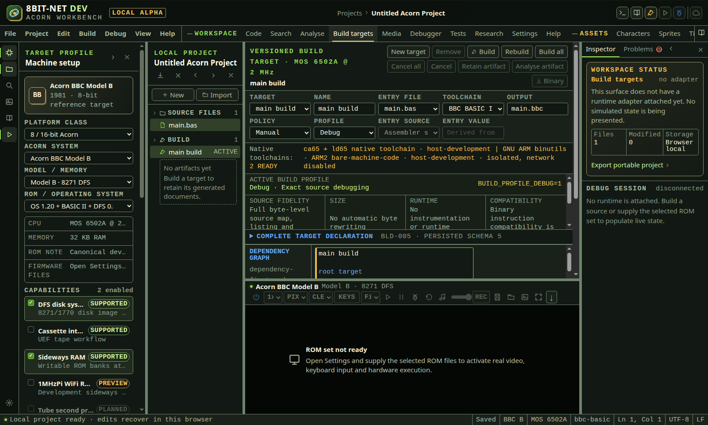
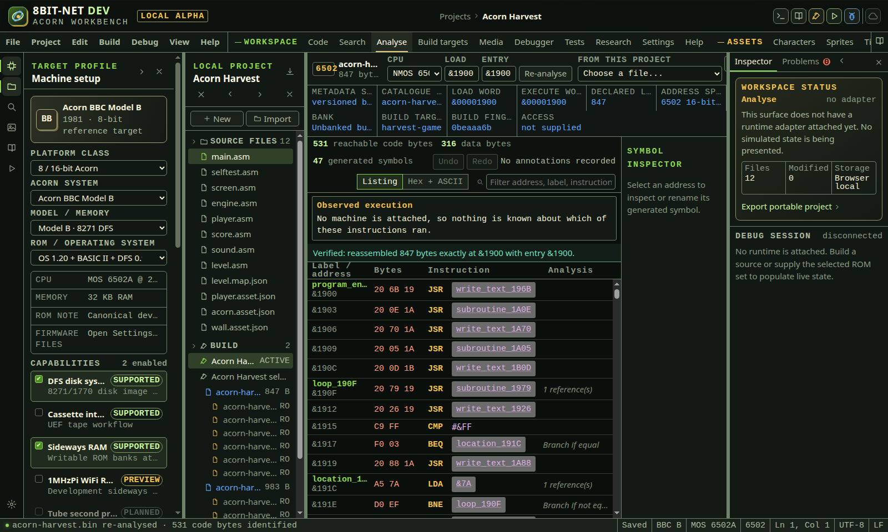

# Building

<!-- Generated by scripts/generateGuides.mjs from src/help/helpTopics.ts. Edit the topics, not this file. -->

## 1. Configure and run builds

Bind an entry file, declared inputs, toolchain, processor profile, output, entry point and build policy into a deterministic target.

**Before you start**

- At least one source file
- Native builder healthy for native toolchains

**Procedure**

1. Open Build targets.
2. Create or select a target.
3. Choose the entry file and a compatible toolchain.
4. Declare source roots, included files, dependencies and output name.
5. Choose debug or release profile and entry-point policy.
6. Select manual, on-save or live build policy.
7. Run Build or Build all and inspect diagnostics, logs, provenance and generated documents.
8. Use bypass when diagnosing a suspected build-cache issue.

**What should happen**

- A successful artifact records exact inputs, versions, profile, machine, hashes and output size.
- Changed inputs visibly stale retained output and block current-only actions.
- Build all respects target dependencies and reports each result independently.

**Limits**

- Browser toolchains and isolated native toolchains expose different capabilities.
- A successful binary does not prove that firmware, media packaging or runtime assumptions are correct.

**If it goes wrong**

- Open the first diagnostic to navigate to its source.
- Check native-builder health if a native adapter is unavailable.
- Bypass the cache, then compare provenance before treating a repeated result as a compiler defect.

*A build target owns its inputs and execution settings. Results show diagnostics and exact provenance.*

In the IDE: Help → `#help/build-targets`

## 2. List BASIC and disassemble machine code

Open a host file, detect supported Acorn containers, list tokenized BASIC or disassemble 6502 and ARM code with labels, cross-references and export.

**Before you start**

- A file to analyse or a current build artifact
- Known origin and entry point when the container does not provide them

**Procedure**

1. Open Analyse.
2. Choose a file or analyse the current build artifact.
3. Confirm processor, origin and entry point.
4. Review format detection before accepting ambiguous raw data.
5. Navigate labels, references, code, data and diagnostics.
6. Adjust analysis hints where bytes were classified incorrectly.
7. Export text, JSON, annotated assembly or project source and verify the round-trip report.

**What should happen**

- Tokenized BASIC is decoded with line numbers and malformed records are identified.
- Disassembly uses control flow and references to create readable labels.
- Generated assembly includes explicit origin and data directives needed to reproduce bytes.

**Limits**

- Raw binaries do not contain a guaranteed processor, origin, entry point or code/data boundary.
- Self-modifying, compressed or runtime-relocated code can require manual hints.

**If it goes wrong**

- Correct origin and entry point, then reanalyse.
- Mark known data or code ranges rather than accepting an implausible instruction stream.
- Use the verification report before treating generated source as lossless.

*The analyser separates supplied metadata from inferred structure and verifies generated source against the original bytes.*

In the IDE: Help → `#help/analysis`

## 3. Record what the bytes cannot say

Add entry points, mark code, data and text, record where a jump through a pointer goes, comment and label addresses, then undo any of it, and have the same deterministic analysis run again with what you recorded.

**Before you start**

- A machine-code file or build artifact open in Analyse
- A 6502 or 65C12 target; ARM annotation is limited to labels and comments

**Procedure**

1. Select the row you know something about.
2. Use Treat as an entry point when the loader calls that address from outside the file.
3. Set Mark span to, then Mark code, Mark data or Mark text to classify a run of bytes.
4. Enter one or more addresses under Flow goes to, then Record flow, to say where a jump through a pointer or a dispatch table actually goes.
5. Apply a label or a comment to name what you found.
6. Use Undo and Redo above the listing to move through your own edits.

**What should happen**

- The listing is re-analysed immediately, so what is on screen is always what your recorded knowledge produces.
- A recorded label replaces the generated one everywhere it appears, including in operands and in the description of a recorded flow.
- Bytes marked as data stay out of the decoder, and an instruction that would run into them is refused with a warning rather than decoded across them.
- Everything recorded is saved in the project against the SHA-256 of the analysed bytes, so re-opening the same binary brings it back, and it travels in the exported analysis document.

**Limits**

- Reachability alone cannot find an entry called from outside the file or resolve a jump through a pointer. Until something is recorded, those bytes are shown as data rather than guessed at as code.
- Annotations are bound to a digest. Rebuilding a binary produces different bytes and therefore a separate, empty record.
- The history keeps sixty-four steps and reports how many earlier ones it dropped.

**If it goes wrong**

- A new marking overwrites whatever it covers, so correcting an earlier decision does not need an undo first.
- Clear marking removes the classification covering the selected address and leaves its neighbours alone.
- Record flow with the field empty to remove a recorded destination.
- An annotation that cannot be read back from a project file is discarded with a reason rather than repaired, because a half-understood annotation would silently change a listing.

In the IDE: Help → `#help/analysis-annotations`
