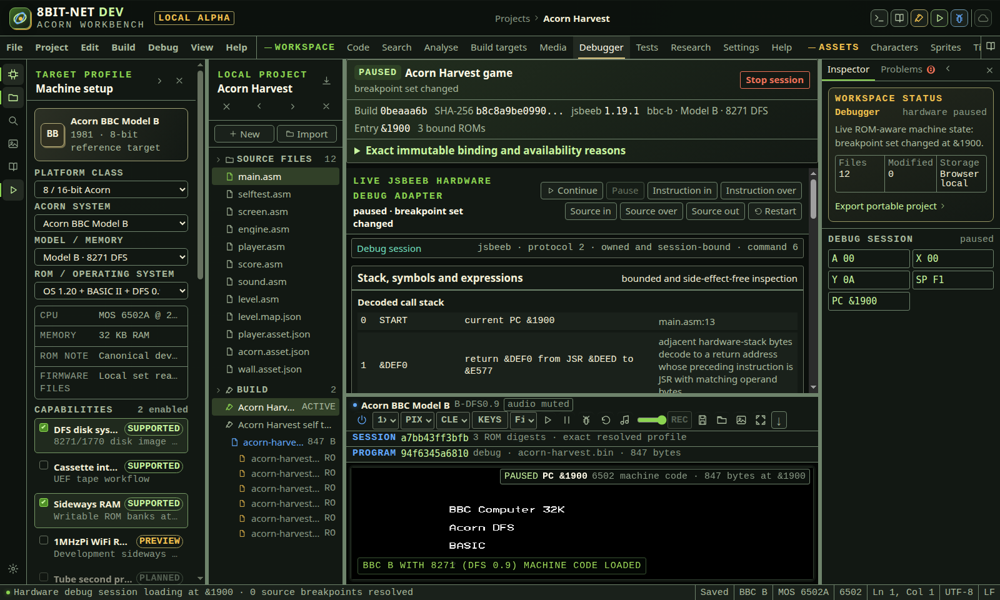
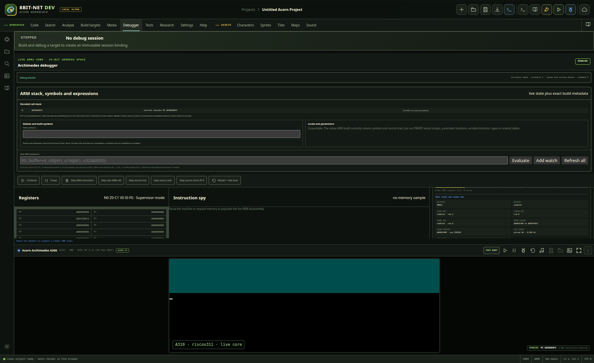

# Debugging and tracing

<!-- Generated by scripts/generateGuides.mjs from src/help/helpTopics.ts. Edit the topics, not this file. -->

## 1. Debug Atom, Electron and BBC family code

Control the live 6502 or 65C12 core with registers, flags, breakpoints, logpoints, watchpoints, memory, disassembly, trace, profiling and replay.

**Before you start**

- A supported 6502-family emulator session
- A current build for source-linked navigation

**Procedure**

1. Choose Build and debug. The workbench builds first, creates a new session from that exact successful result, then loads the bytes into the selected adapter.
2. Read the session strip before controlling execution. It reports lifecycle, build fingerprint, shortened output digest, adapter version, machine profile, entry point and bound ROM count.
3. Open Exact immutable binding and availability reasons. Compare the full output SHA-256, toolchain version, machine and run profile, then verify every firmware filename, size and SHA-256.
4. Pause to establish a stable inspection point.
5. Use instruction step, JSR step over, stack return step out or run to address.
6. Inspect Decoded call stack. The current frame is the live PC. A return candidate appears only when adjacent live stack bytes point immediately after a real JSR opcode in machine memory.
7. Filter Globals and build symbols. This is the exact assembler or linker name/address inventory. Read its provenance note before treating a name as data.
8. Enter a safe expression such as A, buffer+2, byte(buffer) or word(&2000). Numeric values and registers resolve immediately. Memory forms request a genuine mapped read and report its capture cycle.
9. Choose Add watch to retain up to 64 session expressions. Use Refresh or Refresh all after execution changes state. Remove deletes only that watch.
10. Enter a 16-bit address, build symbol, or symbol with a numeric offset for a permanent project breakpoint.
11. Add an optional hit threshold and A, X, Y, S, P or PC comparison. Comparison values may also use current build symbols.
12. Choose pause or log-only action and use the documented log placeholders.
13. Create a named group, select it for the next breakpoint, or reassign retained intent. Clear a group checkbox to remove all of its members from the real core without deleting them.
14. Open Resolution history to compare the requested expression, resolved address and exact output digest after each rebuild.
15. Use source gutter breakpoints alongside project intent. The adapter deduplicates equal resolved addresses before replacing the live hook set.
16. Add a mapped main-RAM read, write or change watchpoint when supported.
17. For an address, opcode, exact memory read or write, or IRQ/NMI-transition event stop, open Hardware trace and configure a trigger. Set pre and post records, then choose whether to pause when that bounded window completes.
18. For a frame, sync, mode, palette or supported beam-position stop, open Raster timeline, select the event or coordinates, and start capture. The high-overhead hook removes itself when capture stops.
19. Inspect mapped CPU memory or physical RAM, ROM and bank views.
20. When a qualified 6502 Tube profile is selected, use Focus host and Focus parasite to distinguish the two live register sets. Compare the parasite logical CPU view with its physical RAM backing. Boot ROM overlay bytes appear only in the logical view.
21. Use the dual address map to compare host and parasite regions and their live PC markers. The parasite map changes its ROM overlay regions when the core unpages the boot ROM.
22. In Parasite memory inspector choose Logical CPU view, Physical RAM backing or Physical boot ROM. Set a bounded address and length, then Read, page, change columns or radix, search, snapshot, copy or export the exact returned bytes.
23. The selected 2 KiB 6502 Tube boot image occupies &F800 to &FFFF inside the core 4 KiB physical ROM store. &F000 to &F7FF therefore reads as zero for that firmware.
24. Read Cross-processor ULA transfers from newest to oldest. Each retained event comes from a real jsbeeb ULA method boundary and includes side, access, register, byte, both PCs, host cycle, parasite cycle and monotonic time.
25. Treat a double hyphen in parasite logical memory as intentional. Addresses &FEF8 to &FEFF are Tube ULA I/O, so the inspector does not read them and cannot acknowledge or consume a FIFO.
26. Use profiler and replay controls within their declared bounds.
27. Edit registers or main RAM only while paused and verify the read-back result.
28. Choose Stop session to send a sequenced Stop command, pause the core and retain the immutable record as Terminated. Restart begins the same bound session again. Build and debug creates a new binding.

**What should happen**

- Starting is shown until the bound image reaches its declared address range. Running and Paused follow live adapter snapshots. Step and reverse commands expose Stepping and Rewinding while work is in flight.
- Terminated means Stop was requested and the machine is safely paused. Crashed reports an adapter error. Disconnected means the selected machine or qualified ROM connection no longer matches the retained session.
- Stops and counts are decided by core hooks.
- Live inventories show installed stops, hits and captured immutable events.
- Source links appear only for addresses mapped by the current artifact.
- A Tube session shows independently sourced host and parasite PCs, registers and cycle domains. The event buffer reports its capacity, retained count and overwritten count.
- Open Debug session to inspect the negotiated adapter, protocol version, session ownership, supported capabilities and bounded accepted-command audit. The audit must contain Stop after termination.

**Limits**

- Skip instruction is intentionally unavailable. Moving PC alone can corrupt processor, stack, interrupt or device state, so no adapter presents that as a safe statement operation.
- Keyboard commands are F6 Pause, Shift+F6 Stop, Ctrl+F5 Restart, Alt+F11 instruction step, F11 source in, F10 source over, Shift+F11 source out and Ctrl+F10 run to cursor. The command palette lists the same actions and explains why an unavailable action is disabled.
- The 6502 toolchains currently supply address symbols and source locations, not lexical scopes, local or parameter locations, types or unwind tables. The debugger therefore leaves Locals and parameters unavailable and does not guess pushed bytes into frames.
- Watches are bounded to 64 entries in the current debugger workspace. They do not mutate memory and are not arbitrary code expressions.
- Data watchpoints currently cover one-byte mapped main RAM on qualified adapters.
- The selected jsbeeb Tube adapter cycle-couples parasite execution to host cycles. Independent parasite pause and instruction step controls are disabled because the core does not expose a safe separate scheduling boundary.
- The Tube event buffer retains at most 256 real ULA transfers. Earlier entries are counted as overwritten.
- Bank-range, device, interrupt and raster stops depend on adapter capability.
- Physical views are read-only when the core cannot guarantee safe writes.

**If it goes wrong**

- If the state is Disconnected, restore the exact machine and ROM profile or create a new session from the current selection.
- If the state is Crashed, read the adapter error, verify ROM readiness, then restart or create a new session.
- If no Tube panel appears, confirm the target capability and required parasite boot ROM are both selected and ready.
- If no transfer event appears, allow the host and parasite to boot or run software that accesses the Tube ULA. The debugger does not create placeholder traffic.
- Remove a stop that triggers immediately before continuing.
- Use Restart to reset the same bound machine. Use Build and debug when source, target or firmware changed.
- Treat an unavailable control as a capability statement, not a hidden emulation.

*The session strip retains exact build, machine, adapter and ROM identity after Stop. The runtime below reports the paused core independently.*

In the IDE: Help → `#help/debugger-6502`

## 2. Debug ARM2 and RISC OS code

Inspect and control the A310 ARM2 core with authoritative 26-bit state, pipeline, banked registers, MEMC mapping, compound breakpoint conditions, logpoints and verified writes.

**Before you start**

- A310 profile with valid ROM and CMOS
- Pause the core before mutation
- A current ARM build for source stepping and symbol resolution

**Procedure**

1. Choose Build and debug, then inspect the session strip before controlling the ARM core. Open its disclosure to verify the exact raw-image digest, pinned Arculator revision, A310 profile, firmware and CMOS digests.
2. Use exact instruction step or BL-aware step over.
3. Use source step into or source step over when the current PC has build metadata.
4. Choose Step source out to R14 to validate and run to the live ARM return register.
5. Inspect ARM stack, symbols and expressions. The current frame comes from execute PC. A caller appears only when R14 points immediately after a BL word in the exact current artifact.
6. Filter the exact linker symbols, then evaluate R0 to R15, PC, symbols, numeric offsets, or u8(...), u16(...) and little-endian u32(...) memory reads.
7. Add up to 64 session watches and refresh them after execution changes the inspected state.
8. Run to an aligned address or symbol.
9. Create a named breakpoint group when several stops should be enabled or disabled together.
10. Select a group for new breakpoints, or reassign retained intent with its Group control.
11. Create permanent breakpoint intent from addresses or symbols.
12. Add up to four R0 to R14 or PC comparisons. Enter a 32-bit number, build symbol or symbol with a numeric offset. Every condition must match.
13. Set a bounded hit threshold and choose pause, log-only or pause-and-log.
14. Inspect R15 status bits, the three pipeline stages and all banked register sets.
15. Read logical memory, search it, snapshot differences and inspect the live logical-to-physical MEMC map.
16. Open A310 hardware to read the sample number and emulated timestamp before comparing values.
17. Inspect the decoded VIDC control word, scan timing, current raster line, cursor coordinates, 20 palette registers and the expandable 64-word raw register file. A highlighted row changed since the preceding live sample and shows its former value where space permits.
18. Use the MEMC section to correlate video, cursor and sound DMA requests with the sound window and moving pointer. VIDC sound period and frequency are shown beside the SDL device availability, enabled state and queued byte count.
19. Use IOC interrupts and timers to compare each status byte with its mask. A source badge distinguishes an asserted line, an enabled source and a genuinely pending source.
20. Use Floppy storage to verify current and selected drives, motor, FDC readiness, mounted media, track position and write protection for all four drive slots.
21. Read Execute-stage SWI only as a live pipeline observation. The panel reports the exact instruction word and SWI number when the current execute latch contains SWI. It reports none for every other instruction.
22. Treat Module registry: not exposed by adapter as a deliberate accuracy boundary. This adapter does not scan guest RAM and invent a module list.
23. Edit R0 to R14, execute PC or mapped physical-main-RAM bytes while paused. Confirm exact core read-back.
24. Choose Stop session to cancel fast boot or pending launch work, clear temporary execution state, pause the core and retain the binding as Terminated. Restart and fast boot reuses that binding.

**What should happen**

- Starting remains visible while the raw image is being attached. Running, Paused, Stepping, Terminated, Crashed and Disconnected have the same meanings as the 6502 adapter.
- Breakpoint conditions and hit counts execute inside Arculator.
- Disabling a group withdraws its members from the core without deleting their project intent.
- Project breakpoint intent re-resolves against each current build and displays requested expression, resolved address, address space, verification, output digest and move or rejection reason.
- A persisted resolved stop is restored into the live core after reload.
- Source stepping stops only after execution reaches a different mapped file and line.
- Open Debug session to inspect the negotiated Arculator capability list, session owner, transport command ID and bounded accepted-command audit.

**Limits**

- The core uses a 26-bit logical address space and requires aligned execute addresses.
- The current ARM build output does not contain DWARF lexical scopes, variable locations, parameter locations, types or unwind tables. Locals, parameters and deeper call frames remain explicitly unavailable rather than inferred from stack words.
- Watches are bounded to 64 safe expressions in the current workspace. They execute no guest code and no browser script.
- Mapped ROM, device and unknown memory cannot be edited.
- VIDC, MEMC, IOC, storage and sound values come from side-effect-free adapter accessors. The debugger does not read mapped device registers that could acknowledge an interrupt or consume data.
- The pinned adapter does not expose the RISC OS module registry. Module and service-call inventories remain unavailable until the core provides an authoritative guest interface.
- The SWI panel identifies only an SWI currently held in the execute pipeline stage. It is not a historical SWI trace.
- The qualified A310 profile has fpa=0. The coprocessor panel therefore reports FPA hardware and registers as absent from the actual configured machine. A future FPA-enabled adapter must provide core-backed registers before this view can show them.

**If it goes wrong**

- Disable unresolved intent until its symbol exists again, or edit the source and rebuild.
- Use Clear all to remove permanent project intent and installed stops.
- If raw injection fails, verify that every destination page maps to installed physical RAM.

*The ARM2 debugger reports core state, source mapping and project-backed breakpoint resolution separately.*

In the IDE: Help → `#help/debugger-arm`

## 3. Persist and re-resolve ARM breakpoints

Store breakpoint intent in the project by build target so symbol movement does not leave a hidden stale numeric stop.

**Before you start**

- An ARM build target
- A current artifact for symbol expressions

**Procedure**

1. Enter one or more comma-separated address or symbol expressions.
2. Configure hit threshold and compound conditions.
3. Optionally create or select a named group.
4. Click Apply permanent.
5. Review Project breakpoint intents for requested expression, resolved address, address space, group, verification and build digest.
6. Open Resolution history to inspect up to eight retained build outcomes and any move or rejection reason.
7. Disable an intent or its group to retain it without installing it.
8. Rebuild after source changes and confirm its new address and digest.
9. Delete one intent or use Clear all to remove target-scoped intent.

**What should happen**

- The expression remains the source of truth.
- Resolved intent in an enabled group is installed into the live core.
- Disabled groups retain their members but project no breakpoint into the core.
- Unresolved intent remains visible with a reason and never receives a guessed address.
- Portable project export includes bounded intent and group records.

**Limits**

- Source gutter breakpoints use their own file and line persistence.
- Intent is scoped to the active build target.
- Resolution history retains the latest eight distinct build outcomes.
- Comparison symbols resolve from the current build only and do not inspect guest-language variables.

**If it goes wrong**

- Re-enable a disabled intent after its symbol is restored.
- Delete a malformed imported intent if migration rejected its unsupported fields.

In the IDE: Help → `#help/breakpoint-persistence`

## 4. Record and read an instruction trace

Record what the machine actually executed into a ring buffer, trigger the recording on an address, an opcode or an event, and search and page through the result.

**Before you start**

- Firmware for the selected machine is present
- A machine that is running or has run
- A build, if the trace is to be read against source symbols

**Procedure**

1. Open the Debugger from the activity bar and find Hardware trace controls.
2. Set Trace ring capacity. The buffer keeps the most recent records and discards the oldest, so capacity is how far back the trace can see.
3. Narrow what is recorded with Trace address start, Trace address end and Trace opcode filter. Recording everything fills the buffer with instructions nobody is looking for.
4. Set Trace sampling interval if the region is executed far more often than it needs to be read.
5. Under Hardware trace trigger controls choose Trace trigger kind and Trace trigger value, then set Trace pre-trigger records and Trace post-trigger records to decide how much of the window sits either side of the moment.
6. Run the machine until the trigger fires.
7. Read Recorded hardware instruction trace. Use Search hardware trace to find an address or opcode, Trace rows per page and Trace result pages to move through it.
8. Unified hardware trace events shows trace records alongside the other events recorded at the same time, so an instruction can be read next to what the hardware was doing.

**What should happen**

- The trace holds instructions the machine executed, in the order it executed them. It is a record, not a prediction from the disassembly.
- A trigger with pre-trigger records set shows what led up to the moment as well as what followed it.
- The count of records dropped is reported, so a buffer that overflowed is visible rather than looking like a short trace.

**Limits**

- A trace needs a running machine and a machine needs firmware, which this build does not include and cannot include. Without imported firmware the controls state that firmware is required rather than showing an empty trace.
- The buffer is a ring. Records older than its capacity are gone, and no filter recovers them after the fact; the filters decide what is kept, so they have to be set before the run.
- Sampling records one in every so many executions of the region. It bounds the cost of tracing a hot loop and it means the trace is not every instruction; the interval used is reported with the results.
- Tracing costs time on the emulated machine. The overhead is reported so that a program whose timing changed under tracing is not read as a program whose timing is wrong.

**If it goes wrong**

- If the trace is empty, confirm the address range covers code that actually ran and that the trigger fired.
- If it overflowed, raise the capacity, narrow the address range or raise the sampling interval.
- If the timing looks wrong, compare against a run with tracing off before treating it as a defect in the program.

In the IDE: Help → `#help/hardware-trace`
