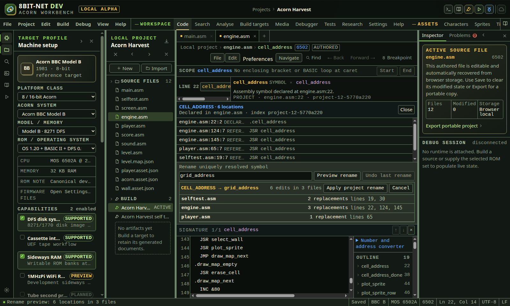
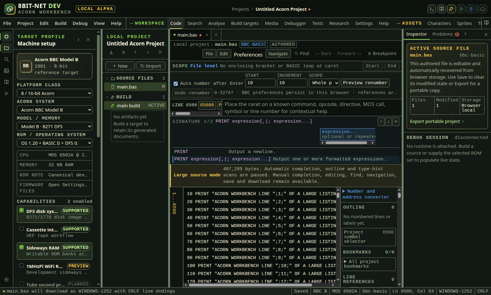
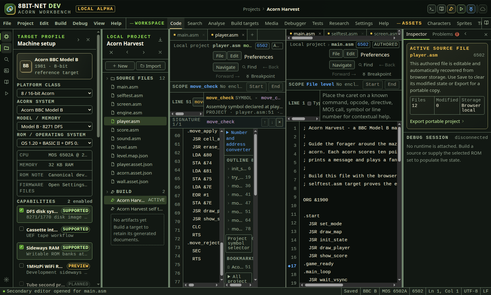
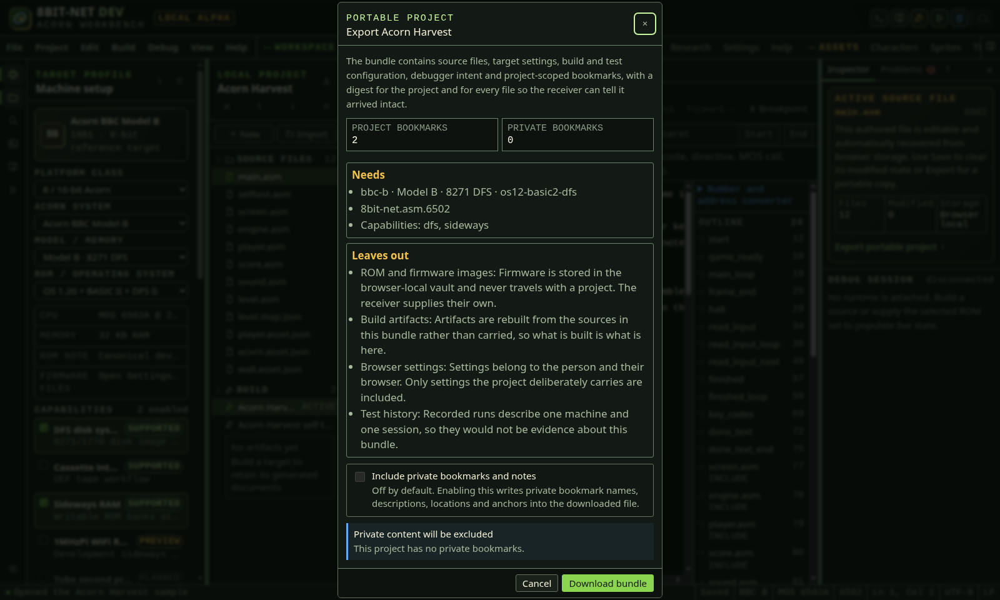
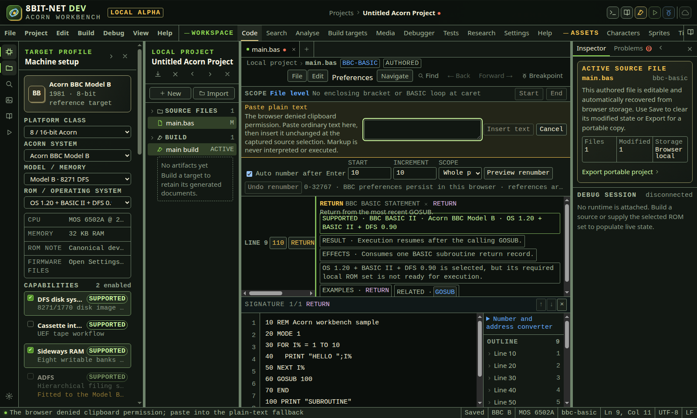
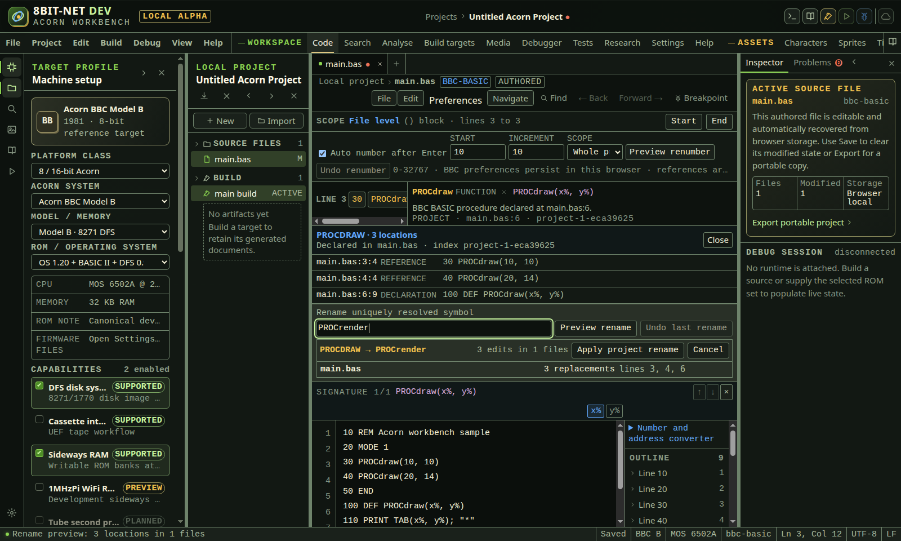
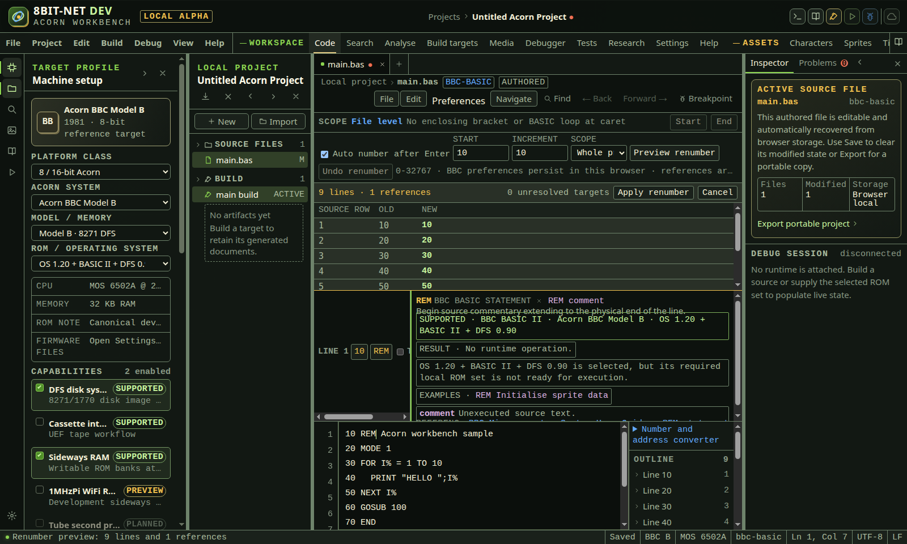
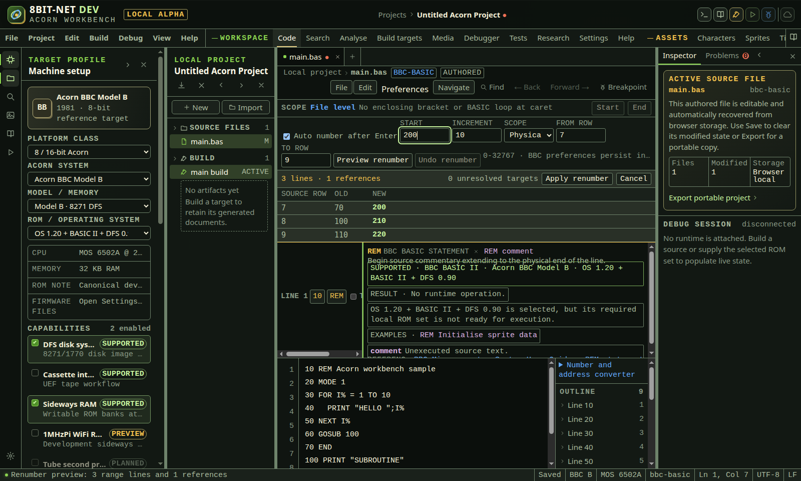
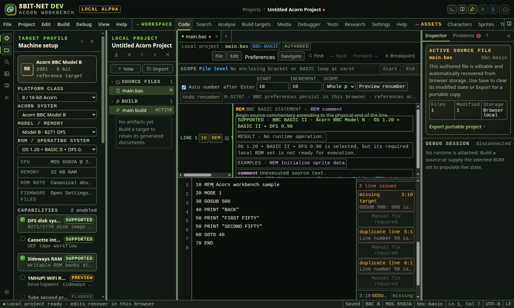

# Writing and editing source

<!-- Generated by scripts/generateGuides.mjs from src/help/helpTopics.ts. Edit the topics, not this file. -->

## 1. Edit source with completion, help and navigation

Use the source editor for BASIC, 6502, ARM, C and text with language-aware completion, definitions, references, bookmarks and safe editing commands.

**Before you start**

- A source file is open
- The selected target and active build toolchain match the source language

**Procedure**

1. Type to request automatic completion or press Ctrl+Space.
2. Press Ctrl+Shift+Space for signature help.
3. Hover or focus a recognized token to read its definition, compatibility, parameters, effects and cited source.
4. Open Project symbol selector in the source sidebar. Search by any combination of symbol name, parsed kind or filename, such as paint label lib.
5. Press Enter to open the first filtered symbol, or choose a result to move to its exact file, line and declaration column. Press Escape in the search field to clear it.
6. Open Number and address converter in the source sidebar for decimal, Acorn hex, dollar hex, C hex, binary or octal input.
7. Choose an 8, 16 or 32-bit width. Read unsigned and signed decimal, fixed-width binary, octal, little-endian bytes, big-endian bytes and printable low-byte text.
8. Use Toolchain literal for the active ca65, Acorn-style, C or ARM source syntax. Check the address row before using the value as a 6502-family or word-aligned ARM 26-bit address.
9. Use Split editor or Ctrl+Backslash for an independently navigable second source pane.
10. Use F12 or the visible definition command to jump to a symbol, label or BASIC line.
11. Use references and navigation history to inspect callers and return.
12. To rename a uniquely resolved assembly label, C function or BASIC PROC/FN routine, place the caret on a resolved use or declaration and choose References.
13. Enter the replacement identifier and choose Preview rename. Review every affected file, source line and replacement count.
14. Choose Apply project rename only when the preview is complete. All connected files change in one project transaction. Use Undo last rename to restore every affected file.
15. A rename is refused if resolution is ambiguous, a range became stale, the identifier is invalid, the replacement collides, source is protected or conditional, or an occurrence cannot be classified safely.
16. Use Ctrl+F and Ctrl+H for find and replace.
17. Use the BASIC numbering command to preview numbering or renumbering before applying it.
18. Add a bookmark with Ctrl+Alt+B and navigate bookmarks with Ctrl+Alt+PageUp or Ctrl+Alt+PageDown.

**What should happen**

- Completion is filtered by language, processor, selected ROM and project symbols.
- No completion is offered inside comments or strings where it would be invalid.
- The symbol selector uses the parsed project index shared with completion, definition, references and safe rename. It does not create results from arbitrary text matches.
- Open Preferences in the editor toolbar to set 10 to 18 pixel text, bounded line height, 2, 4 or 8-column tabs and word wrapping. The validated browser-local settings apply to every source file and survive reload.
- Unresolved and ambiguous targets are reported instead of guessed.
- Assembly rename follows the same connected INCLUDE graph used by definition and reference lookup.
- Normal undo and redo includes editor commands and accepted BASIC renumber operations. Project rename provides its own cross-file undo control.

**Limits**

- Assembly type inference is not claimed. BASIC type hints follow documented naming and expression rules.
- The selector displays at most 200 parsed symbols at once. Enter a search to narrow larger indexes. Constants, macros and C declarations require the remaining language-adapter work before they can be listed authoritatively.
- Safe project rename covers uniquely resolved assembly labels, C functions and BASIC PROC/FN routines. Numeric BASIC targets use renumbering. Variables, members, macros, conditionals and unclassified occurrences remain blocked.
- Editor preferences are local to this browser profile and are not included in the portable project.
- Clipboard permission can be denied by the browser; the editor exposes a manual fallback.

**If it goes wrong**

- Undo an unwanted edit with Ctrl+Z.
- Use source navigation Back and Forward if a definition jump moved away from the original location.
- Rebuild the project index after fixing an INCLUDE path or duplicate label.

*Safe rename lists every declaration and reference change. The source sidebar converts the same target context into exact literals, values, byte order and address validity.*

In the IDE: Help → `#help/editor`

## 2. Control source encoding and large files

Detect legacy source bytes, edit normalized text, choose exact download encoding and line endings, and understand the bounded large-file policy.

**Before you start**

- A project source file is open
- Use Import for an existing host source file
- Use Preferences in the source toolbar to inspect or change its text format

**Procedure**

1. Import a source file. Files up to 1 MiB are read as bytes rather than through an assumed browser text encoding.
2. The importer first validates UTF-8. A leading UTF-8 byte-order mark selects UTF-8 BOM. Invalid UTF-8 falls back to Windows-1252.
3. The importer detects LF, CRLF or CR. Mixed input is reported internally and the dominant convention becomes the download setting.
4. Edit the normalized source. The editor uses LF internally so caret, language parsing, bookmarks and build inputs are independent of the host convention.
5. Open Preferences and read Encoding and Line endings for the active file.
6. Choose UTF-8, UTF-8 BOM or Windows-1252. Choose LF, CRLF or CR independently.
7. Read the status bar to confirm the active pane encoding and line-ending setting.
8. Save the file in the browser to make the selected format part of its saved baseline. Revert restores saved content, encoding and line endings together.
9. Choose Download. The application encodes the current source and writes the selected line-ending bytes before creating the file.
10. For Windows-1252, resolve any reported unrepresentable character before download. The application refuses the download rather than replacing data with a question mark.
11. When a source exceeds 256 KiB, read the Large source mode banner. Automatic completion, outline, type-hint scans and individual gutter rows pause, while editing, manual completion, find, navigation, save and download remain available.
12. Keep each editable source at or below 1 MiB and the project source total at or below 8 MiB. Oversize imports, portable manifests and edits are rejected with a textual reason.

**What should happen**

- Windows-1252 punctuation and pound signs decode to the intended Unicode editor text and can round-trip to their original bytes.
- UTF-8 BOM download begins with EF BB BF and otherwise contains valid UTF-8.
- CRLF download writes every editor newline as 0D 0A. CR writes 0D and LF writes 0A.
- Format changes mark a previously saved file as modified even when its visible text is unchanged.
- Project format v16 persists current and saved encoding, line-ending state, provenance and access state.
- Projects from earlier formats migrate to UTF-8 and detected or LF line-ending defaults.
- Large source mode is announced as text and the status is exposed to assistive technology.
- The 1 MiB file and 8 MiB project bounds apply before source enters editor or project state.

**Limits**

- The supported legacy single-byte encoding is Windows-1252. Other code pages require an explicit conversion before import.
- Encoding selection applies to host download and saved project metadata. Build adapters receive normalized project text and own their output encoding contracts.
- Mixed line endings are normalized on import. The application preserves the dominant convention, not the original mixture.
- Large source mode is a bounded fallback, not a full virtualized code editor. Files above 1 MiB are intentionally outside the editable source path.
- Binary, tokenized BASIC, disc images, tape images and ROM files belong in Analyse, Media or ROM management rather than the source editor.

**If it goes wrong**

- If text appears incorrect after import, do not save over the original host file. Convert it to UTF-8 or Windows-1252 with a trusted byte-aware tool, then import again.
- If Windows-1252 download is refused, replace or transliterate the named character, or choose UTF-8.
- If a file is rejected for size, split generated data into build inputs or use the binary analysis and media workflows.
- Use Revert in the editor's File menu to restore both text and saved byte-format choices.
- Keep a portable project export before changing many file formats so the source and metadata can be inspected independently.

*The format controls remain available in large source mode while eager semantic scans and thousands of gutter controls are paused.*

In the IDE: Help → `#help/source-text-format`

## 3. Work in two source editor panes

Open two independently navigable source views and retain pane, file, caret, selection and vertical scroll through source navigation history.

**Before you start**

- At least one editable source file is open
- Use a viewport wide enough for side-by-side panes, or expect the responsive layout to stack them

**Procedure**

1. Focus the source file that should seed the second pane.
2. Select Split editor from the primary editor's File menu, or press Ctrl+Backslash in the primary editor.
3. Confirm that Primary source editor pane and Secondary source editor pane are exposed to assistive technology. The focused pane has a non-colour focus edge.
4. Choose a tab independently in either pane. Selecting a secondary tab does not replace the primary file.
5. Move the caret, selection and vertical scroll independently in each pane.
6. Invoke Definition, Declaration, Implementation, Type definition, References, Call hierarchy, a jump target or project source search from the active pane.
7. Confirm that the destination opens in the same pane that initiated the request.
8. Select Back or press Alt+Left. The preceding pane, file, caret, selected token and vertical scroll are restored.
9. Close the secondary pane with Close split, or focus it and press Ctrl+Backslash.
10. Use Back after closing when the preceding source location belonged to the secondary pane. The split reopens with its recorded file and exact source view.
11. Use Forward or press Alt+Right to return to the later location and layout.
12. On a narrow viewport, work with the same two panes in the responsive stacked layout. The source outline is hidden there to preserve editing width.

**What should happen**

- Each pane has its own active file, caret, selected range and scroll position while both edit the same project source records.
- An edit made in one pane updates the shared project file and is visible in the other pane.
- Source navigation is recorded in a bounded 100-entry history with the pane and split layout that owned each location.
- Back can reopen a closed split when its target was in the secondary pane. Forward can restore a recorded unsplit primary layout.
- Visible Split editor and Close split controls provide the same operation as Ctrl+Backslash.
- The active pane is identified by text for assistive technology and a theme-token focus edge for sighted users.

**Limits**

- The current layout supports one primary and one secondary source pane.
- The split is session workspace state. It is restored by navigation history during the session but is not written into a portable project file.
- Find state, completion popups, reference peeks and command undo stacks are local to each mounted pane.
- Closing a split does not close or delete a project file.
- The secondary pane presents project source tabs. Generated documents and immutable SDK headers continue to use their dedicated read-only views.

**If it goes wrong**

- If a navigation result opens in the unexpected pane, focus the intended editor before invoking the command again.
- Use Back to recover the previous exact pane state after an unwanted jump.
- Use Reset split from the primary editor's File menu to reopen the secondary pane from the primary file.
- If the responsive layout is too constrained, close the target profile or inspector panels, increase viewport width or close the split.
- If a file was deleted, history ignores that unavailable destination instead of recreating source.

*The secondary pane has returned from lib.asm to the exact draw call in main.asm. The primary pane remains at its independent source position.*

In the IDE: Help → `#help/editor-splits`

## 4. Use source bookmarks and private notes

Mark source locations for project navigation, attach bounded technical notes and control whether each record can enter a portable project file.

**Before you start**

- A source file is open
- The Project explorer is visible if you also need the portable export control

**Procedure**

1. Place the caret on the intended source line and select Add bookmark, or press Ctrl+Alt+B.
2. Enter a concise bookmark name. The bookmark initially uses project scope and has an empty description.
3. Open All project bookmarks in the source sidebar.
4. Select Description to add or replace a technical note. An empty value clears the note.
5. Select Make private when the name, note, location or anchor must remain in the current browser project by default. The PRIVATE text badge and sidebar marker identify this state without relying on colour.
6. Select Make project to return the record to ordinary portable project scope.
7. Disable a bookmark without deleting it when it should be skipped during next and previous navigation.
8. Search by name, description, scope, filename or line.
9. Use Bookmark up and Bookmark down, or Ctrl+Alt+PageUp and Ctrl+Alt+PageDown, to move across enabled non-orphan bookmarks with wraparound.
10. Choose Project then Export in the workbench menu bar. Review the project and private bookmark counts.
11. Leave Include private bookmarks and notes clear for a privacy-safe export. Select it only after confirming that every private name, description, location and anchor may be shared.
12. Download the portable project. The status message reports included bookmarks and any private records excluded.
13. Use the editor gutter breakpoint control instead when an executable debugger stop is required.

**What should happen**

- Bookmarks persist locally by file, line, column, bounded source anchor, name, description, scope and enabled state.
- Projects created before bookmark scope support migrate with empty descriptions and project scope.
- Deterministic edits move anchors. Deleted anchors become explicit orphan records instead of attaching to guessed code.
- Portable export excludes every private bookmark record by default, including its name, description, location and anchor.
- Explicit private inclusion applies only to that download. The export dialog returns to the safe excluded setting the next time it opens.
- An imported private bookmark remains private and will again be excluded from the next default export.
- ROM bytes and credentials are excluded regardless of the bookmark choice.
- Source breakpoints resolve through current build metadata before hardware installation.

**Limits**

- Private scope is a local export policy, not encryption. Anyone with access to this browser profile or an explicitly unredacted export can read the record.
- A bookmark has no effect on emulator execution.
- A source breakpoint cannot install when its line has no emitted instruction in the current build.
- Bookmark descriptions are plain text and are limited to 1000 characters. Names, anchors and imported records are also bounded during validation.

**If it goes wrong**

- If a private record was included accidentally, delete the downloaded file and create a new export with private inclusion clear. The application cannot recall a file that has already been copied or shared.
- Recover an orphaned bookmark by opening its file, placing the caret on the intended line and selecting Recover.
- If an imported record is missing, confirm whether it was private and therefore excluded by the exporter.
- Rebuild after changing code layout so source breakpoints resolve to current addresses.

*The export review counts both scopes and excludes the complete private bookmark record until the user explicitly includes it.*

In the IDE: Help → `#help/bookmarks`

## 5. Cut, copy and paste source safely

Exchange ordinary plain text with the operating-system clipboard without executing markup or applying a delayed result to changed source.

**Before you start**

- An editable source file is active
- A secure browser context for direct clipboard access, or permission to use the manual fallback

**Procedure**

1. Select source text. With no selection, Copy and Cut operate on the visibly active source line only.
2. Open Edit and choose Copy or Cut. The IDE writes only the visible text range through the browser plain-text API.
3. Choose Paste plain text to read ordinary text at the captured source selection.
4. If the browser denies or does not expose clipboard read access, use the labelled Paste plain text fallback.
5. Paste into the fallback field, review the literal contents, then choose Insert text. Cancel closes it without changing source.
6. Use Undo command after a completed Cut or Paste plain text operation.
7. If source or the active file changes while clipboard permission is pending, repeat the operation at the intended current selection.

**What should happen**

- HTML, script-looking text, Unicode and Acorn characters remain ordinary source characters. The IDE does not parse, execute, format or otherwise interpret pasted text.
- Direct clipboard transport is bounded to 8,388,608 characters in each direction.
- Delayed Cut and Paste compare the active file and complete source snapshot before mutation. A stale result is cancelled.
- The fallback retains the original file, source and selection context and refuses insertion after that context changes.
- Generated artifact documents remain in their separate read-only viewer and are never included in an editor line or selection copy.

**Limits**

- The HTML textarea represents line breaks as LF. A platform clipboard may supply CRLF, but the editor surface exposes its browser-normalized LF representation.
- Direct clipboard access depends on browser permission policy, focus, origin security and user gesture requirements.
- The legacy browser copy fallback can select visible source for the browser copy command, but it cannot bypass a browser or operating-system denial.

**If it goes wrong**

- Use Ctrl or Command+C on the visible source selection if direct clipboard write and the browser fallback are both denied.
- Use the manual plain-text fallback when direct read is unavailable.
- Repeat a cancelled operation after confirming the current file and selection.

*The fallback names the denial, accepts reviewable ordinary text and inserts only after an explicit action at the captured source selection.*

In the IDE: Help → `#help/clipboard-safety`

## 6. Rename resolved symbols and apply safe quick fixes

Preview an atomic project symbol rename or a narrowly proved BASIC line-number repair while refusing protected, conditional, ambiguous, stale and unclassified source.

**Before you start**

- The source file is editable
- Rename requires one uniquely resolved assembly label, C function, BBC BASIC procedure or BBC BASIC function
- A BASIC line-number quick fix requires one non-empty unnumbered row with a collision-free number

**Procedure**

1. Place the caret on a declaration or resolved reference and press Shift+F12, or choose References.
2. Read the declaration and reference list. Confirm that the resolved token and every expected project location are present.
3. Enter a replacement in Rename uniquely resolved symbol.
4. For assembly and C, use an identifier beginning with a letter or underscore. For BASIC, retain the PROC or FN prefix and its routine kind.
5. Choose Preview rename. No project source changes at this stage.
6. Review the replacement count, affected files and physical source lines.
7. If the preview is blocked, read every reason. Resolve ambiguity, collision, conditional compilation, protected source, stale ranges or unclassified occurrences before retrying.
8. Choose Apply project rename only while the complete preview matches the current project revision.
9. Confirm that every affected editable file changes in one project transaction.
10. Choose Undo last rename to restore the exact prior content of every affected file while the undo remains current.
11. For a missing BASIC line-number diagnostic, choose Preview quick fix beside that diagnostic.
12. Review the proposed collision-free number and complete resulting source line in BASIC quick fix preview.
13. Choose Apply quick fix to insert the number as one edit, or Cancel to leave source unchanged.
14. Choose Undo last quick fix to restore the exact unnumbered source row.
15. For duplicate lines, missing targets, ambiguous targets and out-of-range numbers, read Manual fix required. The IDE does not manufacture a destination or choose among ambiguous declarations.

**What should happen**

- C rename remains case sensitive and follows the connected include graph.
- BASIC PROC and FN rename is case insensitive for matching but cannot change one routine kind into the other.
- Assembly rename follows only the connected include graph and retains local leading-dot syntax.
- String and comment text does not become a rename location.
- A protected or generated occurrence blocks the complete rename instead of being silently excluded.
- Conditional source blocks rename until an authoritative active-branch model is available.
- Any lexical occurrence not classified as the same declaration or reference blocks rename.
- Both rename and quick-fix apply revalidate the exact source used by their preview.
- Quick-fix numbering uses the configured start and increment, then a real numeric gap when required.

**Limits**

- Safe C rename currently covers parsed functions and direct calls. Variables, members, macros, function pointers and compiler-generated occurrences require authoritative compiler language records.
- Safe BASIC rename covers PROC and FN routines in one file. Numeric targets use renumbering and Atom compact labels remain manual when ambiguous.
- Assembly operands not classified by the registered reference provider block rename instead of being changed from text matching alone.
- Conditional compilation is refused conservatively for affected assembly, ARM and C source files.
- The implemented automatic diagnostic repair covers only a missing physical BASIC line number with a proved free value.
- Project rename undo and BASIC quick-fix undo each retain one most recent compatible operation.

**If it goes wrong**

- Open References again after any source, include or target change.
- Remove or rename a colliding declaration before retrying.
- Edit the generating input rather than a protected generated output.
- Use project search to inspect an unclassified occurrence, then use an authoritative language adapter or a reviewed manual edit.
- Use Preview renumber when no integer gap is available for an unnumbered BASIC row.
- Export the portable project before a broad refactor when an independent recovery copy is required.

*The rename preview and line-number repair show exact affected source before either atomic edit is accepted.*

In the IDE: Help → `#help/safe-rename-quick-fixes`

## 7. Enter and renumber BBC or Atom BASIC lines

Configure persistent automatic line numbering, insert a safe next or gap line, and preview a whole-program renumber before one atomic edit.

**Before you start**

- A BBC BASIC or Atom BASIC source file is open and editable
- The selected machine identifies the required BBC or Atom dialect

**Procedure**

1. Find the BASIC numbering tools above the source editor.
2. Enable Auto number after Enter to request a number only after a valid numbered program line.
3. Set Start to an integer from 0 to 32,767 and Increment to an integer from 1 to 32,767.
4. Note the BBC or ATOM label. Each dialect has separate browser-local Enabled, Start and Increment preferences.
5. Place the caret at the end of a numbered line, after all non-whitespace source text, with no range selected.
6. Press Enter. The editor proposes the preceding line number plus Increment when that value is in range and below the following program line.
7. When the configured value collides with the following line, the editor uses the midpoint of a real numeric gap and reports that strategy.
8. When no free integer exists or the next value exceeds 32,767, the editor inserts only a newline and reports that the program must be renumbered.
9. Select Preview renumber to validate every non-empty physical line, duplicate number, final range and supported direct reference before changing source.
10. Review old and new line mappings, updated reference count, unresolved target list and any blocking error.
11. Select Apply renumber only when the preview is current and complete. The complete source changes once.
12. Select Undo renumber to restore the exact pre-renumber content while that operation remains available.

**What should happen**

- Automatic numbering never replaces a selected source range.
- Enter in the middle of non-whitespace source leaves ordinary browser editing behavior in control and does not manufacture a numbered split line.
- Start and Increment are validated with the same 0 to 32,767 contract used by preview and automatic insertion.
- BBC and Atom preferences persist separately in local browser storage and malformed or denied storage returns to enabled 10,10 defaults.
- Gap insertion chooses an integer strictly between the preceding and following declared lines.
- Preview preserves quoted strings, DATA payloads and REM text while updating proved direct targets.
- A stale preview is refused after source changes.
- Read-only generated BASIC disables numbering controls and also has a project-level mutation boundary.

**Limits**

- Numbering preferences are local to one browser profile and are not exported with project source.
- Automatic numbering operates only after a syntactically recognizable physical line number. It does not convert immediate-mode commands into program lines.
- Whole-program preview currently renumbers the complete file. Selected-range renumbering remains tracked under EDT-218.
- Computed expressions and references not proved by the BASIC scanner remain unchanged and reported where applicable.
- Undo renumber is a dedicated one-operation control and is cleared by later incompatible source operations.

**If it goes wrong**

- If Enter does not add a number, move the caret after all source text, clear the selection and confirm Auto number is enabled.
- If settings return to 10 and 10, check whether browser storage is blocked or the previous values were out of range.
- If no gap exists, preview a whole-program renumber with a smaller increment or a different start.
- Resolve duplicate input numbers and unnumbered non-empty lines before applying preview.
- Export a portable project before a large renumber when an independent recovery copy is required.

*Automatic entry preferences and whole-program renumber evidence remain visible before the source is changed.*

In the IDE: Help → `#help/basic-numbering`

## 8. Renumber a physical BASIC source range

Renumber only numbered statements within an inclusive physical-row range while safely updating proved references from the complete program.

**Before you start**

- An editable BBC or Atom BASIC source file is open
- The program uses unique line numbers
- The physical source rows to change are known

**Procedure**

1. Open the BASIC numbering tools above the source editor.
2. Choose Physical line range in Scope.
3. Enter the first inclusive physical source row in From row.
4. Enter the last inclusive physical source row in To row. The last row must not precede the first.
5. Set Start to the new number for the first numbered line inside the range.
6. Set Increment to the spacing between subsequent numbered lines inside the range.
7. Choose Preview renumber. No source changes at this stage.
8. Review every mapping. Source row identifies the physical file row, Old is its current BASIC line number and New is the proposed number.
9. Confirm that lines outside the physical range are absent from the mapping and retain their numbers.
10. Review the reference count. Proved GOTO, GOSUB, RESTORE, RESUME, THEN, ELSE, RUN and computed GOTO or GOSUB list targets are updated across the complete program, including callers outside the selected range.
11. Review unresolved targets. References to declared lines outside the range remain valid and are not misreported as unresolved.
12. Resolve every blocking duplicate, unnumbered selected row, overflow, destination collision, preceding-order or following-order error.
13. Choose Apply renumber only while the preview still matches current source. The range and every proved incoming reference change in one edit.
14. Choose Undo renumber to restore the exact complete source before that range operation.

**What should happen**

- Only numbered lines whose physical rows fall inside the inclusive range receive new line numbers.
- References from inside and outside the range to changed numbers are updated.
- References to declared unchanged numbers outside the range are preserved without warnings.
- A destination that belongs to an unselected line is rejected even if the selected mappings would otherwise be unique.
- The first new number must follow the nearest preceding numbered row, and the final new number must precede the nearest following numbered row.
- Duplicate original numbers remain blocking because a numeric target would be ambiguous.
- Strings, DATA statements and REM tails use the same protected-text scanner as whole-program renumbering.
- Apply is atomic and a stale preview is refused.

**Limits**

- The range is expressed in physical editor rows, not BASIC line-number values.
- Blank rows inside the range are ignored. A non-empty unnumbered row inside the range blocks the preview.
- The initial implementation updates maintained direct numeric target forms. Arbitrary computed expressions cannot be rewritten safely.
- Undo range renumber is the same dedicated one-operation undo as whole-program renumber and is cleared by later incompatible operations.
- Range selection is entered numerically. Dragging a source selection does not implicitly change renumber scope.

**If it goes wrong**

- Use the source gutter line numbers to correct From row and To row.
- Choose a Start and Increment that fit strictly between unchanged surrounding BASIC line numbers.
- Include a colliding surrounding line in the range only when it should deliberately move too.
- Resolve duplicate source numbers before relying on numeric target rewriting.
- Close the preview or change any range field to discard a proposal without altering source.

*The range preview maps only physical rows two to four while proved callers across the complete program are evaluated before apply.*

In the IDE: Help → `#help/basic-range-renumber`

## 9. Navigate BASIC lines and resolve line diagnostics

Open exact BASIC line declarations and references, then distinguish missing, duplicate, ambiguous and out-of-range line states without guessed navigation.

**Before you start**

- A BBC or Atom BASIC source file is open
- The source outline is visible

**Procedure**

1. Open the LINE REFERENCES section in the source outline.
2. Enter a declared BASIC line number in Line and choose Go, or press Enter in that field.
3. Use Previous reference and Next reference to wrap through parsed reference operands in physical source order.
4. In the reference list, choose the left source-location control to select the exact numeric operand in its calling line.
5. Choose the right target control to open a unique declared target.
6. Read missing when no declaration owns the target number. The control reports its reason and does not jump.
7. Read a candidate count followed by a question mark when duplicate declarations make the target ambiguous.
8. Open the line issues section when it appears. Each row names missing line number, line range, duplicate line, duplicate Atom label, missing target or ambiguous target.
9. Choose a diagnostic row to select its exact physical source location.
10. For Atom BASIC, treat compact forms such as 100aPRINT as numeric line 100 plus label a. Duplicate labels remain ambiguous even when their physical order differs.
11. Correct the declaration or reference, then confirm that the live issue and reference state update from current source.
12. Build or tokenize only after the live navigation model is clear. Build diagnostics remain an additional validation layer.

**What should happen**

- Direct line navigation selects the declaration number, while source-reference navigation selects the operand that uses it.
- Reference rows expose source and target as separate keyboard-operable controls.
- Missing and ambiguous states use text and control semantics rather than colour alone.
- Every duplicate numeric declaration receives its own diagnostic at its physical location.
- Numeric references to compact Atom declarations resolve to the correct physical row.
- Strings, DATA payloads and REM tails do not create line references.
- BBC tokenized round trips preserve declared lines, exact reference ranges, resolution states and diagnostics.
- Atom packed-text round trips preserve numeric and compact-label navigation semantics.

**Limits**

- The scanner covers maintained direct numeric target forms and Atom compact labels. Arbitrary computed expressions are not guessed.
- Diagnostics describe current editable text. A stale build can have different retained source evidence until rebuilt.
- A duplicate declaration cannot be resolved by choosing the first physical occurrence because that would conceal ambiguity.
- Tokenized semantic round-trip evidence covers BBC BASIC II. Other BASIC ROM dialects require their own qualified codecs before claiming equivalence.

**If it goes wrong**

- Add the missing numbered line or correct the target operand.
- Renumber or remove duplicate declarations, then confirm the ambiguous state disappears.
- Use Preview renumber when several numeric declarations and references need coordinated changes.
- Select the correct Atom machine profile when compact label syntax is expected.
- Use project search for text that is intentionally inside strings, DATA or REM and therefore excluded from navigation.

*The live model exposes ambiguous and missing targets without selecting a declaration by accident.*

In the IDE: Help → `#help/basic-line-diagnostics`
