# Running a machine, and controlling it

<!-- Generated by scripts/generateGuides.mjs from src/help/helpTopics.ts. Edit the topics, not this file. -->

## 1. Run the selected Acorn machine

Start, pause, reset and interact with the genuine configured emulator adapter and distinguish its state from build or UI state.

**Before you start**

- All required firmware imported
- Selected machine profile supported by an emulator adapter

**Procedure**

1. Use Run to build the active target when required and load its compatible artifact.
2. Click the emulator canvas before typing so it owns keyboard focus.
3. Use the runtime toolbar for pause, continue, reset, audio and capture.
4. Mount media through Media rather than changing emulator internals.
5. Open Debugger for register, memory and instruction control.
6. Open Debug session, then read Emulator adapter API 1. Every EMU-001 lifecycle, media, artifact, input, state, capture, inspection and debug operation is declared as yes or no for the exact adapter revision.
7. Treat a no operation as an enforced capability boundary. The interface also gives the technical limitation, such as unavailable A310 state serialization or audio capture.
8. Open Runtime performance in the Debugger to inspect the active frame interval, average and maximum interval, late frames and estimated dropped presentation slots.
9. Compare Audio path latency with the declared adapter capability. The jsbeeb path counts long sound-buffer gaps while audio is enabled. The pinned A310 adapter reports AudioContext latency and SDL queue depth, but labels its callback underrun counter unavailable.
10. Read the resource budget chips for active session count, 20 ms frame target, snapshot cadence, trace capacity and per-drive media bytes.
11. Check Background before diagnosing an apparent stop. A hidden WebIDE pauses the genuine core and active audio, then restores the prior run state when visible.
12. Open the bounded crash list after a runtime error. Records contain monotonic time, category and a redacted 500-character message. It retains at most 16 entries and does not capture source, ROM or memory content.

**What should happen**

- The status names the real adapter and selected ROM profile.
- The adapter disclosure names its pinned revision and never enables an undeclared operation.
- Keyboard input goes to the emulator only while its surface has focus.
- Audio activation asks for a user gesture when required by browser policy.
- Runtime performance names the isolated iframe and worker boundaries, the exact budgets and the source of each measurement.
- Dropped-frame values are labelled as estimates derived from active requestAnimationFrame intervals, not emulator accuracy claims.

**Limits**

- Atom, BBC family, Electron and Archimedes use different cores and expose different debug capabilities.
- A310 RISC OS initialisation can be lengthy even when fast boot is enabled.
- Browser frame timing includes scheduler and headless-browser effects. Use it to diagnose delivery pressure, not to certify emulated hardware timing.
- The pinned A310 SDL adapter does not expose callback underruns. The interface reports this absence instead of displaying a fabricated zero-rate claim.

**If it goes wrong**

- Reset the machine if guest software leaves it unusable.
- If the adapter reports an error, choose Restart adapter on the emulator status overlay. This destroys the failed iframe, clears pending commands and creates a new random session before reloading the same resolved profile.
- Pause before editing registers or memory.
- Reimport firmware if startup reports a missing or rejected ROM.
- If drops rise while hidden, confirm the background indicator changes to suspended. A hidden session should not accumulate active-frame samples.
- If audio gaps rise, keep only one active machine session, close expensive trace or raster capture, and verify that the AudioContext is running after a user gesture.

*The emulator remains beside the active tool so target, build and machine state can be compared without leaving the workbench.*

In the IDE: Help → `#help/emulator`

## 2. Power cycle and pace the live emulator

Release a complete emulator session, boot a new isolated machine and select a qualified jsbeeb CPU pacing rate without confusing pause, reset or display scaling with physical power.

**Before you start**

- A selected machine with all required firmware ready
- A jsbeeb-backed Atom, Electron, BBC or Master profile for live runtime speed control
- Machine audio muted before selecting any speed other than authentic 1x

**Procedure**

1. Open Code and locate the emulator toolbar below the source workspace.
2. Wait for the machine status to report running or paused. Power is available as soon as the configured full-machine adapter is available.
3. Use Run and Pause to change processor execution without discarding RAM, mounted media or the emulator session.
4. Use Reset to assert the emulated machine reset path. Reset preserves the iframe session but returns the selected machine to its reset state.
5. Open Runtime speed and select 0.5x, 1x, 2x or 4x on a jsbeeb machine.
6. Wait for the bottom status to report that the live jsbeeb runtime accepted the chosen rate.
7. Confirm the machine overlay shows the accepted multiplier beside the emulated cycle count.
8. At 0.5x, the runtime executes half of the authentic CPU cycle budget per 50 Hz presentation callback. At 2x and 4x it executes two or four times that budget.
9. Treat display scaling as separate. Fit, 1x and 2x framebuffer choices change only the CSS viewport and do not change CPU pacing.
10. Return to authentic 1x before enabling machine audio. The audio control is disabled at other rates because accelerated or reduced sound is not currently qualified.
11. Select Power off machine when the full volatile machine must be released.
12. Confirm that the emulator canvas disappears and the powered-off explanation appears. Run, Pause, Step, Reset, input, state, capture and display controls become unavailable.
13. Treat power off as destructive to volatile machine state. The iframe process, RAM, child debugger state, queued commands and live media acknowledgements are released.
14. Select Power on machine to create a new isolated iframe and boot again from the configured ROM profile.
15. Wait for a fresh running or paused snapshot before issuing debugger or input commands.
16. On jsbeeb machines, confirm the retained runtime speed is applied again only after the new child reports ready.
17. Open Debug session when auditing isolation. The session identifier before power off must differ from the identifier after power on.
18. Use Save machine state before power off only on adapters that declare deterministic state serialization. A310 does not currently declare that operation.

**What should happen**

- Power off removes the emulator iframe rather than representing shutdown with a paused processor.
- All volatile parent views are cleared with the child, including registers, memory, disassembly, hardware inspection, tests and mounted-media acknowledgements.
- Power on rotates the random session identity and boots a new child from the resolved machine and ROM configuration.
- A jsbeeb speed change is acknowledged by speed-state and then included in subsequent live snapshots.
- CPU speed changes multiply the real cycle budget passed to jsbeeb while keeping the browser presentation callback at 50 Hz.
- The selected jsbeeb speed persists for this browser origin and is re-applied to a new ready session.
- Non-authentic speed cannot be selected while audio is active, and audio cannot be enabled while a non-authentic speed is active.

**Limits**

- Live runtime speed is not available for the pinned A310 core because it does not expose a qualified pacing API. The disabled selector states this boundary.
- 0.5x, 2x and 4x change CPU work per browser presentation callback. They do not promise wall-clock delivery when the host cannot execute the requested cycles in time.
- Machine audio is qualified only at authentic 1x. Pitch-correct time stretching and accelerated audio export are not implemented.
- Power off does not serialize RAM, filing-system state, cassette position, debugger history or guest-modified media.
- A retained speed preference is origin-local UI configuration, not part of a portable project or build artifact.
- The available rates are bounded. Arbitrary multipliers and unlimited warp are not exposed because they have not been performance-qualified.

**If it goes wrong**

- If a speed choice is refused, mute audio and try again.
- If the machine becomes unresponsive at 4x, return to 1x. If it cannot accept the command, use Reset or power cycle it.
- If the host reports late or dropped presentation frames, lower the runtime speed and disable expensive trace, raster or profiler capture.
- If power on reports missing firmware, open Settings and reimport the selected ROM set.
- If state was lost after power off, restore a previously downloaded compatible state on a jsbeeb machine. Unsaved volatile state cannot be reconstructed.
- If the adapter reports an error, use Restart adapter. This also creates a new isolated child session but is intended for fault recovery rather than normal power control.

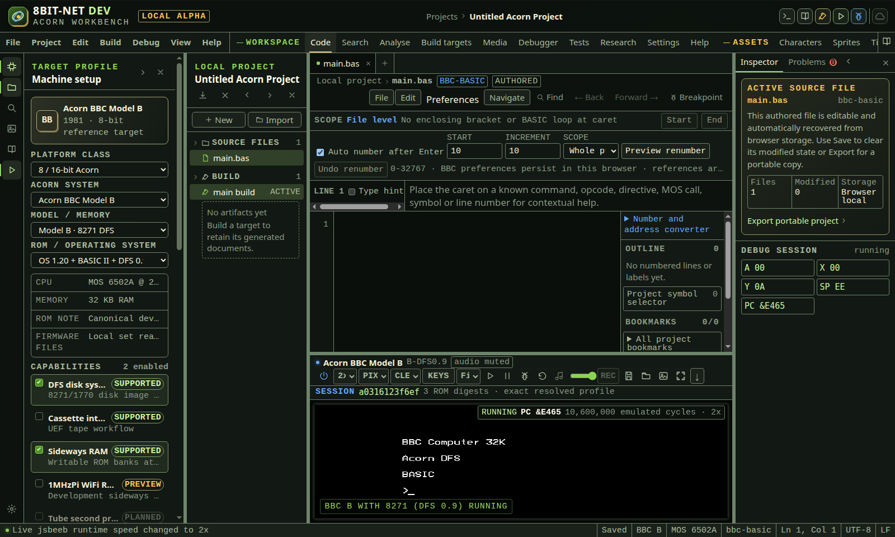

*The runtime status reports the multiplier accepted by the live child. Power releases the complete child session, while Run, Pause and Reset keep the session attached.*

In the IDE: Help → `#help/emulator-power-speed`

## 3. Control machine keyboard focus, mapping and text input

Inspect the active keyboard policy, transfer host focus deliberately, use the accessible Acorn key surface, select a saved jsbeeb mapping profile and queue bounded reviewed text through the live emulator adapter.

**Before you start**

- A selected Atom, Electron, BBC family, Master or A310 profile with all required firmware ready
- A running hardware emulator shown in the workbench
- Plain ASCII text when using the reviewed machine text queue

**Procedure**

1. Open Code and wait for the emulator status to change from booting to running or paused.
2. Choose KEYS in the emulator toolbar. The control is disabled until a real machine adapter reports state.
3. Read the focus statement at the top of Machine input before pressing a host key.
4. Choose Capture input to move browser focus into the real emulator canvas.
5. Confirm that KEYS CAPTURED and Keyboard focus is captured by the emulator are visible. Focus state comes from the child runtime, not from the parent button action.
6. Type directly only while the emulator owns focus. Host keydown and keyup events then enter the selected machine keyboard implementation.
7. Choose Release input before returning to IDE shortcuts. Moving focus to another IDE control also releases emulator focus.
8. On Atom, Electron, BBC and Master targets, select Physical, Natural or Gaming under jsbeeb mapping profile.
9. Use Physical when host key positions are preferred. Use Natural when printed UK or US characters are preferred. Use Gaming when browser shortcut positions conflict with important BBC keys.
10. Reload the IDE if required and reopen Machine input. The selected jsbeeb profile is stored for this browser origin and supplied during the next emulator initialization.
11. Use the on-screen Acorn keyboard when a host function key or modifier is consumed by the browser. Each enabled button sends one validated key tap through the session-bound runtime channel.
12. On A310, use the host canvas or reviewed text queue. On-screen buttons remain disabled until every displayed Acorn key has a verified SDL scancode mapping.
13. Enter text in Reviewed machine text. Review the character count before sending it.
14. Choose Queue text to live machine. The 6502 adapter converts the string with its Atom or BBC keyboard table. The A310 adapter converts supported characters to SDL scancodes. Both paths press the emulated keyboard rather than writing guest memory.
15. Confirm the bottom status reports the acknowledged character count. The text box clears only after the child runtime accepts the queue.
16. Use RETURN as a line feed in the text box. Windows and classic Mac carriage returns are normalized before conversion.
17. For BREAK on BBC-family machines, capture the emulator first and press host F12. If the browser retains F12, use a non-conflicting profile or the maintained on-screen key when present.
18. Open Debugger and inspect the keyboard matrix or adapter command audit when proving an automated input sequence. The event and audit records retain the active random session identity.

**What should happen**

- Input capture changes only after the active emulator iframe reports its real canvas focus state.
- Release clears held keys where the adapter exposes that operation and returns IDE shortcut ownership to the parent document.
- The jsbeeb mapping choice is validated as Physical, Natural or Gaming and persists in local storage for the same origin.
- An on-screen jsbeeb key reports key-tapped only after the live adapter accepts the maintained host-key identity.
- A text queue is limited to 4,096 characters and reports its accepted character count from the emulator iframe.
- The 6502 text path uses the selected machine keyboard conversion table and scheduler. The A310 text path uses the pinned core host-key bridge.
- Focus, layout, tap and text events carry the same random session identity as the active emulator.

**Limits**

- Reviewed text accepts printable ASCII, line feed and tab at the shared validation boundary. A target converter can support a smaller set and will refuse unsupported punctuation.
- The A310 on-screen key grid is display-only until its complete SDL mapping is verified. Disabled controls state this boundary.
- Physical, Natural and Gaming are complete upstream jsbeeb mapping profiles. A separately validated custom table can override up to 32 maintained host identities on jsbeeb.
- Standard browser gamepads can drive six held jsbeeb key actions or the qualified BBC and Master ADC plus System VIA fire path, and A310 has qualified absolute mouse input. Atom and Electron expansion joysticks, 6502-family mouse devices and unrestricted peripherals remain unfinished EMU-404 work.
- Some browser and operating-system shortcuts cannot be overridden. The IDE does not claim they reached the guest unless the runtime acknowledges the related input command.
- Queued text is paced keyboard input. Guest firmware, line editors and application input routines still decide how characters are consumed.
- Input is an irreversible replay boundary in the current 6502 rewind segment.

**If it goes wrong**

- If typing edits source instead of the guest, reopen KEYS and choose Capture input.
- If KEYS is disabled, open Settings and complete the exact selected ROM manifest, then wait for genuine emulator state.
- If a held key appears stuck, choose Release input, then capture again. Reset the machine only if guest state also needs resetting.
- If queued text is refused, replace smart quotes, non-ASCII symbols or unsupported A310 punctuation with plain ASCII and send again.
- If the wrong BBC symbol appears, compare Physical and Natural profiles and confirm the host keyboard language.
- If a browser shortcut wins, use the on-screen key surface or Gaming profile where supported.
- If the adapter reports an error, use Restart adapter. This replaces the isolated frame and random session before accepting further input.

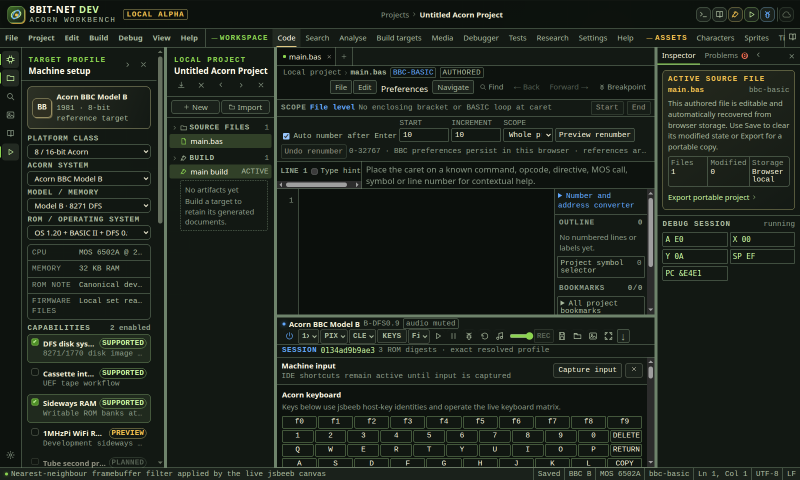

*Machine input exposes the live focus state, maintained jsbeeb mapping profiles, accessible Acorn keys and bounded text policy beside the genuine BBC framebuffer.*

In the IDE: Help → `#help/emulator-keyboard-input`

## 4. Create custom jsbeeb key mappings

Override a maintained host key identity with an Acorn key, validate conflicts and bounds, apply both matrix edges to the live jsbeeb keyboard and retain the table for the next session.

**Before you start**

- A live jsbeeb-backed Atom, Electron, BBC or Master session
- Machine input open from KEYS
- A host key that the browser allows the focused canvas to receive

**Procedure**

1. Open KEYS and locate Custom key mappings.
2. Choose a host key from the maintained list of navigation, editing, letter and function-key identities.
3. Choose the Acorn key that should receive its press and release.
4. Select Add or replace mapping.
5. Wait for the bottom status to report that jsbeeb applied the custom table.
6. Review the visible host to Acorn row.
7. Capture emulator input and press the chosen host key.
8. Confirm the intended guest key operates. The runtime translates both keydown and keyup before passing them to jsbeeb.
9. Add another mapping when required. A host identity can have only one target, and replacing it does not create a duplicate.
10. Use Remove on one row to restore that host key to the selected Physical, Natural or Gaming profile.
11. Use Clear custom mappings to restore the complete selected profile.
12. Reload or power cycle and reopen KEYS to confirm the validated table returns.
13. Treat browser-reserved shortcuts separately. A mapping cannot force the browser to deliver a key it owns.
14. Keep an accessible on-screen key available for critical actions when a host or operating-system shortcut cannot be released.

**What should happen**

- The table is limited to 32 mappings and sorted by host identity.
- Unknown host codes, unknown Acorn targets and duplicate host entries are refused.
- Changing the table clears held matrix keys before the new mapping is acknowledged.
- A remapped host key produces the selected target key on both press and release.
- The live audit event reports host code, target code, edge and random runtime session.
- The validated table persists as browser-origin configuration and is sent during a new jsbeeb initialization.
- A310 does not display this editor because its complete SDL mapping contract is not yet qualified.

**Limits**

- The maintained host list is deliberately bounded. Arbitrary browser key strings, scan codes and modifier chords are not accepted.
- Mappings operate after browser delivery and before the selected jsbeeb profile. Browser-reserved keys can still be unavailable.
- Modifier state is not synthesized except for the real Shift state accompanying the delivered event.
- Custom tables are local preferences and are not stored in the portable project or runtime run record.
- Gamepad, joystick, mouse and analogue axes are not represented by this keyboard table.
- A mapping can make ordinary text entry surprising. Reviewed text queue conversion remains independent.

**If it goes wrong**

- Remove an incorrect row or use Clear custom mappings.
- Release input and recapture it if a key appears held after changing the table.
- If the browser consumes a function key, choose another host identity or use the on-screen Acorn key.
- If persisted JSON is invalid, the IDE discards it and starts with no custom mappings.
- Return to Physical, Natural or Gaming and clear custom rows when diagnosing keyboard-layout behavior.
- Restart the adapter only if the live child refuses a valid bounded table repeatedly.

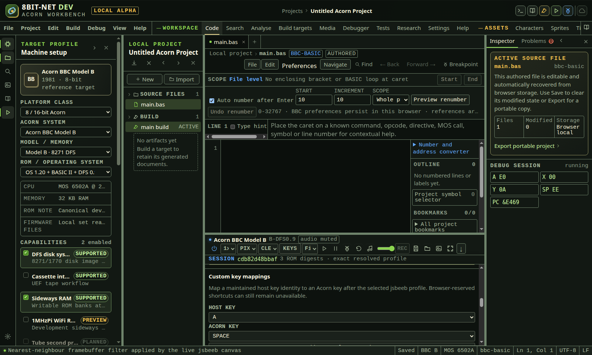

*The live test delivered both press and release as Acorn SPACE under the same jsbeeb session, then restored the mapping after reload.*

In the IDE: Help → `#help/emulator-key-remap`

## 5. Use a standard gamepad with keys or a native machine port

Poll a selected browser gamepad, then choose real held jsbeeb key edges, the BBC and Master analogue connector, or the Atom AtoMMC joystick port.

**Before you start**

- A live jsbeeb-backed Atom, Electron, BBC or Master session
- A browser exposing the Gamepad API
- A standard-mapping controller connected after user interaction where required by the browser

**Procedure**

1. Open KEYS and locate Gamepad.
2. Connect or activate the controller. Some browsers expose it only after a button is pressed.
3. Select Gamepad 1 through Gamepad 4 to match its browser index.
4. Choose an axis dead zone from 0.10 through 0.90. Start with 0.45.
5. Choose Acorn key mapping for Atom, Electron and ordinary keyboard-controlled games.
6. Map Up, Down, Left, Right, Fire 1 and Fire 2 to six different maintained Acorn keys.
7. Resolve any duplicate target error before enabling input. Unique targets prevent one action release from incorrectly releasing another held action.
8. On BBC A, BBC B, BBC B+ or Master, choose BBC analogue port when software reads the physical joystick connector.
9. On an Atom target with AtoMMC enabled, choose Atom AtoMMC port when software issues CMD_READ_PORT at &B400.
10. Enable standard gamepad polling.
11. In key mode, move standard axes 0 and 1 or use D-pad buttons 12 through 15. Buttons 0 and 1 are Fire 1 and Fire 2.
12. Read Held for the exact current key actions.
13. In BBC analogue mode, read the four exact ADC values and two fire states in the controller status.
14. Confirm left and up approach 65,535 while right and down approach 0. This inversion is the BBC hardware convention.
15. Confirm axes 0 through 3 feed ADC channels 0 through 3.
16. Confirm buttons 0 and 1 pull System VIA PB4 and PB5 low through the native fire inputs.
17. In Atom AtoMMC mode, confirm the status reports an active-low hexadecimal port. Directions use bits 0 through 3 and either browser fire button drives bit 4.
18. Disconnect the controller while a control is active. Key mode releases every held key. Analogue mode centres all channels and releases both fire inputs.
19. Reload the IDE to confirm controller index, dead zone, interface, mappings and enabled state persist for this browser origin.

**What should happen**

- Configuration validation limits controller index to 0 through 3 and dead zone to 0.10 through 0.90.
- Interface validation accepts only Acorn key mapping or BBC analogue port and migrates older saved tables to key mapping.
- All six key actions require maintained, unique Acorn target identities.
- Axes cross the key-mode dead-zone threshold deterministically and combine with standard D-pad buttons.
- Only changed key edges create runtime commands.
- BBC analogue mode clamps four axes, centres values inside the dead zone and converts the range from minus one through one to 65,535 through 0.
- The jsbeeb child installs one real ADC source across channels 0 through 3 for supported BBC and Master models.
- Native fire calls System VIA setJoystickButton, which drives the active-low PB4 and PB5 inputs.
- Every accepted analogue state returns four channel values, two button states, hardware source and the current random runtime session.
- AtoMMC mode attaches one bounded gamepad source to the real AtomMMC2 device. The guest reads right, left, down, up and fire as active-low bits 0 through 4.
- Disabling, changing configuration, losing the machine or disconnecting releases keys or centres and releases the native interface.
- The accessible live region exposes active keys or the precise native hardware mapping without requiring visual controller inspection.

**Limits**

- BBC analogue mode is offered only for the qualified BBC A, BBC B, BBC B+ and Master jsbeeb models.
- Atom supports the qualified AtoMMC joystick only when the AtoMMC capability is enabled. Other Atom joystick adapters remain in key mapping mode.
- Electron remains in key mapping mode because a qualified Electron expansion joystick is not present in the pinned browser core.
- A310 remains excluded until its pinned SDL bridge has a qualified joystick contract. Its mouse support is separate.
- Key mode uses standard axes 0 and 1, D-pad buttons 12 through 15 and buttons 0 and 1.
- BBC analogue mode uses axes 0 through 3 and buttons 0 and 1. Hat switches and additional buttons are not native ADC channels.
- Browser controller ordering can change after reconnect. Recheck the selected index.
- The browser can hide controller identity until a user gesture for privacy.
- Configuration is local preference data and is not included in portable projects or run records.
- Gamepad input creates an irreversible replay boundary.

**If it goes wrong**

- Press a controller button if the status remains Waiting.
- Select another controller index when the reported identity is wrong.
- Increase the dead zone if a worn stick produces unwanted movement.
- Disable polling to release every held key or centre the BBC ADC channels.
- For AtoMMC, disable polling or disconnect the controller to return the guest port to &FF.
- Choose six different Acorn targets when duplicate key validation is reported.
- If BBC software ignores movement, confirm it reads the analogue connector and selected ADC channel rather than keyboard or user-port hardware.
- If fire is inverted, verify the software expects active-low System VIA PB4 or PB5.
- Use Acorn key mapping to distinguish controller delivery problems from native-interface compatibility.

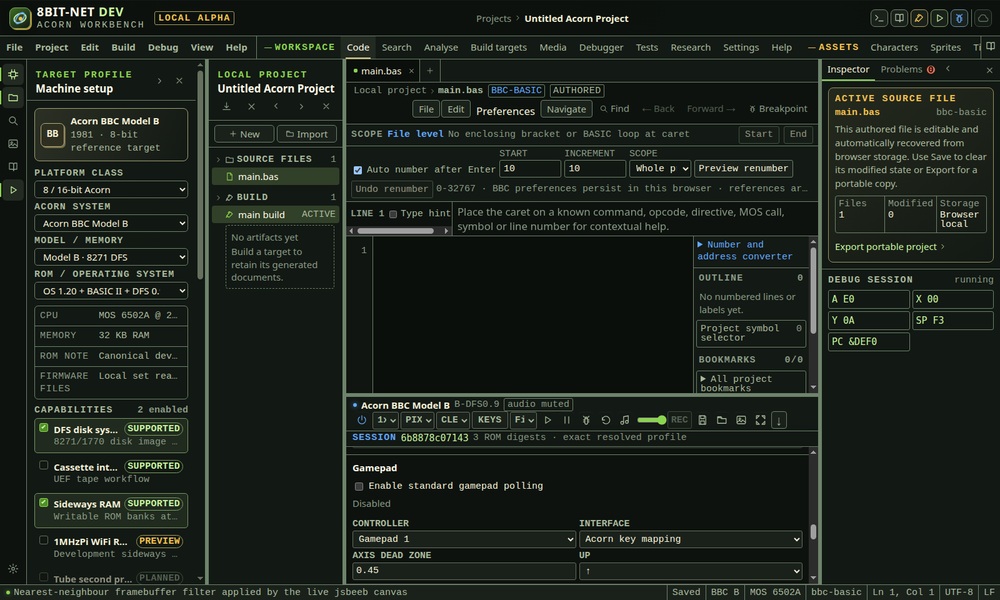

*The same standard controller can use maintained key edges or the real BBC ADC and active-low fire path. Disconnect centres and releases the selected interface.*

In the IDE: Help → `#help/emulator-gamepad`

## 6. Drive the BBC analogue joystick with the mouse

Use pointer position and two mouse buttons as a bounded BBC or Master analogue joystick through the real ADC and System VIA inputs.

**Before you start**

- A live BBC A, BBC B, BBC B+ or Master jsbeeb session
- A pointing device
- Software that reads the standard BBC analogue joystick connector

**Procedure**

1. Open KEYS and locate Mouse analogue joystick.
2. Select Drive the BBC analogue port from the live display.
3. The IDE disables standard gamepad polling because both modes own the same ADC and fire inputs.
4. Close KEYS so the live display is unobstructed.
5. Move across the display. Horizontal position feeds ADC channel 0 and vertical position feeds channel 1.
6. Hold the left button for Fire 1 on System VIA PB4. Hold the right button for Fire 2 on PB5.
7. Move off the live display and confirm the joystick centres and both fires release.
8. Open KEYS again to read the last exact ADC and fire state.
9. Disable the mode when ordinary pointer interaction with the display is required.

**What should happen**

- Left and top approach 65,535 while right and bottom approach 0, following the BBC inverted analogue convention.
- Channels 2 and 3 remain centred at 32,768.
- Every pointer event is checked by reading back the installed jsbeeb ADC sources and System VIA joystick latches.
- Pointer leave, focus loss, reset, Release input and disabling the mode centre the axes and release fire.
- The enabled preference is stored for this browser origin and is reapplied only to supported BBC and Master sessions.
- The accessible live output reports exact ADC values and both fire states.

**Limits**

- This is a mouse-driven standard analogue joystick, not an AMX Mouse, Trackerball, user-port mouse or guest pointer device.
- Only ADC channels 0 and 1 and the two standard fire inputs are driven. Channels 2 and 3 stay centred.
- Atom, Electron and A310 use different input hardware and are excluded from this mode.
- The KEYS panel overlays the display. Close it before moving the emulated joystick.
- Right click is consumed while enabled and does not open the browser context menu over the emulator canvas.
- CSS display scaling changes host travel but the full visible canvas still maps to the full 16-bit joystick range.
- Deterministic Tests can store explicit normalized pointer positions and button states for this mapping. They do not record an unrestricted stream of live pointer motion.

**If it goes wrong**

- If motion is ignored, confirm the guest reads the standard analogue connector rather than keyboard or user-port hardware.
- If the display cannot be reached, close KEYS before moving the pointer.
- If a gamepad stops polling, disable mouse analogue joystick mode and enable the intended gamepad interface again.
- Move completely outside the emulator frame or choose Release input to clear a stuck fire state.
- Reload and inspect the live status if the stored preference does not match the intended controller.

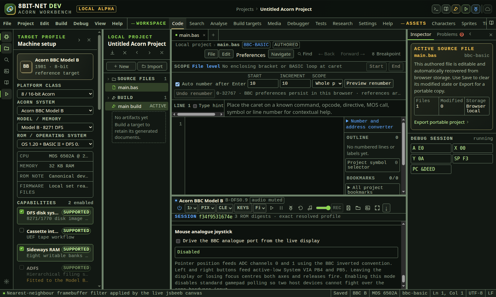

*Pointer position feeds the standard BBC ADC while left and right buttons feed the two active-low System VIA fire inputs.*

In the IDE: Help → `#help/emulator-bbc-mouse-joystick`

## 7. Use the A310 mouse

Drive the live RISC OS pointer with scaled browser-canvas coordinates and all three buttons through the pinned Arculator core absolute host mouse path.

**Before you start**

- An Archimedes A300 target configured as A310 with a qualified RISC OS firmware set
- The live A310 framebuffer visible in Code
- A pointing device capable of browser pointer events

**Procedure**

1. Open Code and wait for the genuine A310 core to report running or paused.
2. Allow the RISC OS desktop or application to finish starting. A310 initialisation can remain lengthy after the core attaches.
3. Choose KEYS and locate A310 mouse.
4. Move the pointer over the live framebuffer.
5. Read the live region for the exact emulator x and y coordinate, framebuffer dimensions and current button mask.
6. Confirm RISC OS pointer movement follows the host pointer.
7. Press the primary button for Arculator button bit 1.
8. Press the secondary button for bit 2. The browser context menu is suppressed only over the emulator canvas.
9. Press the middle button for bit 4.
10. Move outside the framebuffer before returning to source work. The bridge releases all button bits on pointer leave.
11. Choose Release input to clear keyboard and mouse injection together.
12. When checking safety, hold a button and move outside the framebuffer. The live region must change to Released.
13. Use the status coordinates to distinguish browser scaling problems from guest application pointer handling.
14. Reset or power off only when guest state also needs to be restarted. Both operations clear injected mouse state.

**What should happen**

- Browser client coordinates are scaled against the current canvas rectangle and live backing width and height.
- Coordinates are clamped inside the framebuffer before entering WebAssembly.
- The C bridge accepts only coordinates from 0 through 32,767 and a three-bit button mask from 0 through 7.
- The patched input poller replaces its sampled absolute coordinates and buttons only while browser injection is active.
- Arculator consumes the values through its existing absolute mouse polling and doosmouse path rather than a parent-only cursor overlay.
- Every changed browser sample reports exact coordinates, dimensions, button mask, source and random runtime session to the parent.
- Pointer leave, canvas blur, Release input, reset and page teardown clear injected button state.
- The generic firmware manager does not overwrite readiness owned by the Archimedes physical-lane firmware manager.

**Limits**

- This is the qualified absolute A310 mouse path. Relative capture, pointer lock and unrestricted analogue deltas are not claimed.
- Atom, Electron, BBC and Master mouse interfaces remain dependent on their specific expansion hardware and are not implemented by this path.
- The A310 configuration still declares joystick_if = none. Mouse support does not imply an Archimedes joystick interface.
- Browser touch synthesis, pressure, tilt, wheel and additional buttons are not mapped.
- The status event proves browser-to-core delivery. Guest software can still ignore or reposition the pointer according to its own state.
- CSS scaling and browser zoom change host travel, but not the reported framebuffer coordinate bounds.
- No mouse action is yet recordable in deterministic Tests input scripts.

**If it goes wrong**

- If no coordinate appears, move inside the actual black framebuffer after the A310 core has attached.
- If the pointer does not move in RISC OS, wait for desktop startup and confirm the live status changes before restarting.
- If a button appears held, move outside the canvas or choose Release input.
- If the context menu appears, confirm the click was over the child canvas and not the parent bezel.
- If coordinates appear compressed or offset, return Framebuffer scaling to Fit and browser zoom to 100 percent, then retest.
- If firmware says ready but the core does not attach, reopen Settings and verify the selected A310 model and exact RISC OS profile.
- Use Restart adapter only after repeated bridge failure. It creates a new isolated core and session.

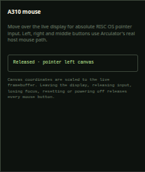

*Movement and left and right button edges entered Arculator through its absolute host mouse path. Leaving the canvas cleared the injected buttons.*

In the IDE: Help → `#help/emulator-a310-mouse`

## 8. Use the Atom AtoMMC joystick port

Drive and test the five active-low joystick controls implemented by the pinned AtomMMC2 device at &B400.

**Before you start**

- A live Acorn Atom jsbeeb session
- AtoMMC storage enabled in the target capabilities
- Guest software that uses AtoMMC CMD_READ_PORT

**Procedure**

1. Select Acorn Atom and enable AtoMMC storage in Machine setup.
2. Open KEYS, locate Gamepad and choose Atom AtoMMC port.
3. Select the browser controller index and a suitable dead zone, then enable standard gamepad polling.
4. Use axes 0 and 1 or D-pad buttons 12 through 15 for directions. Use either browser fire button for the single AtoMMC fire input.
5. Read the live hexadecimal port status. No controls produces &FF because all five inputs are active low.
6. For guest code, write command &A2 to &B400 and read &B400. Bits 0, 1, 2, 3 and 4 represent right, left, down, up and fire respectively.
7. Disconnect the controller and confirm the live status and adapter acknowledgement return to &FF.
8. In Tests, open Deterministic input script, select the required AtoMMC controls and choose Add Atom AtoMMC state.
9. Run guest code that reads CMD_READ_PORT and assert its accumulator or stored memory against the expected active-low value.

**What should happen**

- The interface is selectable only for an Atom session whose immutable runtime manifest includes AtoMMC.
- Standard stick and D-pad state is dead-zone normalized before mapping to the five guest bits.
- The runtime attaches a stable 16-button source object to jsbeeb AtomMMC2 and updates only indices 12 through 15 and 0.
- Live acknowledgements report the five booleans, exact active-low byte, device path and random runtime session.
- Deterministic replay uses the same attached source. Guest 6502 code can observe the byte through the real CMD_READ_PORT implementation.
- Disconnect, disable, interface change and machine loss clear all five inputs and return &FF.

**Limits**

- This is the AtoMMC expansion joystick, not a base Atom keyboard joystick, analogue device or user-port adapter.
- The device exposes one fire bit. Browser Fire 1 and Fire 2 are deliberately combined.
- AtoMMC storage remains a preview target capability. The joystick path is qualified independently from mass-storage catalogue workflows.
- Electron and Archimedes joystick devices use different hardware and are not covered by this interface.

**If it goes wrong**

- If the interface option is disabled, return to Machine setup and enable AtoMMC storage.
- If the port remains &FF, press a controller button so the browser exposes it and confirm the selected controller index.
- If guest code reads another value, verify it sends &A2 to the command register before reading the same &B400 port.
- Use deterministic Tests to separate guest protocol errors from browser controller delivery.

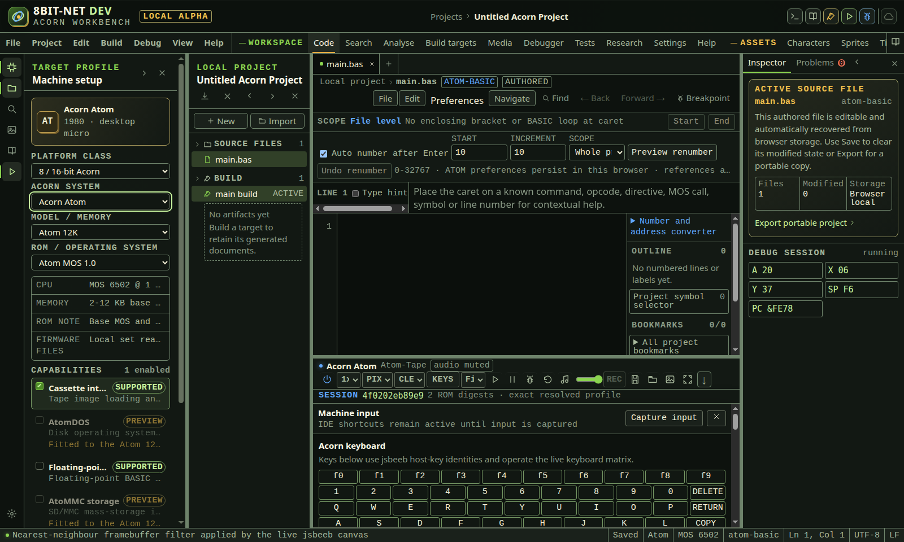

*The standard controller drives the real AtomMMC2 source while the deterministic plan can assert the exact byte read by guest code at &B400.*

In the IDE: Help → `#help/emulator-atom-atommc`

## 9. Scale and enlarge the live framebuffer

Choose a fluid fit or an exact one-times or two-times integer viewport for the genuine framebuffer, scroll oversized output and enter full screen without changing guest video state.

**Before you start**

- A supported emulator adapter with its required firmware ready
- The machine has reported at least one live state snapshot

**Procedure**

1. Locate Framebuffer scaling in the emulator toolbar. It is disabled until the real adapter reports machine state.
2. Choose Fit for ordinary integrated work. The iframe fills the available emulator region while the child canvas preserves the complete framebuffer with contain scaling.
3. Choose 1x when inspecting individual output pixels. The parent iframe width and height become exactly the current live framebuffer dimensions.
4. For Atom, Electron, BBC and Master adapters, the qualified jsbeeb framebuffer is 1,024 by 625 pixels.
5. For A310, the dimensions come from the current live SDL canvas reported in the VIDC hardware snapshot. The IDE does not assume a desktop mode before that value exists.
6. Use the horizontal and vertical scrollbars around the iframe when a 1x viewport is larger than the emulator region.
7. Choose 2x to multiply both reported framebuffer dimensions by exactly two.
8. At 2x, use the scrollbars to inspect the required area. The guest framebuffer bytes and emulated video mode do not change.
9. Return to Fit before routine source work when the exact viewport obscures too much of the display.
10. Reload the IDE and confirm the last selected mode returns. The mode is stored for this browser origin.
11. Choose Toggle machine full screen to enter the browser Fullscreen API from a direct user action.
12. In full screen, the framebuffer always fits the available screen. Full-screen width and height override the retained integer viewport temporarily.
13. Choose Exit full screen or press the browser full-screen exit key. The retained Fit, 1x or 2x mode resumes in the integrated workbench.
14. Use Capture machine screen to download the actual framebuffer. Capture dimensions come from the emulator and are independent of CSS scaling.
15. Do not use a scaled screenshot to infer guest resolution. Inspect the capture acknowledgement or live A310 VIDC dimensions for the authoritative pixel extent.

**What should happen**

- Fit has no fixed inline framebuffer viewport and follows the available workbench region.
- 1x uses the exact current framebuffer width and height as CSS pixel dimensions.
- 2x doubles the exact current framebuffer width and height without resizing guest memory.
- Integer modes expose scrollbars instead of silently shrinking an oversized viewport.
- The selected mode persists locally and is validated as Fit, 1x or 2x before use.
- Full screen fills the browser display even when 1x or 2x is retained.
- Framebuffer capture remains based on real canvas pixels and is unaffected by the selected CSS mode.

**Limits**

- Integer scaling describes the browser viewport around the live emulator canvas. It does not alter CRTC, ULA, VIDC or guest mode registers.
- The jsbeeb render surface includes border and timing area, so its 1,024 by 625 extent is larger than a typical visible BASIC mode.
- A310 integer controls remain unavailable until the SDL canvas reports valid dimensions between 1 and 4,096 pixels on each axis.
- A very large 2x A310 desktop can require substantial browser surface memory and scrolling.
- Browser zoom applies after the WebIDE scaling calculation and can change the physical monitor pixel relationship.
- The current control offers nearest-neighbor child-canvas rendering. A user-selectable smoothing filter is not implemented.

**If it goes wrong**

- If the display appears cropped, use the frame scrollbars or return to Fit.
- If the scale control is disabled, complete the selected ROM manifest and wait for the adapter state overlay.
- If A310 dimensions are not ready, allow the genuine core and SDL video path to initialize.
- If full screen is refused, allow full-screen permission and invoke the toolbar button directly.
- If an integer viewport appears stale after a guest mode change, wait for the next live snapshot or choose Fit and then reselect the integer mode.
- If browser zoom makes pixel inspection ambiguous, restore browser zoom to 100 percent before using 1x.

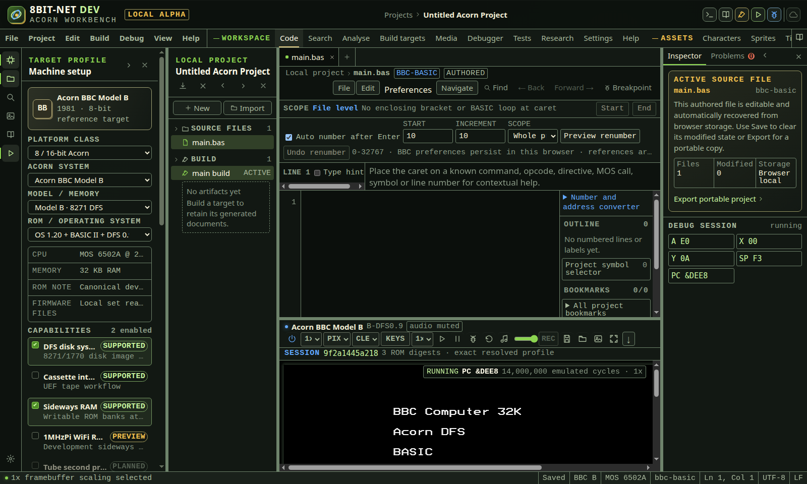

*One-times scaling preserves the live framebuffer pixel dimensions and exposes scrollbars when the integrated emulator region is smaller.*

In the IDE: Help → `#help/emulator-display-scaling`

## 10. Choose a presentation-only display effect

Apply a clean, scanline or soft CRT overlay to the workbench view while preserving the exact emulator canvas and downloaded framebuffer pixels.

**Before you start**

- A running or paused full-machine emulator
- CSS gradients and custom properties supported by the browser
- PIXEL or SMOOTH framebuffer filtering selected independently

**Procedure**

1. Open Code and wait for the emulator controls to become available.
2. Open Display presentation effect beside the framebuffer filter.
3. Choose CLEAN for no presentation overlay.
4. Choose LINES for a repeating horizontal scanline overlay.
5. Choose SOFT CRT for scanlines, a subtle colour grille and edge vignette.
6. Read the selector tooltip. Each effect is a CSS presentation choice and is not described as authentic monitor emulation.
7. Compare the effect with PIXEL and SMOOTH. Filtering controls browser interpolation on the child canvas. The effect remains a parent overlay.
8. Pause the machine when comparing a fixed frame.
9. Use Capture machine screen to download the child framebuffer.
10. Confirm the downloaded PNG is identical regardless of CLEAN, LINES or SOFT CRT when the machine frame has not changed.
11. Reload the IDE to confirm the browser-origin preference is retained.
12. Override the four display effect theme tokens in theme-overrides.css when integrating this IDE with another 8bit-net service theme.
13. Return to CLEAN for pixel inspection, visual regression review or screenshots that should show only the emulator framebuffer.

**What should happen**

- CLEAN applies no pseudo-element overlay.
- LINES applies a pointer-transparent scanline gradient above the iframe.
- SOFT CRT adds token-driven scanline, grille and vignette gradients while remaining pointer-transparent.
- The keyboard, mouse and emulator controls remain operable because the overlay cannot receive pointer events.
- The effect selection persists locally and is reapplied after reload.
- The child emulator receives no display-effect command and its video memory, canvas and PNG capture remain unchanged.
- A paused-frame PNG has the same SHA-256 before and after selecting an effect.

**Limits**

- These effects are visual preferences, not measured simulations of an Acorn monitor, television, RF path, phosphor, beam or analogue decoder.
- The overlay covers the workbench emulator frame and can look different with browser zoom, display scaling and operating-system colour management.
- SOFT CRT does not implement curvature geometry, bloom, persistence, interlace, PAL artefacts or machine-specific monitor profiles.
- Effects are not part of a portable project or runtime run record.
- A browser that does not support the gradients still shows the underlying emulator without changing machine behavior.
- Full-screen layout can change the apparent scanline pitch because the overlay uses CSS pixels.

**If it goes wrong**

- Choose CLEAN if source pixels or debugger overlays are hard to read.
- Use PIXEL and an integer framebuffer scale for exact nearest-neighbour visual inspection.
- If a theme override makes an effect too strong, restore the default effect tokens or set their alpha values to zero.
- If the selection does not persist, check whether browser site storage is blocked for the local origin.
- If captured PNG bytes differ, pause the machine and capture again. A running guest can change the framebuffer between captures.
- Use Restart adapter only for child faults. Presentation effects do not require an emulator restart.

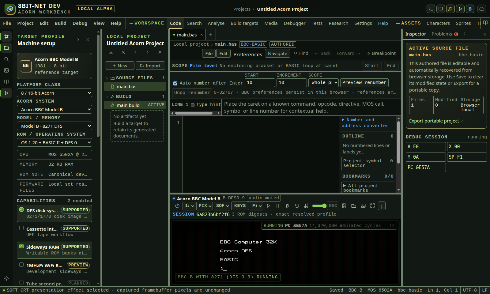

*The effect is a pointer-transparent parent overlay. Two paused framebuffer downloads before and after selection had the same SHA-256.*

In the IDE: Help → `#help/emulator-display-effects`

## 11. Set machine volume and framebuffer filtering

Control the live jsbeeb WebAudio gain independently of mute, and choose exact nearest-neighbour pixels or browser interpolation without changing emulated video memory or captured framebuffer bytes.

**Before you start**

- A running or paused full-machine emulator
- A jsbeeb-backed machine for master volume control
- Browser WebAudio and AudioWorklet support when audible output is required

**Procedure**

1. Open Code and locate the emulator toolbar.
2. Read the audio status beside the machine name. Audio begins muted and the browser can require a user gesture before its AudioContext runs.
3. Set Runtime speed to authentic 1x before enabling audio. Audio is intentionally unavailable at 0.5x, 2x and 4x.
4. Use the speaker control to enable machine audio.
5. If the emulator canvas asks for audio activation, select its button. This satisfies browser autoplay policy inside the child frame.
6. Adjust Machine volume with the range control beside the speaker.
7. Wait for the bottom status to report the accepted percentage. The parent updates only after the child applies the value.
8. Treat zero volume and mute differently. Zero retains the enabled audio path with zero master gain. Mute stops the sound chip output path and suspends its AudioContext.
9. Read Runtime performance in Debugger when diagnosing gaps. Volume does not hide latency, underrun or buffer-gap measurements.
10. Open Framebuffer filter and choose PIXEL for nearest-neighbour rendering.
11. Use PIXEL for source pixels with hard edges. The live canvas sets image-rendering to pixelated.
12. Choose SMOOTH for browser linear interpolation. The live canvas sets image-rendering to auto.
13. Compare filter choice with Framebuffer scaling. Fit, 1x and 2x determine viewport dimensions. PIXEL and SMOOTH determine only sampling between source pixels.
14. Capture a machine screenshot if source pixels are required. PNG capture reads the real canvas framebuffer, so the CSS filter does not rewrite captured pixels.
15. Reload or power cycle the machine. The retained browser-origin volume and filter are sent only after the new child reports ready and are applied through acknowledged commands.
16. On A310, PIXEL and SMOOTH both operate on the real SDL canvas. Master volume remains disabled because the pinned SDL audio path exposes enable and queue state but no qualified gain node.
17. Use mute before selecting a non-authentic speed. Return to 1x before re-enabling audio.
18. Open Debug session to confirm volume and filter commands use the same random session and ordered command transport as other runtime controls.

**What should happen**

- jsbeeb validates a whole volume percentage from 0 through 100 before changing its real GainNode.
- The GainNode uses percentage divided by 100 while audio is enabled and remains zero while muted.
- volume-state is published only after the GainNode value has been applied.
- audio-state includes the current volume for diagnostics and independent UI acknowledgement.
- Both jsbeeb and A310 validate nearest or linear before changing the live canvas style.
- display-filter is published only after the child canvas has been changed.
- Volume and filter preferences persist for this browser origin and do not modify project source or build output.

**Limits**

- A310 master volume is unavailable until its pinned SDL path exposes a qualified gain operation. The control is disabled with that reason.
- The current filter choices are nearest-neighbour and browser linear interpolation. CRT masks, scanlines, phosphor simulation, palette transforms and aspect correction remain open EMU-008 work.
- Linear interpolation is browser rendering and is not evidence of authentic analogue display behaviour.
- Volume changes do not alter deterministic sound-chip write capture used by hardware tests.
- Audio output at speeds other than 1x is blocked because pitch correction and time stretching are not implemented.
- Browser and operating-system output volume remain outside the emulator and can further change audible level.

**If it goes wrong**

- If audio remains silent, return to 1x, enable audio, act on the in-canvas browser gesture request and check AudioContext state in Runtime performance.
- If the volume control is disabled on jsbeeb, wait for a live snapshot and confirm WebAudio availability.
- If a control is refused, choose a whole volume from 0 to 100 or one of the two maintained filters.
- If SMOOTH appears unchanged at an integer scale, switch temporarily to Fit or a non-integer browser size to inspect interpolation.
- If a retained preference is unwanted, choose 100 percent and PIXEL. These become the new origin-local defaults.
- If audio gaps increase, mute audio, reduce runtime speed to 1x and disable expensive debugger capture before retrying.

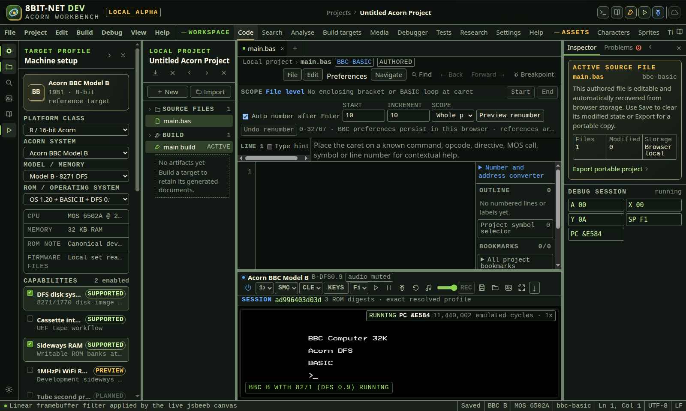

*Filtering changes only live canvas sampling. The adjacent slider controls the jsbeeb GainNode and reports its accepted percentage through the child session.*

In the IDE: Help → `#help/emulator-audio-filter`

## 12. Save and restore a compatible machine state

Download a versioned jsbeeb state bound to the exact adapter, machine configuration and ROM digests, then restore it only after its snapshot payload and compatibility contract pass validation.

**Before you start**

- A live jsbeeb-backed Atom, Electron, BBC or Master session
- A safe location for the downloaded state file
- The same adapter revision, model, ROM set, Tube setting, sideways ROM configuration and ROM bytes when restoring

**Procedure**

1. Pause the machine when a precise operator-selected moment is required. Save also pauses the core briefly while its snapshot is created.
2. Select Save machine state in the emulator toolbar.
3. Wait for the browser download and the status message Machine state v1 saved.
4. Keep the .8bitstate.json extension. The file is JSON but is not a raw upstream jsbeeb snapshot.
5. When auditing the file, confirm schema is 8bit-net.machine-state and version is 1.
6. Inspect adapter ID and version. The current qualified format requires jsbeeb and its exact pinned revision.
7. Inspect machine model, ROM-set ID, Tube state and sorted extra sideways-ROM paths.
8. Inspect every firmware record. Each contains its origin-private storage key, exact byte count and SHA-256.
9. Inspect payload encoding, byte count and SHA-256. The payload JSON is the upstream jsbeeb snapshot protected by those integrity fields.
10. Keep the file private if volatile RAM or mounted media contains sensitive data. State files can include complete RAM and disk bytes.
11. To restore, power on the matching machine and wait for a live snapshot.
12. Select Load machine state and choose the state file.
13. The IDE first enforces the 12 MiB file limit.
14. The child validates schema and version, adapter revision, machine profile, Tube and sideways ROM settings, and the complete ordered ROM digest manifest.
15. The child recalculates the payload byte count and SHA-256 before passing any snapshot data to jsbeeb.
16. After compatibility and integrity pass, mounted disk records are bounded and validated, runtime inspection histories are cleared, the upstream state is restored and the framebuffer is repainted.
17. Wait for the status message state v1 restored. It reports verified ROM count and restored media count.
18. The restored machine remains paused. Inspect registers, memory and screen before selecting Run.
19. Treat restore as a replay boundary. Reverse history cannot cross an externally loaded complete machine state.
20. Keep the original file until the restored application, media and debugger state have been checked.

**What should happen**

- The downloaded file uses a maintained WebIDE schema and does not depend on an unlabelled upstream JSON shape.
- Adapter, machine and firmware compatibility are checked before restore.
- The payload SHA-256 detects any changed character in the embedded snapshot JSON.
- Only drive 0 or 1 media entries of at most 2 MiB each are accepted from a snapshot.
- Save restores the machine run state after capture. Load leaves the machine paused for inspection.
- Successful restore reports schema version, ROM count, media count and payload SHA-256 from the child.
- A legacy raw jsbeeb snapshot is refused with an unsupported-envelope message rather than guessed or silently migrated.

**Limits**

- A310 save and restore remain unavailable because the pinned core has no complete deterministic serialization contract for WebAssembly, SDL, filesystem and device state.
- The file limit is 12 MiB. States beyond that limit are not split or compressed automatically.
- Cassette stream position is not included by the current upstream snapshot path.
- State files are downloads. The IDE does not currently retain a named state library in browser storage.
- Browser storage quota reporting and retention controls remain open EMU-405 work.
- Compatibility checks prove declared identity and payload integrity, not that arbitrary guest software will resume without application-specific side effects.
- State files are not portable project source and are not placed in a project export.

**If it goes wrong**

- If a state is rejected as unsupported, use the IDE version that created the legacy file or recreate it with schema version 1. Do not edit the schema label.
- If adapter revision differs, run the matching WebIDE build. A forced cross-version restore is unsafe.
- If ROM SHA-256 differs, select and import the original firmware bytes. Matching filenames are insufficient.
- If model, Tube or sideways ROM configuration differs, change Machine setup to the original configuration and boot a new session before retrying.
- If integrity fails, recover the original downloaded file or backup. Recalculating the digest over an edited payload would hide corruption and is not a supported repair.
- If media validation fails, return to an earlier trusted state or mount independently validated media after boot.
- If the restored machine is paused, inspect it and select Run. Paused after restore is the intended safe state.

*A state download binds volatile jsbeeb data to the current adapter, machine configuration and complete ROM digest manifest before it can be restored.*

In the IDE: Help → `#help/emulator-machine-state`

## 13. Monitor browser storage quota and retention

Measure origin-local project, preference and private ROM usage against the browser quota, distinguish best-effort from persistent retention and act before storage pressure threatens recoverable work.

**Before you start**

- A browser that exposes the StorageManager estimate API
- Settings open for this WebIDE origin
- A portable export location outside browser storage for important projects and state files

**Procedure**

1. Open Settings.
2. Locate Browser storage above the ROM manager.
3. Read used MiB, quota MiB and percentage. These values come directly from navigator.storage.estimate for the current origin.
4. Treat the quota as browser policy, not a WebIDE allocation. It can change with free disk space, browser profile policy or private-browsing mode.
5. Read the retention label.
6. Best-effort retention means the browser can evict origin data under storage pressure.
7. Persistent retention granted means the browser has agreed not to evict this origin through its ordinary pressure policy. It is not a backup and does not protect against profile deletion or disk failure.
8. Expand Browser-reported usage categories when available.
9. Use IndexedDB as the closest browser category for private ROM records. The browser can combine other WebIDE data or apply implementation overhead, so it is not a per-ROM catalogue.
10. Use serviceWorkerRegistrations only as browser-reported infrastructure usage. It does not contain project source or ROM payloads by itself.
11. Select Refresh after importing or removing ROMs, saving project changes or changing browser storage outside this tab.
12. Select Request persistent storage when important ongoing work should ask for stronger browser retention.
13. Read the bottom status after the browser decides. Browsers can grant or deny without showing a prompt.
14. If denied, keep regular portable project exports and state downloads. The WebIDE does not claim persistence was granted.
15. At or above 80 percent, read the warning and stop large imports until recoverable exports exist.
16. Export the portable project before removing browser-local data.
17. Download compatible machine states separately when volatile machine recovery is required. State downloads do not consume this origin quota after the browser saves them to the chosen download location.
18. Remove only ROM sets that can be reimported legally and exactly. SHA-256 values in session and state records identify which bytes will be needed.
19. Do not clear the whole browser origin as routine quota management. It can remove projects, settings, bookmarks and private ROMs together.
20. Refresh again and confirm usage and retention after any cleanup.

**What should happen**

- The panel reports live StorageManager usage and quota rather than a hard-coded capacity.
- Usage percentage is derived from the same returned values and changes to warning styling at 80 percent.
- Retention state comes from navigator.storage.persisted.
- The persistence button calls navigator.storage.persist only from the user action and reports the browser decision.
- A browser-provided usageDetails record is sorted by descending bytes and displayed without inventing unavailable categories.
- When category detail is absent, total usage remains visible and the UI states that no breakdown was provided.
- Downloaded state and project export files live outside origin storage after download and therefore remain the primary recovery path.

**Limits**

- StorageManager values can be rounded, delayed or implementation-specific. They are capacity guidance, not a byte-accurate ROM inventory.
- Persistent retention cannot be forced. The browser owns the decision.
- Private browsing can provide a temporary quota and discard all data when its context closes.
- The panel does not delete data. Destructive origin-wide clearing remains a browser action and should follow verified exports.
- A category breakdown cannot reliably attribute every byte to one project or ROM.
- Remote browser profiles, managed policies and mobile storage pressure can behave differently from desktop Chromium.
- The WebIDE cannot recover an evicted project or ROM that was never exported or retained elsewhere.

**If it goes wrong**

- If quota measurement is unavailable, use browser site-storage settings and export work before continuing.
- If persistence is denied, keep the tab and browser profile stable during work, then export frequently.
- If usage exceeds 80 percent, export projects, preserve required ROM sources and remove unneeded origin-local data through the relevant workspace or browser controls.
- If a project disappears after eviction, import its last portable project export.
- If a ROM set disappears, reimport the exact local files and confirm their session SHA-256 values.
- If state recovery is needed, load the separately downloaded compatible .8bitstate.json file after restoring the exact firmware configuration.

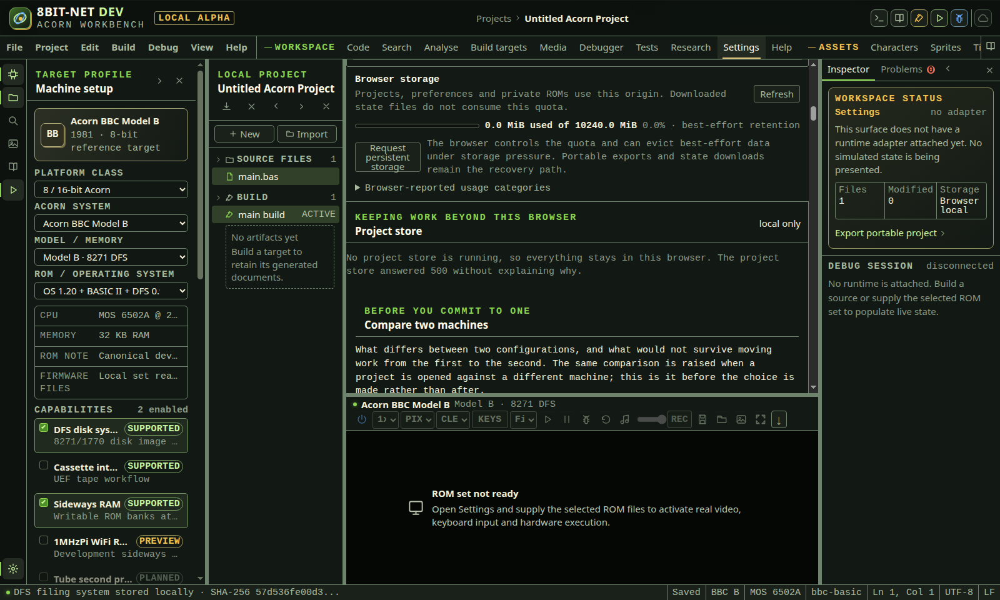

*Quota and retention come from the current browser profile. Portable project exports and downloaded state files remain the recovery path.*

In the IDE: Help → `#help/emulator-storage-quota`

## 14. Capture live machine audio as WAV

Record a bounded stream from the real jsbeeb sound-chip callback or Arculator SDL post-mix buffer and download a standard PCM16 WAV without treating host volume, speakers or a test digest as captured audio.

**Before you start**

- A live jsbeeb-backed Atom, BBC or Master machine, or a live Arculator-backed A310
- Runtime speed set to authentic 1x
- Machine audio enabled with any required browser gesture completed
- A writable browser download location

**Procedure**

1. Open Code and wait for the machine to report running or paused.
2. Set Runtime speed to 1x.
3. Enable machine audio with the speaker control.
4. If the child canvas shows Enable machine audio, select it to satisfy browser autoplay policy.
5. Confirm the audio status no longer asks for a gesture.
6. Select Start machine audio capture. The control is labelled REC when idle.
7. Wait for the bottom status to report the maximum duration and live sample rate.
8. Confirm the control changes to STOP REC. Recording state comes from the child acknowledgement.
9. Run or interact with the guest so the sound chip produces the required material.
10. Select Stop machine audio capture before the 10-second sample budget when the required section is complete.
11. Wait for the .wav download and the status message with audio duration, sample rate and byte size.
12. Keep the .wav extension. The file uses RIFF/WAVE linear PCM with 16 bits per sample. jsbeeb capture is mono. A310 capture is stereo.
13. For jsbeeb, use the WAV sample rate reported by the browser AudioContext. For A310, the pinned SDL output contract is 48,000 Hz stereo.
14. Treat WAV duration as captured frames divided by sample rate. It can differ from operator wall-clock delay because buffers follow emulated CPU production.
15. Use Machine volume for jsbeeb listening only. Its capture taps the raw sound-chip PCM before the WebIDE GainNode. A310 captures Arculator's post-gain, post-disc-noise stereo buffer immediately before SDL queues it.
16. Use mute to stop audible output after capture. Do not mute during an active capture.
17. For deterministic automated assertions, use AUDIO[WRITES] in Tests. That path hashes exact SN76489 command bytes without requiring speakers or WebAudio.
18. Use Runtime performance to inspect latency and sound-buffer gaps when a user-facing capture sounds discontinuous.
19. Inspect the WAV header with an audio editor or binary tool when archiving evidence. Confirm the acknowledged channel count, 16 bits and sample rate.
20. Power off or restart discards an unfinished capture without downloading it.

**What should happen**

- Capture cannot start until authentic 1x audio is enabled.
- The jsbeeb BrowserAudio path retains bounded copies of the real Float32 callback buffers.
- The A310 bridge retains bounded copies of the exact 2,400-frame interleaved stereo buffers delivered to SDL at 48,000 Hz.
- At most 30 seconds is accepted by the shared validator. The current toolbar requests a 10-second maximum.
- Stop concatenates only retained samples and converts finite values to bounded little-endian PCM16.
- The WAV writer emits RIFF, WAVE, fmt and data chunks with exact byte lengths.
- audio-captured reports the same byte count, sample count, rate and duration as the downloaded Blob.
- The active random session ID accompanies capture state and completion events.

**Limits**

- jsbeeb capture is mono because it supplies one mixed sound-chip stream. A310 capture preserves the core's stereo output.
- jsbeeb capture is raw PCM before the WebIDE master gain. A310 capture includes Arculator sound and disc-noise gain but not browser, operating-system or speaker volume.
- A maximum sample budget prevents unbounded browser memory growth. Recording stops retaining new samples at the budget and downloads when STOP REC is selected.
- Power loss, adapter restart or tab closure discards an unfinished capture.
- WAV capture is user-facing evidence, not a deterministic test oracle. Use sound-chip write assertions for repeatable automated tests.
- No MP3, FLAC or microphone mixing is provided.

**If it goes wrong**

- If REC is disabled, set speed to 1x, enable audio and complete the in-canvas gesture.
- If stop reports no samples, allow the machine to run until at least one sound buffer is produced, then try again.
- If audio has gaps, stop capture, inspect Runtime performance, disable expensive trace tools and retry at 1x.
- If the download is blocked, allow downloads for this origin and record again.
- If an unfinished capture was lost, repeat it. The IDE does not retain partial PCM in project or browser storage.
- If A310 capture is empty, keep the machine running with sound DMA active until at least one 2,400-frame SDL buffer is produced.

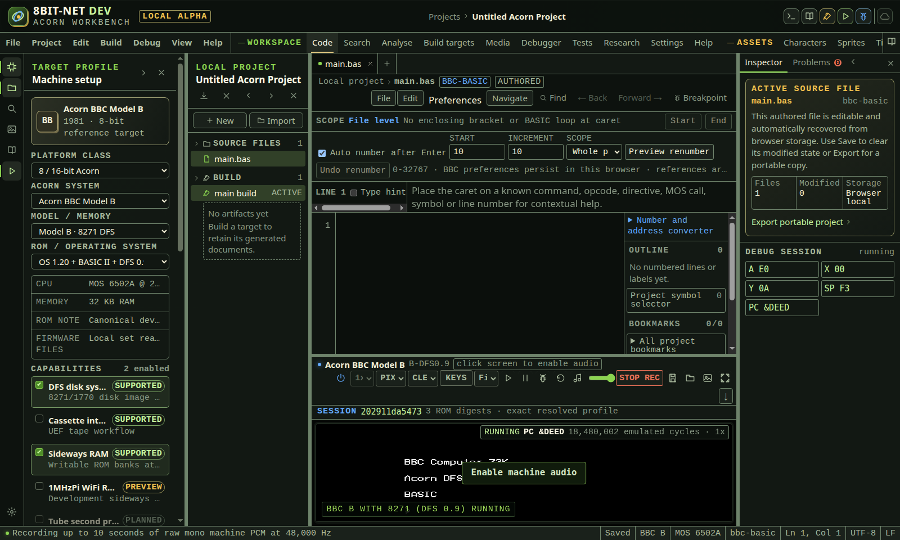

*The child records its real sound-chip PCM callback. STOP REC encodes the retained samples as a standard mono 16-bit WAV and downloads it.*

In the IDE: Help → `#help/emulator-wav-capture`

## 15. Capture A310 stereo audio

Capture the exact post-mix stereo PCM frames that the pinned Arculator core passes to SDL and download them as a bounded 48 kHz PCM16 WAV.

**Before you start**

- A live A310 session with valid browser-local firmware
- Fast boot complete and the machine state showing running or paused
- Machine audio explicitly enabled
- A writable browser download location

**Procedure**

1. Open Code and wait for the A310 machine state to change from fast boot to running or paused.
2. Select Enable machine audio. Requested audio state and core device state are tracked separately so an SDL transition cannot invert the control.
3. Confirm the toolbar reports audio on and shows the live SDL queued-byte count.
4. Select Start machine audio capture. The REC control changes to STOP REC only after the child accepts a bounded capture buffer.
5. Run or interact with the guest until the required section has played.
6. Select STOP REC. Muting or resetting during capture also finalizes the retained complete frames.
7. Wait for the .wav download and the status message reporting duration, stereo, 48,000 Hz and byte size.
8. Open the WAV in an audio or binary editor. Confirm RIFF, WAVE, format 1, two channels, 48,000 Hz, 192,000 bytes per second, four-byte frame alignment and 16 bits per sample.
9. If the waveform is silent, confirm the guest had active sound DMA or generated audio during the selected interval. A valid silent capture is not replaced with synthetic sound.

**What should happen**

- The C bridge copies the exact 2,400-frame interleaved post-mix buffer immediately before Arculator calls SDL_QueueAudio.
- Capture accepts a whole duration from 1 to 30 seconds. The toolbar requests 10 seconds.
- The bridge allocates a fixed maximum buffer, stops writing at the bound and exposes data only when capture stops.
- The child copies completed frames out of WebAssembly memory before releasing the C allocation.
- The downloaded file length is 44 plus four bytes for every retained stereo frame.
- Completion reports frames, samples, channels, rate, duration, byte size and whether the maximum was reached under the active random session.

**Limits**

- Capture contains Arculator's configured sound and disc-noise gains but excludes browser, operating-system and speaker volume.
- A310 master gain remains unavailable because the pinned SDL adapter exposes no qualified live gain control.
- Silent guest output remains silent. The IDE does not add a tone or claim signal where none exists.
- Closing the tab or powering off discards an unfinished capture.
- WAV capture is user-facing output evidence. It is not a deterministic automated sound assertion.

**If it goes wrong**

- If REC is disabled, wait for fast boot to finish and enable machine audio.
- If no complete frame exists, leave the machine running until the SDL path produces one buffer, then stop again.
- If a capture is silent, run guest software that programs VIDC sound DMA and repeat the capture.
- If the download is blocked, allow downloads for this origin and record again.
- If requested and actual audio state differ during startup, wait for the running state. The toggle uses requested intent after initialization.

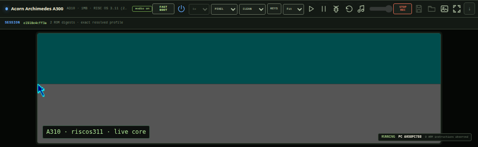

*STOP REC finalizes complete 48 kHz stereo frames from the real Arculator SDL path and downloads a PCM16 WAV.*

In the IDE: Help → `#help/emulator-a310-wav-capture`

## 16. Audit the immutable emulator session binding

Prove which adapter, machine profile, capabilities, boot options and private ROM digests created the current emulator child, then distinguish exact support from a declared substitution or limitation.

**Before you start**

- A selected full-machine target with every required ROM imported
- The emulator has reached running or paused state
- Access to the original local ROM files when independently checking their SHA-256 values

**Procedure**

1. Open Code and wait for the emulator child to report live state.
2. Locate SESSION directly below the emulator toolbar.
3. Read the first 12 hexadecimal characters as a concise display of the full 64-character session-manifest SHA-256.
4. Confirm the summary says exact resolved profile. A non-empty substitution list must appear as a warning and means the instance cannot count as exact target support.
5. Expand SESSION.
6. Read the adapter identifier and pinned revision. jsbeeb sessions name jsbeeb 1.19.1. A310 sessions name the pinned arculator-wasm commit.
7. Read the platform class, machine ID, selected variant and ROM-set ID as one resolved machine path.
8. Compare Capabilities with the checked target capabilities. The list is sorted before fingerprinting so equivalent selection order produces the same declaration.
9. Read Tube state, extra sideways ROM paths, keyboard profile, initial runtime speed and A310 boot acceleration from the boot binding where applicable.
10. Inspect every ROM row. It includes the browser import filename, exact byte count and complete SHA-256 digest.
11. Compare each digest with a trusted local SHA-256 tool when auditing an imported set. The IDE never treats a filename alone as firmware identity.
12. Read every limitation. A limitation remains part of the fingerprinted session record and is not hidden when the adapter starts successfully.
13. Open Debug session to inspect the random transport session and command audit.
14. Confirm the session-manifest ID equals the random transport session ID. Power cycling creates a new ID and therefore a new manifest fingerprint.
15. Treat the expanded disclosure as the parent binding. Every child snapshot must return that same complete manifest fingerprint.
16. If the child omits or changes the fingerprint, the parent refuses the snapshot, reports an adapter error and does not update register or machine state from it.
17. Use the immutable debug-session binding after starting Debug to audit the exact build output SHA-256, toolchain version, origin and entry point in addition to the runtime firmware binding.
18. Capture or export the relevant build and debug records before changing profiles. The ordinary boot-session disclosure is current-session evidence, not a project export.

**What should happen**

- The manifest schema and content are normalized before a dependency-free SHA-256 is calculated.
- ROM records are limited to the required files for the selected profile and enabled capabilities. Unrelated ROMs under the same browser storage prefix are excluded.
- The parent sends the frozen manifest with initialize and the jsbeeb child validates its complete fingerprint before loading the resolved model.
- The A310 child validates session identity, adapter, profile and fingerprint format before core initialization.
- Both children echo the bound manifest in every snapshot.
- The parent compares the echoed fingerprint with its own binding before accepting live state.
- A power cycle changes the random session ID and fingerprint even when all machine and ROM inputs remain the same.

**Limits**

- The boot-session manifest binds firmware and machine startup. A separate PROGRAM disclosure appears after an assembled 6502, raw ARM2, Atom ATM, tokenized BBC BASIC or keyboard-entered Atom BASIC payload is accepted.
- BASIC manifests bind the exact payload without inventing a fixed address. BBC BASIC declares interpreter-page placement and reports the resolved PAGE address after injection. Atom BASIC declares keyboard-queue placement because the guest interpreter owns later placement.
- ROM bytes remain private in origin-local IndexedDB and are not displayed, exported or copied into a portable project by this disclosure.
- A valid SHA-256 proves byte identity, not copyright status, provenance ownership or hardware accuracy.
- A filename can contain an imported directory prefix. The digest and byte count are authoritative.
- The A310 child recomputes the program byte and canonical manifest digests using Web Crypto. Its boot-session validation remains structurally bounded, with the TypeScript parent rejecting a mismatched snapshot echo.

**If it goes wrong**

- If SESSION does not appear, open Settings and confirm ROM SET READY for the exact selected profile.
- If a ROM digest differs from the trusted source, remove and reimport that ROM. Do not continue using a filename match.
- If the machine profile path is wrong, change the linked platform, machine, variant and ROM selectors, then allow a new session to boot.
- If a capability is missing, enable it in Machine setup and supply any newly required ROM. The session will rotate.
- If a child snapshot is refused, use Restart adapter only after checking the visible fingerprint and ROM rows. Repeated refusal indicates an adapter or transport defect.
- If a substitution warning appears, choose a supported exact profile or accept that the session cannot be used as evidence of exact target support.

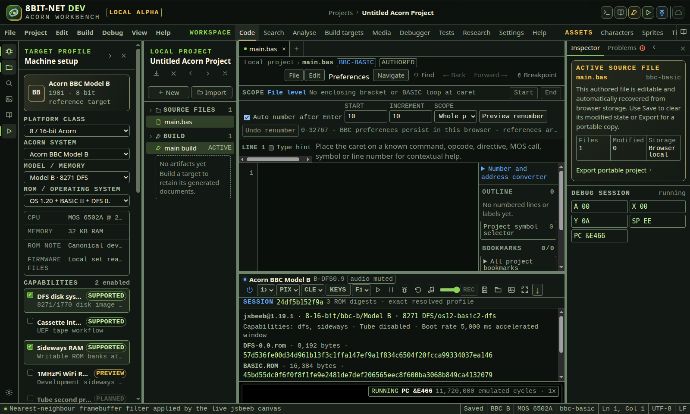

*The parent fingerprints the complete session declaration. The emulator child must return the same fingerprint before its live snapshot is accepted.*

In the IDE: Help → `#help/emulator-session-provenance`

## 17. Audit and export the loaded program binding

Verify that the exact assembled or imported bytes accepted by the emulator belong to the current ROM-backed machine session, then export one integrity-protected run record.

**Before you start**

- A live jsbeeb or A310 emulator session
- A successful 6502, BBC BASIC, Atom BASIC or ARM2 build, or a validated Atom ATM file
- A current build whose output is not stale when using Run or Debug

**Procedure**

1. Build and run, build and debug, or run a hardware test for the selected machine-code target.
2. Wait for the emulator to publish program-loaded. The PROGRAM disclosure appears only after the child accepts the bytes.
3. Expand PROGRAM below SESSION.
4. Read run, debug, test or load to identify why the payload entered the machine.
5. Confirm the program name, processor, exact byte count, origin and entry point.
6. For a build, confirm target name, toolchain identifier and pinned toolchain version.
7. For a host file, confirm the container and filename.
8. Read Output SHA-256. It is calculated over the exact bytes passed to the child, not over source text or a display listing.
9. Read Runtime session. It must equal the complete SESSION fingerprint above it.
10. Use an independent SHA-256 tool on a downloaded build output or original host file when an external audit is required.
11. Select Export run record.
12. Keep the .8bitrun.json file with test evidence or a release candidate.
13. Inspect schema 8bit-net.runtime-run and version 1.
14. Confirm the record contains the complete runtime session manifest, all ROM digests, the complete program manifest and a run-record SHA-256.
15. Treat a power cycle, profile change, ROM change or rebuild as a new run. Each change produces a different binding.
16. When debugging, compare the same output digest, origin and entry point with the immutable Debug session panel.

**What should happen**

- The parent refuses to queue bytes when their SHA-256 differs from build or host-file provenance.
- The jsbeeb child reconstructs and validates the complete program manifest before writing 6502 RAM or queuing interpreter input.
- Hardware tests require test mode and require their result build fingerprint to match the PROGRAM build fingerprint before execution starts.
- The A310 child independently hashes the ARM bytes and canonical program declaration before writing ARM RAM.
- program-loaded returns the validated manifest and every later child snapshot carries it.
- The parent refuses a snapshot whose program session fingerprint differs from the active SESSION binding.
- The PROGRAM disclosure shows complete output and session digests rather than filename-only identity.
- Export produces a versioned JSON record whose fingerprint covers its export time, complete session declaration and complete program declaration.

**Limits**

- The record contains identity and integrity evidence. It is not a deterministic replay recording and does not contain volatile RAM or input history.
- BBC and Atom BASIC run records bind payload identity and the declared interpreter placement policy. They do not claim the later interpreter workspace layout as a fixed machine-code origin.
- A hardware-test run record binds the exact session and loaded program. Detailed assertions, captures and input actions remain in the separate test report and project plan.
- A SHA-256 match does not prove source ownership, licence rights, emulator accuracy or a successful gameplay outcome.
- The record contains ROM filenames and digests but never ROM bytes.
- Changing JSON text invalidates the run-record fingerprint. There is no supported in-place edit workflow.

**If it goes wrong**

- If PROGRAM does not appear, inspect the build result and emulator status for a refused load.
- If output SHA-256 differs, rebuild from the intended source or reselect the original host file. Do not edit a manifest to match altered bytes.
- If Runtime session differs from SESSION, restart the adapter and reload the program only after the new machine reports ready.
- If export is refused, confirm SESSION and PROGRAM are both visible and belong to the same powered machine.
- If a record was edited or corrupted, export a fresh record from the still-running bound session.
- If the machine was power cycled, build or load again and create a new record. The earlier record remains evidence only for the earlier session.

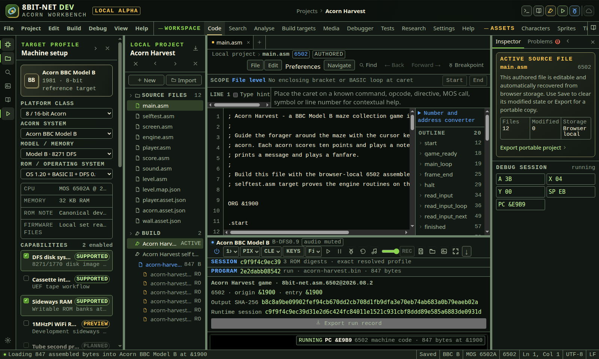

*The child accepts the eight-byte program only after its declared build digest and current ROM-backed session binding validate. The export joins both immutable manifests.*

In the IDE: Help → `#help/emulator-program-provenance`
