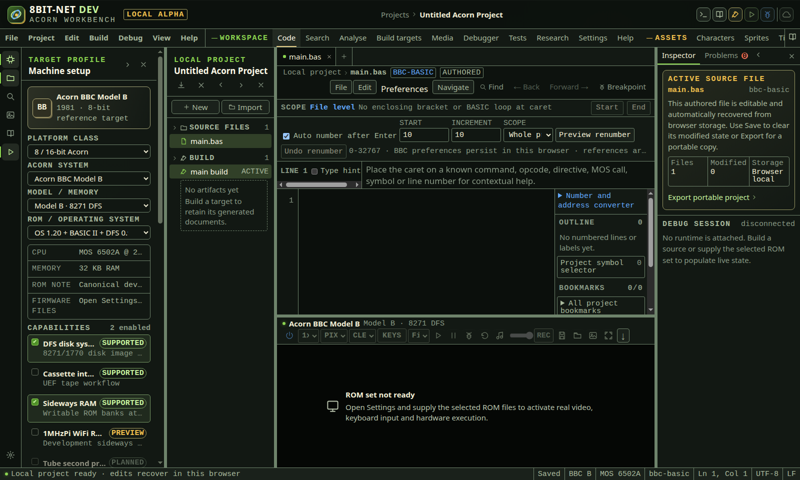
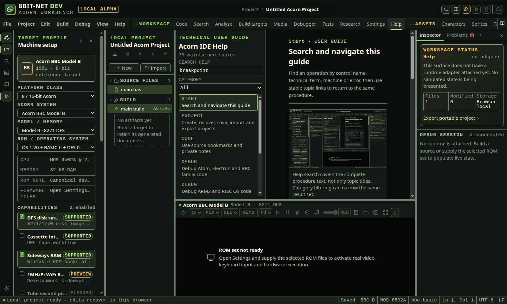

# First run

<!-- Generated by scripts/generateGuides.mjs from src/help/helpTopics.ts. Edit the topics, not this file. -->

## 1. First run and workspace layout

Start the container, open the IDE, identify the project, workbench, emulator and status regions, then confirm that the selected machine can run.

**Before you start**

- Docker Engine with Docker Compose
- Port 8090 available on the host
- A modern browser with WebAssembly, IndexedDB and workers enabled

**Procedure**

1. Run docker-compose up -d from the project directory.
2. Open http://localhost:8090.
3. Use the top target bar to confirm platform, system, model and ROM.
4. Use the left activity bar to open Code, Build targets, Media, Debugger or Help.
5. Read the bottom status line before running or debugging. It reports build and runtime readiness.
6. Put a panel away with its close button or its activity-bar button, and bring it back the same way. The machine runtime beneath the editor is a panel too.
7. Drag the bar between two panels to resize them, or focus it and use the arrow keys. Home and End go to the narrowest and widest; Enter, Space or a double-click returns the panel to its usual size.

**What should happen**

- The webide-acorn and native-builder containers report healthy.
- The IDE opens with a recoverable local project and no bundled proprietary ROM.
- Controls that need firmware remain disabled or state that firmware is required.
- The panel arrangement is remembered in this browser, so the workbench opens the way it was left.
- A panel with more in it than fits scrolls. Nothing is clipped away with no route to it, and the release gate fails if anything ever is.

**Limits**

- Imported ROMs are stored in browser IndexedDB and are not included in project exports.
- A310 startup can take a long time. Fast boot advances the genuine core; it does not substitute a fake boot state.
- On a narrow window the panels are laid over the editor rather than beside it, so there is no edge between them to drag. The inspector is not shown at all below about 1180 pixels.

**If it goes wrong**

- If the page does not load, run docker-compose ps and confirm the 8090 to 8080 port mapping.
- If a capability is unavailable, check the selected machine profile and Settings ROM inventory.
- If the panels end up an awkward size, run Reset panel sizes from the command palette.

*The desktop workbench. Target context is at the top, project files are on the left, the active tool is central and the real machine surface is on the right.*

In the IDE: Help → `#help/first-run`

## 2. Search and navigate this guide

Find an operation by control name, technical term, machine or error, then use stable topic links to return to the same procedure.

**Before you start**

- The IDE is open

**Procedure**

1. Open Help from the activity bar or command palette.
2. Enter one or more terms in Search help. Every term must occur in a matching topic.
3. Choose a category when the result set is broad.
4. Select a result and follow the numbered procedure in order.
5. Read the expected result and limits before changing firmware, project data, machine state or media.
6. Use related, previous and next topic controls to continue without losing the current search.
7. Copy the #help/topic-name address from the browser when recording a support procedure.

**What should happen**

- Search examines titles, summaries, procedures, limitations and recovery guidance.
- Selecting a topic updates a stable browser fragment.
- Each maintained screenshot has a caption and a complete text equivalent in the surrounding procedure.

**Limits**

- Screenshots show the documented interface release and can differ from local theme overrides.
- The guide does not include proprietary ROM content or private project data.

**If it goes wrong**

- Clear the search and select All to restore the complete topic list.
- If a saved topic link no longer exists, Help opens the first maintained topic.

*Help search covers the complete procedure text, not only topic titles. Category filtering can narrow the same result set.*

In the IDE: Help → `#help/using-help`

## 3. Open a sample game

Open one of the two complete sample games as an ordinary editable project, then build it, run it and, for the assembly sample, execute its real-machine test plan.

**Before you start**

- A browser with IndexedDB and workers enabled
- For running or testing on the real machine, the BBC Model B ROM images you supply in Settings

**Procedure**

1. Choose Start from a sample or existing codebase in the toolbar, or run that command from the command palette.
2. Stay on the Sample projects tab and read what each sample demonstrates.
3. Choose Open Acorn Harvest for the 6502 assembly maze game, or Open Acorn Catcher for the BBC BASIC II game.
4. Press F7 to build, or F5 to build and run once firmware is present.
5. For Acorn Harvest, select the Acorn Harvest self test build target and open Tests to run its engine contract on the real machine.

**What should happen**

- The sample opens as a normal browser-local project: every file is editable, nothing is read-only and nothing is hidden.
- Acorn Harvest builds two targets from seven shared modules and three generated pixel assets.
- Acorn Catcher builds to a real tokenized BBC BASIC II program rather than a text listing.
- Test all reports the Acorn Harvest engine contract against genuinely executed 6502 state.

**Limits**

- Opening a sample replaces the current browser-local project; export the current project first if you still need it.
- Building a sample needs no firmware, but running or testing one on the real machine needs ROM images you are entitled to use.
- Acorn Catcher has no automated test plan: this build runs hardware tests for 6502 and 65C12 targets only.

**If it goes wrong**

- If the samples do not appear, the catalogue failed to load and the dialog says so; reload the page.
- If Run or Test is refused, open Settings and check the ROM inventory for the selected machine.

In the IDE: Help → `#help/sample-projects`

## 4. Move, reset and share your settings

See which layer each preference is coming from, carry one with a project, and move a whole setup between browsers.

**Before you start**

- A browser that allows local storage for this origin
- A project open, to use the project layer

**Procedure**

1. Open Settings and read the settings table.
2. Check the From column: Built in, This browser, or This project.
3. Use Carry with project on a preference the work needs, so it travels with the project rather than with your browser.
4. Use Export settings to write a document, and Import settings to apply one in another browser.
5. Use Reset to built-in defaults to clear what you have chosen here.

**What should happen**

- The value in effect is the highest layer that validates: project over browser over built in.
- A stored value that no longer matches its schema is ignored, not corrected, and the reason is shown against the setting.
- Import applies each entry on its own, so one bad value does not discard the rest, and reports what was refused and why.
- A setting written by a newer build is preserved through export and import rather than dropped.
- Reset names exactly which settings it cleared.

**Limits**

- Projects, firmware, test history and asset drafts are not settings. They are excluded from export, and an import cannot write one back.
- Settings live in this browser for this origin. Clearing site data clears them.
- A preference carried by a project applies for as long as that project is open, and is validated again when the project is opened.

**If it goes wrong**

- If a setting appears to be ignored, read the note under it: the layer that supplied it and the reason it was refused are both stated.
- If an import reports refusals, correct those entries in the document and import it again. What was applied stays applied.
- Reset to built-in defaults clears only settings, never a project.

In the IDE: Help → `#help/settings-layers`
