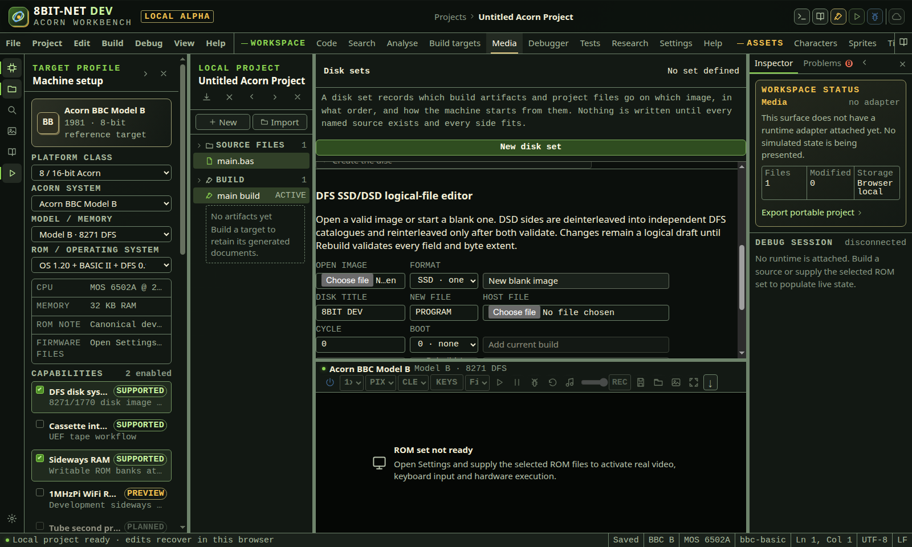
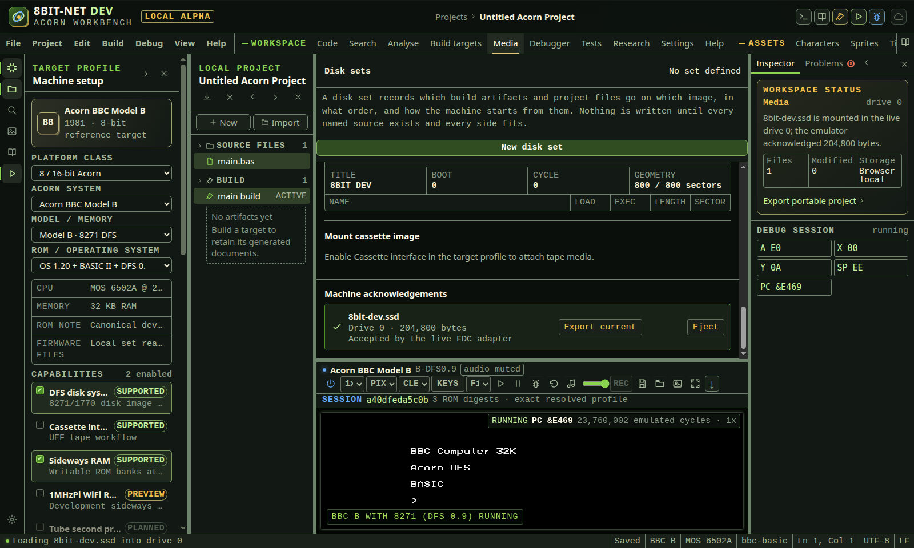
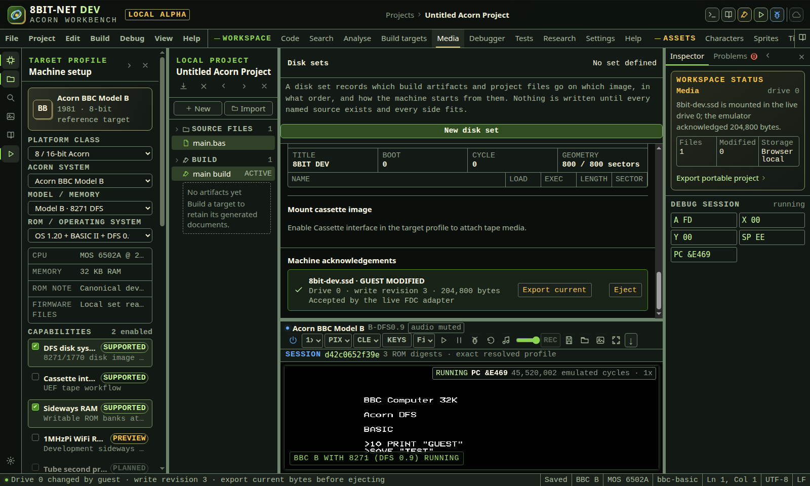

# Discs, tapes and media

<!-- Generated by scripts/generateGuides.mjs from src/help/helpTopics.ts. Edit the topics, not this file. -->

## 1. Create, inspect and mount media

Work with DFS, DSD, ADFS, cassette, Atom ATM and RISC OS application payloads while preserving Acorn metadata.

**Before you start**

- A compatible selected machine and capability
- A current artifact when adding build output

**Procedure**

1. Open Media and choose the medium or container.
2. Open an existing image or create a new one with explicit geometry.
3. Inspect catalogue names, load address, execution address, lock state, file type and size.
4. Add, replace, rename, extract or remove files.
5. Validate capacity and catalogue rules before export.
6. Mount the image in the selected drive or cassette adapter.
7. For RISC OS, stage an application or ADFS file and launch only after the real core reaches the entry point.

**What should happen**

- Exports are deterministic and catalogue validation runs before download.
- Mounted media appears in live emulator state.
- Launch completion is reported only from the emulator execution hook.

**Limits**

- Not every machine supports every media type.
- Unsupported protection, extended metadata or damaged-image recovery must be reported, not discarded silently.

**If it goes wrong**

- Unmount the medium before replacing it.
- Export a backup before catalogue mutation.
- Check load and execution addresses if a file loads but does not start.

*The media workspace validates catalogue fields and byte limits before rebuilding or mounting an image.*

In the IDE: Help → `#help/media`

## 2. Assemble a release on disc

Record which build artifacts and files go on which disc and side, in what order, how the machine boots from them, and write every image in one step.

**Before you start**

- A project with at least one 6502 or ARM build target
- A build of each target the set names, retained in this session

**Procedure**

1. Open Media and use New disk set.
2. Name the set, then add a disc and choose single- or double-sided DFS.
3. Give each side a DFS title of up to twelve characters.
4. Use Add file, then choose the build target, project file or generated boot file each entry comes from.
5. Set the DFS filename and directory letter for each entry, and reorder entries with the arrow controls.
6. Choose the boot action and the file it acts on.
7. Read the sector and file counts on each side, then use Write disk set.

**What should happen**

- The dependency list names each build target once and says whether an artifact for it exists.
- Write disk set stays unavailable, naming the targets to build, until every source exists.
- Each side reports its sector and file use against the real DFS limits before anything is written.
- Every image is written through the same DFS writer used elsewhere, so each side is reparsed and byte-compared.

**Limits**

- A DFS side holds 798 sectors after its catalogue and names at most 31 files. Sectors are whole, so a one-byte file still costs 256 bytes of the disc.
- Artifacts come from builds retained in this browser session. Reloading loses them until the targets are built again.
- This workflow writes DFS single- and double-sided images. ADFS and RISC OS application transfer are separate workflows.

**If it goes wrong**

- If a side does not fit, the shortfall is stated in sectors and bytes. Move a file to another side or disc.
- If a side says it cannot be sized yet, build the targets its files come from.
- A file with no bytes is refused rather than written as an empty catalogue entry, because DFS cannot hold one.
- A disk set that cannot be read back from a project file is dropped whole rather than partly repaired.

In the IDE: Help → `#help/disk-sets`

## 3. Mount and eject live jsbeeb media

Attach a validated disk or cassette to the active Atom, Electron, BBC or Master adapter, distinguish request state from machine acknowledgement, then eject it from the real FDC or cassette input.

**Before you start**

- A jsbeeb-backed machine with its required firmware ready
- DFS, ADFS or cassette capability enabled for the selected profile
- A supported validated image, or a DFS image built by the logical-file editor

**Procedure**

1. Open Media and confirm the live machine remains visible below the workspace.
2. For a new DFS disk, choose New blank image or add files to the logical editor.
3. Choose Rebuild / validate. Mount remains unavailable until the deterministic writer and independent reader both accept the image.
4. For an existing disk, choose Disk image file and inspect the decoded catalogue, geometry and warnings before mounting.
5. Choose Drive 0 or Drive 1. This choice is part of the command sent to the live FDC.
6. Choose Mount disk. The status first reports that loading was requested.
7. Wait for Machine acknowledgements to show the filename, drive, byte count and Accepted by the live FDC adapter.
8. Treat the acknowledgement as authoritative. Selecting a local file alone does not mean that the machine has it mounted.
9. For cassette input, enable the cassette capability, select a bounded UEF or tapefile image and choose Mount cassette.
10. Wait for the cassette acknowledgement. It names the parser format and accepted byte count from the runtime.
11. Use the guest filing system or cassette commands normally. The IDE does not bypass MOS, ADFS, DFS, ACIA or Atom PPIA behavior after attachment.
12. Choose Eject beside the acknowledged disk or cassette.
13. Wait for the bottom status to report live FDC or live input adapter acknowledgement.
14. Confirm the removed item disappears from Machine acknowledgements. No media is mounted appears when the final item is gone.
15. If another disk remains in the other drive, only the requested drive record is removed.
16. Open Debug session when auditing transport. Mount and eject must use the same random runtime session and increasing command IDs.
17. Treat mount and eject as replay boundaries. Existing reverse history cannot cross a physical-media transition safely.

**What should happen**

- A generated blank DFS SSD is 204,800 bytes and round trips through the independent catalogue reader before mount.
- The runtime publishes media-loaded only after the real jsbeeb FDC or cassette device accepts the image.
- Disk acknowledgement records include drive 0 or 1 and replace an earlier record only for the same drive.
- Cassette acknowledgement replaces only the prior cassette record and does not remove mounted disks.
- Eject calls the real FDC with an empty drive or clears the real ACIA or Atom PPIA tape source before publishing media-ejected.
- The UI removes media only after media-ejected arrives from the active child session.
- The machine, debugger and media workspace observe the same retained mount list.

**Limits**

- The pinned A310 adapter can mount qualified 800 KiB ADFS images, but its core does not yet expose qualified current-byte export or unload operations. Its controls are disabled with those reasons.
- Media bytes are retained in browser memory for the active machine session and are not added to the project automatically.
- Cassette stream position is not preserved in current machine-state downloads.
- Guest write tracking and current-byte export are qualified for jsbeeb SSD and DSD images. The pinned upstream ADF loader does not expose its write callback.
- Mounting or ejecting resets the current 6502 replay segment because device input changes cannot be reconstructed from processor state alone.

**If it goes wrong**

- If Mount disk is disabled, rebuild the logical DFS image or resolve catalogue errors in the imported image.
- If no acknowledgement appears, verify machine connection, drive capability and adapter error state.
- If Eject is disabled on A310, reset or restart the A310 session only when losing all current guest state is acceptable.
- If the guest still reports a removed disk, wait for its filing system to rescan or issue the appropriate guest mount command.
- If an eject command reports an adapter error, use Restart adapter and remount only the required media.
- Export generated media before clearing browser storage or replacing it with another logical draft.

*Machine acknowledgements appear only after the jsbeeb FDC accepts the exact disk bytes. Eject acts on that acknowledged drive record.*

In the IDE: Help → `#help/emulator-media-eject`

## 4. Export a disk changed by the guest

Track writes made through the live jsbeeb FDC, distinguish mounted source bytes from current guest bytes and download the current SSD or DSD image before ejecting or powering off.

**Before you start**

- A jsbeeb-backed BBC or Master profile with a qualified FDC and filing-system ROM
- A validated writable SSD or DSD image mounted in drive 0 or 1
- Enough host storage for the exported current image

**Procedure**

1. Open Media and mount a validated SSD or DSD image.
2. Wait for Machine acknowledgements to report the accepted drive and original byte count.
3. Use DFS from the emulated machine to save, delete, compact, rename or change catalogue data.
4. Wait for the drive acknowledgement to show GUEST MODIFIED.
5. Read write revision. It increases when jsbeeb serializes a changed current image through its disk callback.
6. Treat the revision as a change signal, not as a count of individual sectors or files.
7. Select Export current before ejecting, resetting browser storage, restarting the adapter or powering off.
8. Keep the downloaded filename extension. SSD and DSD layout is preserved.
9. Compare the downloaded image with the mounted source when auditing changes. A byte digest should differ after a successful guest write.
10. Open the exported image in the Media catalogue reader before relying on it.
11. Confirm the intended guest files, catalogue title, boot option, cycle number, load addresses and execution addresses.
12. Export another copy after later guest writes. Export does not clear the dirty state because it does not prevent additional writes.
13. Eject only after the required revision has been downloaded and independently opened.
14. Keep the original image until the exported current image has passed catalogue and application checks.

**What should happen**

- The disk callback supplies a complete current image after jsbeeb accepts a guest write.
- The child replaces its retained export bytes, marks the drive dirty and increments the revision before publishing media-changed.
- The parent updates only the matching drive acknowledgement.
- Export current requests bytes from the active child rather than downloading the stale file originally selected in Media.
- The child returns a bounded Blob with the retained current byte count, dirty state and revision.
- The downloaded SSD or DSD has the same geometry and byte count as the mounted image while changed sectors differ.
- A real BBC DFS save changes the exported SHA-256 and its new catalogue entry is readable by the independent Media parser.

**Limits**

- Current-byte export is qualified for SSD and DSD because the pinned jsbeeb loaders expose complete-image write callbacks for those formats.
- The pinned jsbeeb ADF and ADL loaders currently ignore their write callback. The IDE does not claim current-byte export for those formats.
- A310 guest media export remains unavailable because the pinned core bridge does not expose its current disk bytes.
- Cassette output recording is separate and is not implemented by this disk control.
- Dirty state is volatile machine-session state. Reload, adapter restart and power off discard it.
- The revision can group writes according to upstream serialization timing and must not be interpreted as a sector-write counter.

**If it goes wrong**

- If GUEST MODIFIED does not appear, confirm that the guest command completed without a filing-system error and that the image is SSD or DSD.
- If export reports no mounted disk, remount the intended source and repeat the guest operation. Lost volatile changes cannot be reconstructed.
- If the independent catalogue reader rejects the export, keep the original, do not overwrite backups and reproduce the operation on a fresh copy.
- If the guest reports write protected, inspect source format and drive configuration. The IDE does not silently bypass guest write protection.
- If A310 or ADF export is disabled, use a supported host-side media workflow or a qualified emulator-specific export path when one is added.
- If the browser blocks the download, permit downloads for this local origin and select Export current again before changing the machine session.

*The live FDC callback replaced the retained image after the guest write. Export current downloads those changed bytes, not the stale image originally mounted.*

In the IDE: Help → `#help/emulator-guest-disk-export`
