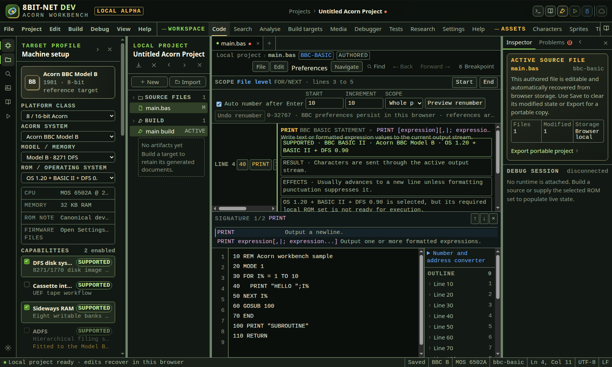
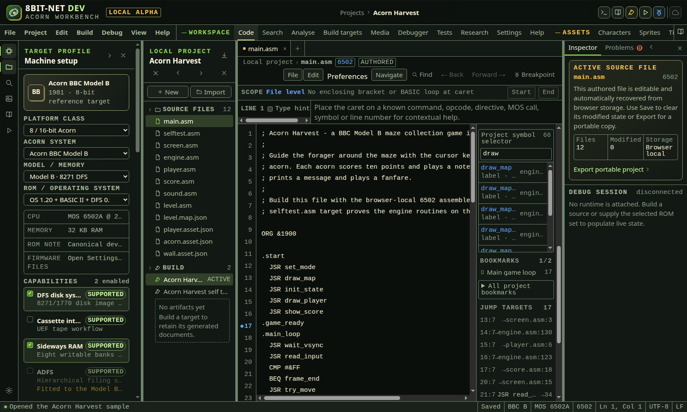
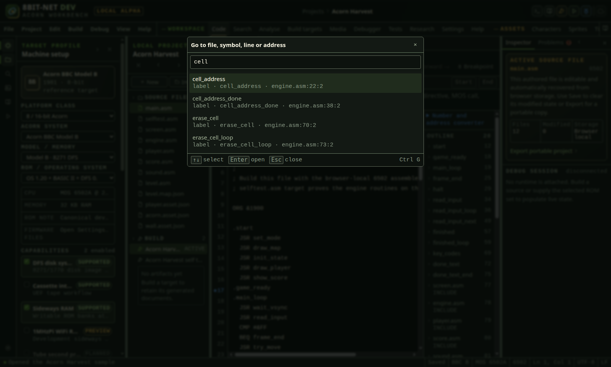
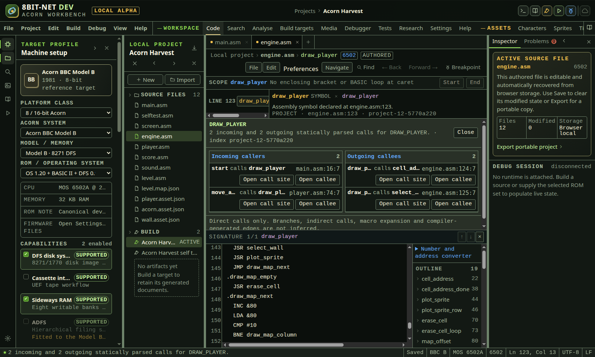
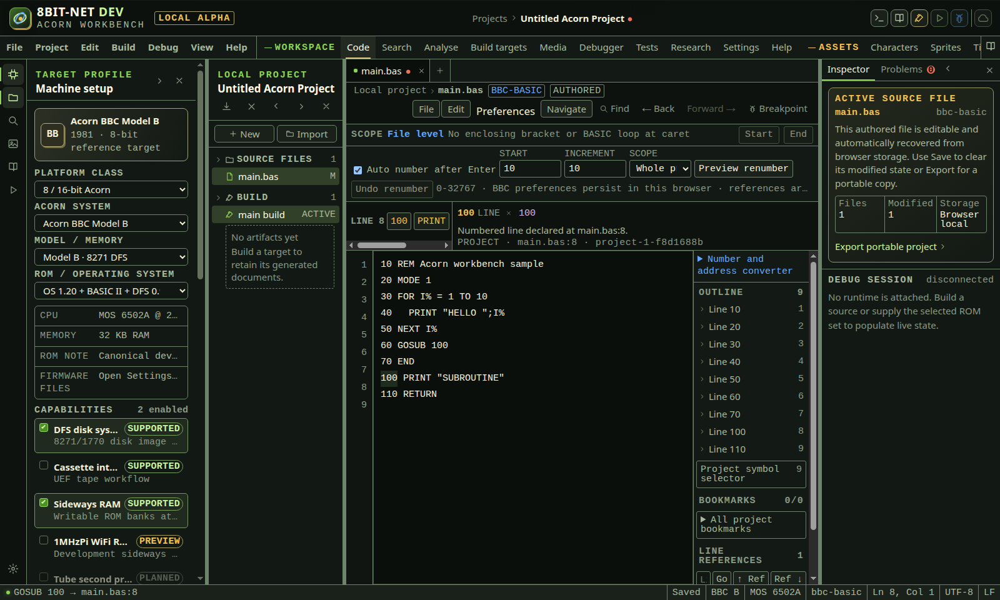
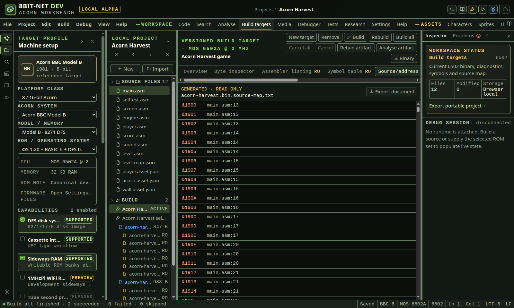
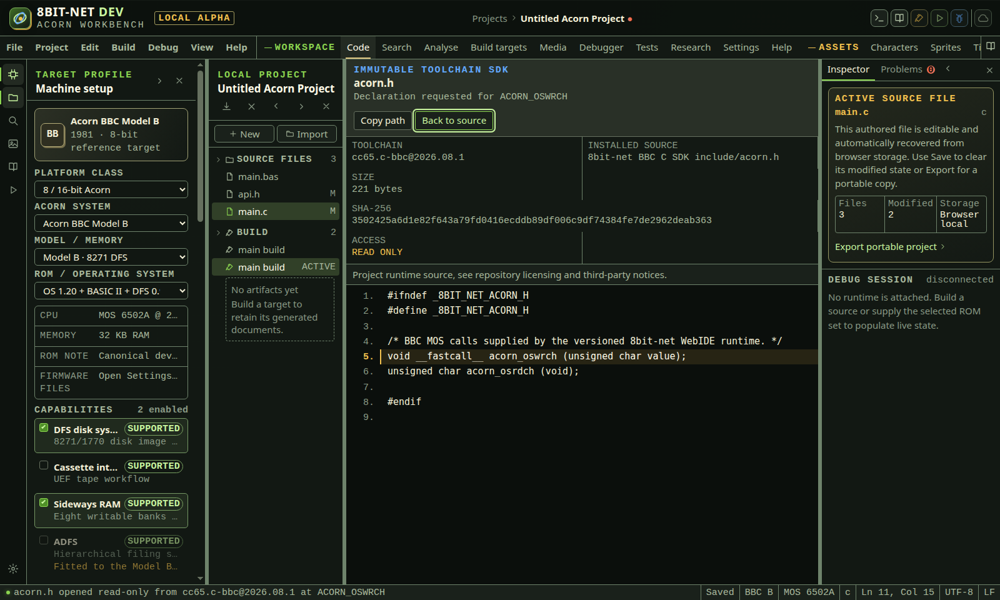
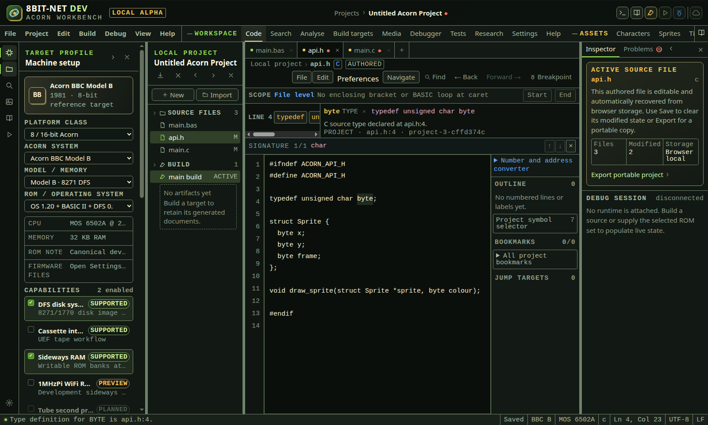

# Finding your way around a codebase

<!-- Generated by scripts/generateGuides.mjs from src/help/helpTopics.ts. Edit the topics, not this file. -->

## 1. Navigate files, scopes, diagnostics and saved changes

Move through exact project source, current build addresses, matched code scopes, live diagnostics and saved-baseline changes without losing the preceding editor location.

**Before you start**

- At least one source file is open
- A current successful machine-code build is required only for address lookup
- Saved-change navigation requires a file with a saved baseline and text changes

**Procedure**

1. Press Ctrl+G to open Go to file, symbol, line or address.
2. Enter a filename or language to open a matching project file at physical line 1. Files without parsed declarations remain available.
3. Enter : followed by a physical line number to move within the active file.
4. Enter a symbol, kind or filename term to filter the current project language index. Use several space-separated terms when the project has repeated names.
5. Enter @ followed by an Acorn hexadecimal address, such as @&1900, to use the current successful build source map.
6. For an unmapped byte inside a mapped instruction or source span, review the nearest preceding mapped address named in the result before opening it.
7. Use Up Arrow and Down Arrow to select a destination. Press Enter to open it or Escape to cancel without changing location.
8. Read the breadcrumb above the editor. It shows project, active file and the nearest parsed routine or label scope. Choose the scope name to open its declaration line.
9. Read the fixed Current source scope strip while editing. It reports the smallest enclosing matched bracket or BBC BASIC loop and its start and end physical lines.
10. Choose Start or press Alt+[ to select the opening bracket or loop command. Choose End or press Alt+] to select its proved matching close.
11. Press F8 for the next live source diagnostic or Shift+F8 for the previous diagnostic. Navigation wraps at the first and last item.
12. Press Alt+F8 for the next working-copy line changed from the saved baseline or Alt+Shift+F8 for the previous changed line.
13. Open Navigate in the editor toolbar when a visible control is preferable. Unsupported actions remain disabled and explain the missing capability in their title or adjacent state.
14. Use Recent file entries in Navigate to return to one of the last ten files visited in the mounted editor pane. The current file is identified and disabled.
15. Use Back or Alt+Left after any recorded project source jump to restore the preceding pane, file, caret, selection and scroll. Use Forward or Alt+Right to revisit the later location.
16. Use the project symbol selector, outline, bookmarks, line references and jump-target list for browsable alternatives that expose all matching destinations.

**What should happen**

- File lookup does not depend on the file containing a parsed symbol.
- Address lookup reads only the exact current artifact source map and never invents a source line from a stale or absent build.
- Bracket matching ignores quoted strings and registered line comments. BASIC loop matching ignores strings, REM tails and DATA payloads.
- The smallest enclosing pair wins when brackets or BASIC loops are nested.
- Diagnostic and saved-change traversal use physical line and column order and wrap predictably.
- Removed saved lines are not treated as working-copy destinations because no current source row exists.
- Breadcrumb, scope strip, navigation menu and keyboard commands reach the same selection functions.
- Disabled state, text labels, focus and notices convey capability without relying on colour.

**Limits**

- Current structural matching covers parentheses, square brackets, braces and maintained BBC BASIC FOR/NEXT, REPEAT/UNTIL, WHILE/ENDWHILE and multiline IF/ENDIF forms.
- Assembly labels provide breadcrumb scopes, but assembler macro, conditional and anonymous-label block pairing requires a dialect-specific parser before it can be claimed.
- Address lookup requires retained debug source locations from the exact current machine-code artifact. BASIC tokenized builds do not expose an address map here.
- Nearest preceding address lookup identifies the mapped source owner. It does not claim that every requested byte is an instruction boundary.
- Live editor diagnostic traversal currently uses the registered BASIC navigation diagnostics in the source pane. Compiler and linker result navigation remains available in build diagnostics.
- Recent files are pane-session state and are not written into the portable project.
- Saved-change traversal is line based and uses the same bounded large-file policy as Compare saved.

**If it goes wrong**

- Rebuild the selected target if an expected @address destination is unavailable or stale.
- Use the build source-map document to confirm an instruction boundary before debugging a byte inside a mapped span.
- Move the caret inside the intended brackets or BASIC loop when Start and End are disabled.
- Correct unmatched brackets or loop commands, then move the caret to refresh the structural range.
- Save the file once if saved-change controls are disabled because no baseline exists.
- Open Compare saved when several additions and removals need to be reviewed together.
- Use Ctrl+G by filename when an expected file has no symbols and therefore is absent from symbol-only results.

*The source navigation surface keeps structural scope, diagnostic traversal, saved-change traversal and recent file access beside the active editor.*

In the IDE: Help → `#help/source-navigation-workflow`

## 2. Find and open project symbols

Search the parsed project symbol index and open a declaration at its exact source range without guessing from plain text.

**Before you start**

- A source project is open
- The files use a language with a registered symbol parser

**Procedure**

1. Open Project symbol selector in the source sidebar.
2. Enter one or more terms. Every term must match the symbol name, parsed signature, kind or filename.
3. Review the displayed kind, signature, filename and physical line.
4. Press Enter to open the first result, or choose a specific result.
5. Confirm that the destination file opens and the declaration range is selected.
6. Press Escape in the search field to clear the query.

**What should happen**

- Assembly labels, BASIC line declarations, Atom BASIC labels, BBC BASIC procedures and BBC BASIC functions come from the same project index used by completion, definition, references and safe rename.
- Cross-file selection preserves the parsed declaration line, column and length.
- Results are sorted by symbol name, filename and line.

**Limits**

- The list is bounded to 200 displayed results. Type a narrower query for larger projects.
- Constants, macros and C declarations are omitted until their language adapters can identify them authoritatively.
- A symbol outside the current INCLUDE graph may be listed project-wide even when definition lookup correctly refuses to resolve it from the active assembly file.

**If it goes wrong**

- Clear the query and search by filename plus symbol kind.
- Fix duplicate declarations or broken INCLUDE paths when definition and reference lookup reports ambiguity.
- Use project text search when looking for comments, strings or other content that is not a declaration.

*The selector identifies the parsed label, source file and physical line before exact cross-file navigation.*

In the IDE: Help → `#help/symbol-navigation`

## 3. Go to a line or parsed symbol

Use one modal keyboard surface for an active-file physical line or an exact declaration from the parsed project symbol index.

**Before you start**

- A source file is active

**Procedure**

1. Press Ctrl+G from the editor or another workbench control, or choose Go to line or project symbol from the command palette.
2. For a physical line in the active file, enter the number with an optional colon prefix, such as :120.
3. For a declaration, replace the query with one or more terms from its symbol name, parsed kind, signature or filename.
4. Use Up and Down Arrow to change the active result.
5. Press Enter to open the active result, or choose it with a pointer.
6. Press Escape or Close to cancel without moving the source caret.

**What should happen**

- The dialog initially selects the current physical line.
- A valid line result reports the active filename and permitted range.
- A symbol result reports its parsed kind, signature, filename, physical line and column before navigation.
- Opening a symbol selects its exact declaration range.

**Limits**

- At most 100 symbol results are displayed in the modal. Enter more terms to narrow the index.
- Numeric input means a physical source line, not a BASIC program line number or machine address.
- Machine-address navigation requires current build debug metadata. It is not guessed from source literals and remains a separate capability-bound workflow.

**If it goes wrong**

- If a line is rejected, enter a value within the range shown for the active file.
- Use the BASIC line navigation control when the destination is a BASIC program line number.
- Use project text search when the destination is not a parsed declaration.

*Ctrl+G searches trustworthy parsed destinations and shows their exact kind, signature, file, line and column before navigation.*

In the IDE: Help → `#help/go-to-source`

## 4. Inspect direct callers and callees

Derive a bounded incoming and outgoing call graph from exact parsed project source, navigate either end of each edge, and keep this static evidence distinct from the live debugger stack.

**Before you start**

- A BASIC, 6502, ARM or C source file is open
- The caret is on a uniquely resolved callable symbol or one of its parsed direct calls
- Cross-file assembly, ARM or C sources are connected through project include relationships

**Procedure**

1. Place the caret on the callable symbol or a direct call to it.
2. Choose Call hierarchy from the editor's Navigate menu or press Alt+Shift+H.
3. Read the source-index identity and the separate Incoming callers and Outgoing callees counts.
4. In Incoming callers, review the caller, callee and exact call-site file, physical line and column.
5. In Outgoing callees, review each direct call owned by the selected routine or nearest parsed assembly label.
6. Choose Open call site to select the exact call operand or function name in editable source.
7. Choose Open callee when a unique destination is resolved. The exact declaration range is selected.
8. Choose Back or press Alt+Left to return. File, caret, selection and vertical scroll are restored from the bounded source-location history.
9. Choose Forward or press Alt+Right to revisit the destination.
10. Choose Close or change the source, project, target or build context to discard the hierarchy. Results from an older language revision are not retained.
11. Use References when you need all parsed declarations and references rather than call edges only.
12. Use the Debugger call stack when you need observed runtime frames. Static Call hierarchy and the live stack answer different questions.

**What should happen**

- 6502 JSR is treated as a direct call. JMP and conditional branch instructions are excluded.
- ARM BL is treated as a direct call. Ordinary B and conditional B instructions are excluded.
- BBC BASIC PROC, FN and GOSUB forms are treated as calls when their targets are parsed.
- Direct C function-call expressions are included across connected quoted headers and sources.
- Disconnected project components do not contribute callers or callees.
- Every displayed edge has a navigable source range. A callee action appears only when a unique project declaration is available.
- The result labels itself as statically parsed source evidence and never claims to represent executed frames.
- Keyboard and pointer requests use the same versioned language session and stale-response rejection.

**Limits**

- Indirect calls through addresses, vectors, C function pointers or dispatch tables cannot be derived without points-to or compiler records.
- Macro expansion, conditional compilation and linker-generated calls are not inferred.
- For assembly, the nearest preceding parsed label owns a call. Code and data intent beyond that label requires debug metadata.
- Tail calls expressed as jumps are excluded because source syntax alone does not prove call semantics.
- A duplicate destination remains ambiguous. The hierarchy does not choose one declaration by file order.
- The static hierarchy does not include recursion depth, return addresses, stack contents, hit counts or calls made only on a particular runtime path.
- Source-location history is bounded to 100 entries.

**If it goes wrong**

- If the hierarchy is unavailable, use F12 first and resolve duplicate or disconnected declarations.
- If an expected C call is absent, confirm the source uses a direct identifier call and that its quoted include graph reaches the declaration.
- If an assembly edge is absent, confirm the instruction is JSR for 6502 or BL for ARM.
- If Open callee is absent, inspect References for ambiguity or a missing target.
- After editing an include or call, close and invoke Call hierarchy again so the current language revision is used.
- Use the live Debugger stack when a call is indirect, generated, conditional at runtime or supplied by ROM code.

*The parsed hierarchy includes main calling draw and draw calling plot. The nearby BNE draw branch is deliberately absent, and each proven call edge provides source and destination navigation.*

In the IDE: Help → `#help/call-hierarchy`

## 5. Open source targets and technical references

Follow parsed control-flow operands and declarations while keeping ambiguous, unavailable and non-source destinations explicit.

**Before you start**

- A BASIC, 6502, ARM or C source file is open
- Included project files use resolvable project filenames
- The selected machine, processor, ROM and toolchain match the source

**Procedure**

1. For a parsed BASIC GOTO, GOSUB, PROC or FN target, click or tap the target text once.
2. For a parsed 6502 JMP, JSR or conditional branch operand, click or tap the operand once.
3. For a parsed ARM B, conditional B or BL operand, click or tap the operand once.
4. For a parsed C function call whose definition is in the current source, click or tap the function name once.
5. For a macro, include filename, constant, declaration or another semantic token, place the caret on the token and press F12.
6. Pointer users can double-click the same semantic token. Touch and switch users can place the caret and choose Definition / Research from the editor's Navigate menu.
7. Ctrl+click or Command+click also requests the semantic destination at the current caret.
8. Confirm the destination file, physical line and column in the status bar. The exact declaration range is selected.
9. Use Back or Alt+Left to return to the preceding source location. Use Forward or Alt+Right to revisit it.
10. If more than one declaration is visible in the connected include graph, choose a named file and location from the definition dialog. Cancel leaves the source location unchanged.
11. For a maintained MOS call, SWI, opcode, command or hardware symbol with no editable project declaration, use F12, double-click or Definition / Research. The IDE opens Research with the language and token selected.
12. Use the Jump targets or Line references list to review every parsed source range, resolution status and destination. Its separate source button selects the operand; its target button follows the destination.
13. Use Shift+F12 to inspect all declarations and parsed references for the token before navigating.
14. After editing an include, target or build configuration, invoke navigation again. Results from an older source, project, target or build revision are rejected.

**What should happen**

- A normal single click navigates only when the caret is inside an exact parsed reference range, so ordinary editing clicks elsewhere do not leave the file.
- BASIC numeric targets select the declared line number, not a physical line guessed from its value.
- Cross-file assembly destinations are limited to the connected INCLUDE graph.
- A unique editable declaration opens directly. Duplicate declarations require an explicit choice.
- Maintained operating-system and hardware knowledge opens as technical reference material and is never presented as editable project source.
- Keyboard, pointer, touch and switch-control paths use the same versioned resolver and produce the same destination.
- The selected destination is visible through text selection and a status message, not colour alone.

**Limits**

- Direct one-click ranges currently cover BASIC line and routine calls, 6502 jump and call operands, ARM branches and direct C function calls identified by the registered parsers.
- Macro and include activation uses F12, double-click, Ctrl+click or the visible Navigate menu control because a plain editing click must still position the caret safely.
- C function pointers, preprocessor-generated calls, linker aliases and conditionally compiled declarations require compiler language records and are not guessed.
- Build-only symbols open immutable artifact evidence rather than an editable source declaration.
- Bank-qualified symbols require explicit bank-aware debug metadata. Duplicate source names without bank evidence remain ambiguous.
- Research routing is available only for maintained reference entries. Unknown tokens stay unresolved.
- Text files have no semantic target provider.

**If it goes wrong**

- Open the Jump targets or Line references list and read the displayed reason for a missing destination.
- Correct a filename or INCLUDE path when the declaration exists outside the connected graph.
- Rename or remove duplicate declarations, then invoke navigation again.
- Rebuild before following a generated or linker-derived address after source or target changes.
- Use project text search when the destination is comment text, a string or a token unsupported by the current parser.
- Use Research directly when you know the technical term but the source provider cannot identify it at the caret.

*The direct operand action resolves through the parsed BASIC model. The destination line number is selected, the line-reference list retains the source and target, and the status bar reports the exact destination.*

In the IDE: Help → `#help/target-navigation`

## 6. Inspect a current build-only symbol

Open the exact retained artifact address and immutable source-occurrence evidence when a linker, assembler define, SDK startup or generated unit supplies a name that has no editable declaration.

**Before you start**

- A machine-code build target has completed successfully
- The retained artifact still matches the target, machine and every declared source input
- The source contains a symbol emitted by that exact build but not declared in editable project source

**Procedure**

1. Build the active target and confirm SUCCEEDED.
2. Check that the artifact is current. A stale banner means the symbol route is deliberately unavailable.
3. Return to Code and place the caret on the build-only symbol.
4. Press F12. Pointer users can double-click the token or use Definition / Research.
5. The IDE opens Build targets, clears any generated-document view and selects the matching artifact symbol.
6. Read the exact address shown beside the selected symbol.
7. Read Symbols and immutable references. A source occurrence is labelled DEF or REF only when the current artifact has an exact project range.
8. If no project occurrence exists, read the explicit predefined or toolchain symbol message. Do not treat the address as an editable variable or label.
9. Use Symbol table to inspect all names from the same artifact, or Build provenance to verify the target, inputs, toolchain version and digests.
10. Return to Code and edit a declared input. The retained result becomes stale and the previous build-only symbol is removed from language navigation.
11. Rebuild, then invoke F12 again to obtain evidence from the new artifact.

**What should happen**

- The selected name and address come from the exact current successful artifact.
- The build workspace highlights the requested symbol with aria-pressed state and a visible selected style.
- The notice gives the name, address, lack of editable declaration and read-only artifact destination.
- Source occurrences use immutable artifact source maps rather than a fresh text search.
- A repeated open request is consumed after selection, so later visits to Build targets preserve the user’s current symbol choice.
- Changing source, target, machine, toolchain or build identity removes generated symbols from completion and navigation until a successful rebuild.

**Limits**

- An address symbol is not automatically a typed variable, function, memory region or writable location.
- Assembler and linker artifacts can omit lexical scope, storage class, type, bank and lifetime.
- The browser-local 6502 assembler includes predefined, profile and project symbols in the artifact. The panel identifies project occurrences separately.
- A symbol with an editable unique declaration opens source instead of this artifact panel.
- A stale retained artifact remains available for inspection but cannot supply current editor navigation.
- Bank-qualified routing remains unavailable until the toolchain provides bank-aware symbol and source-map records.

**If it goes wrong**

- Rebuild when the symbol is absent after an edit or target change.
- Open Build provenance and confirm the artifact inputs include the source you expected.
- Check the build symbol table for spelling and case when F12 reports an unresolved token.
- Use the source definition chooser when the name also has multiple editable declarations.
- Select the correct build target before rebuilding when a project retains more than one artifact.
- Do not copy an old address into source merely to bypass a stale-artifact warning.

*The current build supplies GENERATED_BUFFER at &3200. The selected symbol, mapped instruction, build identity and status notice remain visible together, while the IDE states that no editable declaration exists.*

In the IDE: Help → `#help/generated-symbol-navigation`

## 7. Inspect installed C SDK declarations

Open the exact read-only header used by the selected cc65 BBC toolchain, inspect a declaration with installed-source provenance, then return to the unchanged source position.

**Before you start**

- A C source file is open
- The active build target uses cc65 C + WebIDE BBC runtime
- The system include or function is supplied by the installed cc65 or WebIDE BBC SDK

**Procedure**

1. Place the caret inside an angle-bracket include filename such as acorn.h or conio.h and press F12.
2. Alternatively, place the caret on a maintained SDK function such as acorn_oswrch, acorn_osrdch or cputc and press F12.
3. Pointer users can double-click the same include or function. Ctrl+click, Command+click and Definition / Research use the same resolver.
4. Wait for the immutable toolchain SDK view. The request is cancelled if another SDK document is requested before it completes.
5. Confirm the header path and the cc65.c-bbc toolchain version in the heading and provenance strip.
6. Confirm Installed source identifies either the WebIDE BBC SDK include root or the installed cc65 include root.
7. For a function request, inspect the source line marked as the current location. The requested declaration is selected by token without modifying the header.
8. Read Size and SHA-256 before recording a compiler or SDK defect. These values identify the exact installed bytes.
9. Read the licence note. Any upstream notice present in the header remains visible in the source listing.
10. Choose Copy path to copy the toolchain-relative header path. Clipboard denial produces a visible fallback containing the path.
11. Choose Back to source or press Escape. The IDE restores the source editor, caret, selection and scroll because the editor remains mounted while the SDK view is open.
12. For a quoted include such as #include "game.h", use F12 to open the editable project header instead. Quoted and system includes do not share a destination namespace.

**What should happen**

- The view contains the actual installed compiler input, not a generated summary or duplicated browser definition.
- The SDK document is visibly marked READ ONLY and does not expose editing controls.
- A declaration request marks one exact line with aria-current, a visible line highlight and the source text.
- The server validates a relative bounded path, prevents traversal, limits files to 256 KiB and accepts only readable UTF-8 text.
- The browser validates schema version, requested path, byte count, size bound and SHA-256 shape before displaying content.
- Changing source is impossible from the SDK view. Returning reveals the same editable document state.
- System-header navigation is available only when the active language is C and the selected toolchain is cc65.c-bbc.

**Limits**

- The current semantic map covers maintained functions advertised by editor completion. Other installed declarations can be reached through their angle-bracket include but are not guessed from an unknown token.
- Macro expansion, conditional compilation, typedef chains and declarations selected by compiler command-line defines require future compiler language records.
- The selected declaration is the first exact token occurrence in the installed text. Headers with several conditional declarations for the same token need compiler configuration data to identify the active branch.
- Binary libraries, object files and headers larger than 256 KiB are not source documents and cannot be opened in this view.
- The relative path is copied, not an inaccessible container filesystem path.
- An upstream header licence can differ from project-maintained SDK overlay licensing. Use the displayed source and licence fields together.

**If it goes wrong**

- If the SDK view reports not found, confirm the include spelling and the active cc65 C build target.
- If the request fails, choose Retry after confirming native-builder is healthy.
- If F12 opens Research or reports no declaration, open the matching angle-bracket include directly. The function may not yet be in the maintained semantic map.
- If the source changed while the view was open, return to source and invoke F12 again from the current token.
- If byte or schema validation fails, restart with the matching web and native-builder images. Do not treat mismatched service versions as compiler evidence.
- Use Build provenance to record the complete toolchain and project input identity alongside the SDK path and SHA-256.

*F12 on acorn_oswrch opens the exact project-maintained header consumed by cc65. The highlighted declaration and immutable provenance remain visible together, and Back to source restores the editor state.*

In the IDE: Help → `#help/sdk-document-navigation`

## 8. Open C declarations, implementations and types

Choose the exact relationship you need in connected C project source instead of treating a prototype, function body and typedef as interchangeable destinations.

**Before you start**

- A C source file is open
- The active project include graph connects the calling source, quoted headers and implementation source
- The requested name has a statically parsed C prototype, function body, typedef or tagged type

**Procedure**

1. Place the caret on a C function call or function name.
2. Choose Declaration or press Ctrl+F12 to open a parsed prototype. If no separate prototype exists, the only parsed function declaration is used.
3. Return with Back or Alt+Left.
4. Place the caret on the function again, then choose Implementation or press Ctrl+Shift+F12 to open the function body.
5. Confirm the exact function name is selected at the destination and the physical file, line and column appear in the status message.
6. Return to the source file.
7. Place the caret on a typedef alias or a named struct, union or enum token.
8. Choose Type definition or press Alt+F12.
9. Confirm the typedef or tagged-type name is selected in the connected header or source file.
10. Use Definition / Research or F12 when one general destination is sufficient. For a C function with one implementation and one prototype, the explicit commands avoid an ambiguous result.
11. If several candidates remain for the requested relationship, choose a named file and location from the definition dialog. The IDE does not use file order as a tie breaker.
12. Use Back and Forward to move through the resulting locations. Each history entry restores file, caret, selected range and vertical scroll.

**What should happen**

- Declaration navigation selects the parsed prototype when a prototype and body are both connected.
- Implementation navigation selects only a parsed function body containing an opening brace on its declaration line.
- Type-definition navigation selects a connected typedef alias or named struct, union or enum declaration.
- The selected destination range and status text make the result perceivable without relying on colour.
- All relationship requests run through a versioned language channel. A source, project, target or build revision change invalidates a pending result.
- Assembly and BASIC declarations that also act as implementations can use the same source candidate. Type-definition navigation reports that it is not derivable for those languages.
- Constants and variables report that no separate implementation is derivable rather than navigating to an unrelated token.

**Limits**

- The parser handles direct source forms. Conditional preprocessing, token-pasting macros, generated declarations and compiler-specific abstract syntax records are not inferred.
- A function definition must expose its opening brace on the parsed declaration line. Old-style or heavily macro-generated definitions require compiler records.
- A closing-brace typedef alias declared after a multi-line anonymous structure is not yet indexed unless another supported typedef line names it.
- Type aliases from angle-bracket SDK headers open through the immutable SDK document workflow only when they have a maintained semantic mapping.
- C has no overload resolution. Duplicate names across the connected graph remain ambiguous.
- Declaration and implementation commands do not build, link or prove that a conditionally compiled body enters the final artifact.

**If it goes wrong**

- If Declaration opens the only body, add or connect the intended quoted project header containing the prototype.
- If Implementation is unavailable, confirm the implementation file is reachable through the declared project include graph and the body uses a supported direct declaration form.
- If Type definition is unavailable, place the caret on the alias or tag itself rather than on a variable declared with that type.
- Use References to inspect every same-name parsed declaration before resolving duplicates.
- Rebuild after changing conditional defines, then consult build provenance for the effective compiler inputs.
- Use the immutable SDK document view for angle-bracket headers and record its SHA-256 when reporting an SDK relationship gap.

*The explicit Type definition action selects byte in the connected project header. Declaration and Implementation remain separate Navigate menu actions for the draw prototype and function body.*

In the IDE: Help → `#help/c-source-relationships`
