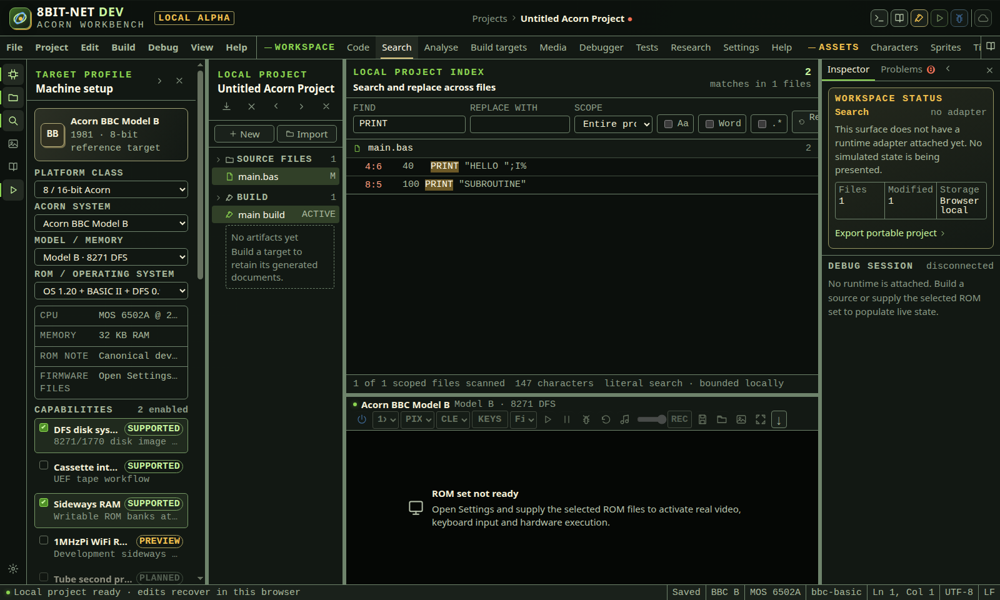
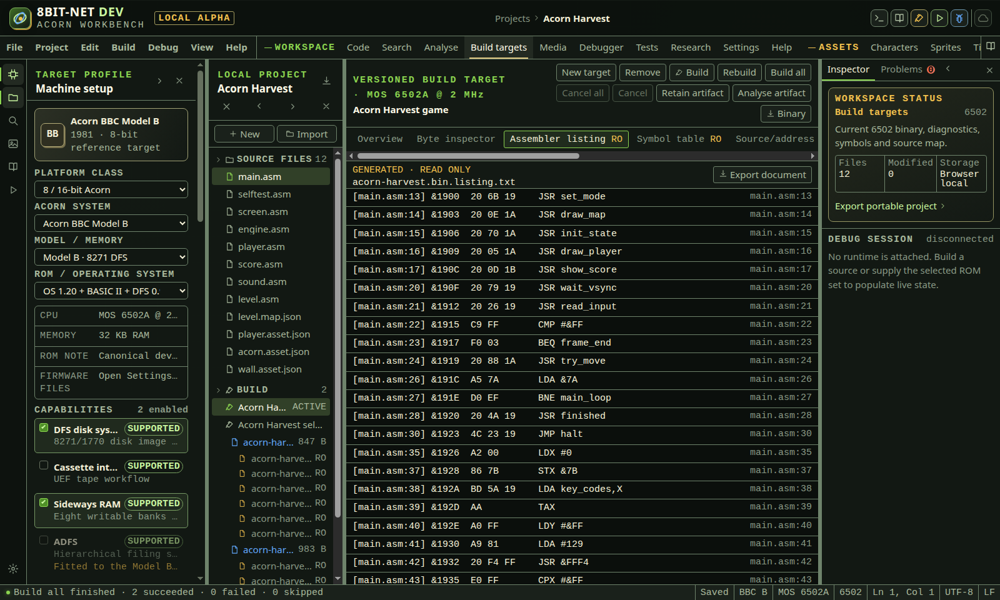
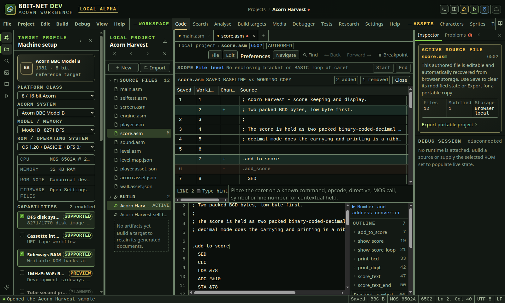

# Projects and source

<!-- Generated by scripts/generateGuides.mjs from src/help/helpTopics.ts. Edit the topics, not this file. -->

## 1. Create, recover, save, import and export projects

Manage browser-recovered working state and explicit saved baselines without confusing recovery with a user save.

**Before you start**

- The IDE is open

**Procedure**

1. Create a project from the File menu or command palette.
2. Add, rename, open, close or delete files from the explorer and editor tabs.
3. Use Save for the active file or Save all for the project baseline.
4. Use Revert only when a saved baseline exists.
5. Export a portable .8bitdev.json file before moving browsers or clearing site storage.
6. Open a project file to migrate supported older schemas to the current schema.

**What should happen**

- Edits recover continuously in the current browser.
- Modified markers compare working content with the last explicit saved baseline.
- Project export includes sources, targets, bookmarks, test plans and debugger intent, but excludes ROM bytes and credentials.

**Limits**

- Browser recovery is local to one origin and browser profile.
- Deleting a never-saved file or confirming a revert can discard content.

**If it goes wrong**

- Reopen a closed editor with Ctrl+Shift+T. Closing an editor does not delete its project file.
- Export before browser maintenance. Import the exported project to restore it elsewhere.

*Project search retains file, line and column locations. Replacement stays disabled until a complete bounded result is available.*

In the IDE: Help → `#help/projects`

## 2. Create a project from an existing codebase

Turn a folder of existing Acorn source into a working project, reviewing the whole plan before anything is created and optionally recovering editable assets from data already in the source.

**Before you start**

- A browser that can offer a folder to a file input
- A folder of Acorn source in editable text form

**Procedure**

1. Choose Start from a sample or existing codebase, then the From an existing codebase tab.
2. Choose the folder. It is read in this browser and is never uploaded.
3. Read the plan: files to import, proposed build targets and the evidence for each, recoverable assets, map-shaped data and everything left out.
4. Tick any recoverable asset you want as an editable document.
5. Adjust the project name and choose Create project.

**What should happen**

- Only editable source types are imported; everything else is listed with the reason it was excluded.
- The folders the codebase arrived in are kept, so existing INCLUDE directives keep resolving. Only the folder you opened is dropped, so its contents sit at the top of the project.
- A proposed entry file states why it was chosen, and can be changed afterwards on the build target.
- A recovered asset regenerates the original assembler bytes exactly and the source it came from is unchanged.
- The project is created through the same parser and migration as any imported project.

**Limits**

- Folders are kept to twelve deep and a path to 240 characters. A file beyond either keeps its filename and is placed at the top of the project, which is reported.
- Imports are bounded to 512 files, 1 MiB per file and 8 MiB in total.
- Binaries, disk images and anything that does not decode as text are reported rather than imported.
- Data that looks like a tile map is reported with its possible grid shapes only. This build has no map document, so nothing is created for it and no grid shape is chosen for you.
- A recovered asset's packing is a reading of the data, not a fact about it. Both packings reproduce the bytes exactly, so check the reading before relying on the picture.
- Creating the project replaces the current browser-local project.

**If it goes wrong**

- Choose a different folder to discard a plan without creating anything.
- If nothing importable was found, the dialog says so and the create action stays disabled.
- Export the current project before importing if you still need it.

In the IDE: Help → `#help/import-codebase`

## 3. Keep a project on the server and read its history

Copy a project into the server-side store, see its revisions, compare or merge two of them, fork when a merge would have to guess, and export or delete what is held.

**Before you start**

- The native-builder container is running, because the store lives there rather than in the browser
- A project name made of letters, digits or hyphens, which is the name the store uses

**Procedure**

1. Open Settings from the activity bar and find Project store.
2. Read the offered action. It reflects where the workbench and the store stand relative to each other: untracked, in step, ahead, behind, diverged or offline.
3. Use Copy this project to the store for a project the store does not hold, or Send these changes for one it does. Either writes a revision.
4. Under Stored projects choose a project to see Revisions of it, newest last.
5. Use Compare the two newest to see what changed between them, file by file.
6. When both sides have changed, use Show what a merge would produce and read Merge preview before anything is written.
7. Use Fork instead, keeping both when the merge would have to guess. The fork's name records where it came from.
8. Use Open its files to bring a stored revision into the workbench, Export everything, history included to take the store away with you, and Delete to remove a project.
9. To open a stored project as the project, use Start a project and its From the project store tab, or run Project store: open a project from the command palette. Project store: save this project writes a revision without leaving the editor.

**What should happen**

- Copying leaves the local project exactly as it is. The store is a copy, not a move.
- A revision carries the project itself as well as its files, so opening one restores the build targets, breakpoints, bookmarks, disk sets and settings rather than having them guessed again from the source.
- Every write is made against the revision the store reports as head, so two workbenches editing the same project collide and are told rather than one silently overwriting the other.
- A divergence sends and overwrites nothing until a merge has been reviewed.
- Refusals name their reason and their remedy: a quota reached, a file too large, a stale parent, a project that is not there. Retrying the same write after a stale parent would fail again, and it says so.

**Limits**

- There is one identity and nothing proves it. This is storage on a machine somebody already controls, not an account, so it is not a way to share a project with another person and must not be relied on as one. Authorisation is tracked as CLD-800.
- The store is bounded by a byte quota and a project quota, and warns before either is reached rather than failing at it.
- Merging is line-based and only for text. A binary or generated file is not merged; the plan says so and offers the fork instead.
- The store holds project files. It does not hold imported firmware, which stays in the browser and is never sent anywhere.
- A revision written before the project manifest existed, or by something that sent only sources, cannot be opened as a project. It says so and offers the codebase import instead, which proposes build targets and says why.
- Deleting leaves a tombstone so that a workbench which still has the project learns it was deleted rather than resurrecting it.

**If it goes wrong**

- If the store does not answer, local work is unaffected and queued changes stay queued; the state reads offline rather than in step.
- If every write is refused as unwritable, the store has nowhere to write. In the container that means the volume is not mounted; outside it, set PROJECT_STORE_ROOT to a directory the backend may create. The refusal names the path it tried.
- If a write is refused for a stale parent, read the head and merge rather than sending the same revision again.
- If a quota is reached, export everything and delete what is no longer needed, then collect to reclaim the space the deleted revisions held.

In the IDE: Help → `#help/project-store`

## 4. Inspect imported and generated read-only source

Use persisted provenance and access state to distinguish authored, imported and generated files, then inspect protected source without accidentally treating output as editable input.

**Before you start**

- A project format v16 file is open
- At least one imported, generated or explicitly read-only source record is present

**Procedure**

1. Open Source files in the project explorer.
2. Read M for a modified editable file, IMP for an unmodified imported editable file, RO for an explicitly protected file, or GEN RO for generated protected source.
3. Open the file and read AUTHORED, IMPORTED or GENERATED beside its language in the breadcrumb.
4. For protected source, confirm that READ ONLY appears in the breadcrumb and RO appears in its tab.
5. Read the access-policy banner. A generated record names its persisted generator, such as the asset document or build stage that produced it.
6. Use selection, source navigation, definitions, references, token help, find, bookmarks and Compare saved while inspecting the protected text.
7. Use Copy or Download to take an explicit copy. These operations do not change the project source record.
8. Do not expect typing, cut, paste, editor commands, formatting, BASIC renumbering, refactoring, filename rename, source-format change, save or revert to mutate protected source.
9. If a command is invoked through a keyboard path or older UI state, read the refusal notice. The mutation boundary is enforced by both the editor and project update handlers.
10. Edit the authored asset, generator input or build configuration identified by the generator instead, then regenerate the output.
11. When importing ordinary host source, note that it is marked IMPORTED but remains editable unless its project record explicitly declares read-only access.
12. Export the project when provenance and access state must travel with source. Project format v16 persists kind, access and bounded generator text.

**What should happen**

- Provenance and access use text labels in the explorer, tab, breadcrumb and policy banner rather than colour alone.
- Generated source is always normalized to read-only during project import even if a manifest incorrectly requests editable access.
- Missing generator text in a migrated generated record is labelled as unspecified rather than silently inventing a tool.
- Read-only source remains available to parsing, navigation, inspection, comparison, copy and download.
- Project-level single-file and multi-file update functions reject protected mutations even if a caller bypasses normal textarea behavior.
- Authored and imported editable source retain the standard editor workflow and dirty baseline behavior.

**Limits**

- The provenance field identifies the generating stage as project metadata. It does not cryptographically prove a tool invocation.
- Deleting a protected project record remains a separate confirmed project operation and is not the same as editing its content.
- Build artifact listings and SDK documents have their own immutable views and provenance. They are not copied into project source merely to demonstrate this state.
- Imported does not mean untrusted or read-only. It records origin, while access separately controls mutation.
- Changing generated output requires its real generator workflow. The IDE does not offer an override that would disguise build output as authored source.

**If it goes wrong**

- If a file was marked read-only in error, correct the source manifest or import workflow that owns its access state rather than editing generated bytes.
- If generator text is unspecified, inspect project history or build configuration before regenerating.
- Copy protected text into a new authored file only when a deliberate source fork is required, and give the new file a distinct name.
- If a mutation refusal appears for an expected editable file, inspect its READ ONLY and provenance labels before changing project metadata.
- Reimport an older project through the supported migration path so absent provenance defaults to authored editable source.

*Generated source remains navigable, comparable, copyable and downloadable while editor and project mutation paths are blocked.*

In the IDE: Help → `#help/source-provenance`

## 5. Compare working source with its saved baseline

Inspect line additions and removals against the explicit saved baseline without leaving the source editor or changing either version.

**Before you start**

- A source file with an explicit saved baseline is open
- The source toolbar is visible

**Procedure**

1. Edit a saved source file, or change its encoding, line endings or filename so its tab shows the modified marker.
2. Choose Compare saved in the source toolbar.
3. Read SAVED BASELINE vs WORKING COPY before interpreting the line-number columns.
4. Read the added and removed counts. A changed line is represented by one removed saved line and one added working line so neither version is hidden.
5. Use the Saved and Working columns to distinguish physical line numbers. A blank cell means that line exists only in the other version.
6. Read the plus or minus Change column as a textual indicator. Added and removed colour is supplementary and is not the sole state cue.
7. Choose an unchanged or added row to move the source caret to its exact working-copy line.
8. Inspect a removed row directly in the comparison. It has no working-copy destination and is therefore not an activation target.
9. When BOUNDED LARGE DIFF appears, interpret the rows as position-aligned changes. The bounded mode avoids an unresponsive quadratic comparison.
10. Choose Close saved comparison to return the vertical space to language help and editing.
11. Use Save only when the working copy is correct. Saving replaces the comparison baseline with the current text and format metadata.
12. Use Revert saved content only when the working changes should be discarded. Revert restores text, encoding and line endings together after confirmation.

**What should happen**

- The comparison is exposed as a named non-modal dialog with a semantic table of saved line, working line, change and source columns.
- An exact longest-common-subsequence comparison is used for ordinary source files.
- Large line matrices use an explicitly labelled bounded position-aligned comparison rather than freezing the browser.
- Opening, closing and navigating the comparison does not alter source content or the saved baseline.
- After a successful save, reopening the comparison reports no text differences.
- A file can remain modified with no text differences when its filename, encoding or line-ending setting differs from the saved baseline.

**Limits**

- This view compares the current browser saved baseline with the current working copy. It is not a Git commit, branch or remote comparison.
- The comparison is line based. It does not highlight individual changed characters within a line.
- Removed lines cannot navigate into the working copy because they no longer have a working location.
- A never-saved file has no baseline and Compare saved remains disabled.
- The bounded large comparison favours responsiveness over move detection and can report shifted lines as paired removal and addition rows.

**If it goes wrong**

- If Compare saved is disabled, save the new file once to establish a baseline.
- If the modified marker remains with no text changes, inspect filename, Encoding and Line endings.
- If a large comparison is difficult to interpret, split generated data into smaller authored source files before editing.
- Close the comparison if reduced editor height makes the active line difficult to inspect.
- Export a portable project before a destructive revert when the working version may still be needed.

*The non-modal comparison preserves both line versions and provides exact working-line navigation without changing source.*

In the IDE: Help → `#help/source-comparison`
