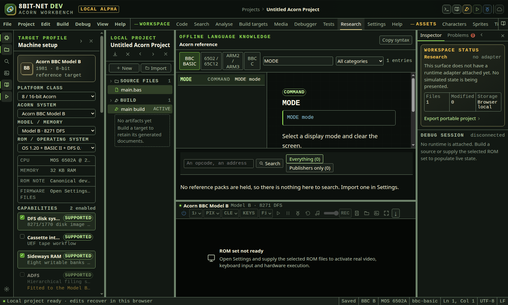

# Reference and research

<!-- Generated by scripts/generateGuides.mjs from src/help/helpTopics.ts. Edit the topics, not this file. -->

## 1. Search technical references

Search the target-filtered local reference index for commands, opcodes, memory, OS calls and project symbols with explicit provenance.

**Before you start**

- A selected machine, ROM and language context

**Procedure**

1. Open Research.
2. Search an exact command, opcode, SWI, register, address or subject.
3. Filter by target or reference type.
4. Read source, version, applicability and compatibility before using a result.
5. Follow a citation to the authoritative source when available.
6. Preview any example insertion before modifying source.

**What should happen**

- Results distinguish built-in reference data from project symbols and external material.
- Unknown facts remain unknown rather than receiving guessed documentation.

**Limits**

- Only approved and indexed references are searchable offline.
- Copyright restrictions can require a link instead of redistributed manual text.

**If it goes wrong**

- Broaden the query or switch to the correct target profile.
- Use exact opcode or symbol spelling when a general query is noisy.

*Research results are filtered by language and category. The selected entry identifies its applicability and shared editor support.*

In the IDE: Help → `#help/research`
