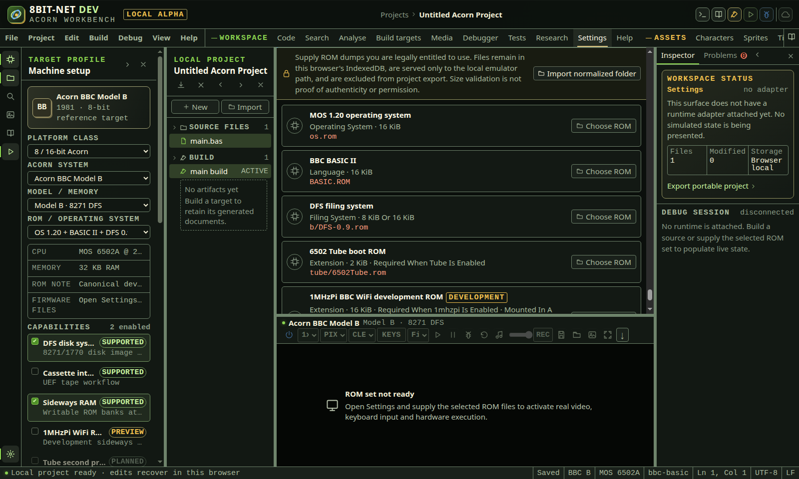

# Importing firmware

<!-- Generated by scripts/generateGuides.mjs from src/help/helpTopics.ts. Edit the topics, not this file. -->

## 1. Import and verify firmware

Supply legally obtained ROM and CMOS files to the browser-local firmware store and verify every requirement before starting a hardware adapter.

**Before you start**

- Correct firmware for the selected physical machine
- Permission to use the supplied firmware

**Procedure**

1. Open Settings.
2. Review the exact filename, size and role of every required ROM.
3. Choose files or a supported folder/archive import.
4. Confirm detected files before committing the import.
5. Check that required entries report present and that the emulator readiness state changes.

**What should happen**

- Firmware bytes stay in local IndexedDB and are served only to the selected emulator frame.
- Known profiles validate filenames, sizes, lane layout and required CMOS data.
- Missing optional expansion ROMs remain visible as optional.

**Limits**

- The container does not ship Acorn ROMs.
- A file with the right name but wrong content can still fail checksum or boot validation.
- RISC OS ROM lanes must be interleaved into the physical image in the documented order.

**If it goes wrong**

- Remove the incorrect entry and import the correct dump.
- For A310 boot failure, verify all four lanes, CMOS profile, memory model and selected RISC OS release.
- Use browser storage controls only after exporting projects. Clearing site data also removes imported ROMs.

*Settings lists firmware by machine profile and reports missing, optional and verified entries without bundling ROM content.*

In the IDE: Help → `#help/rom-import`
