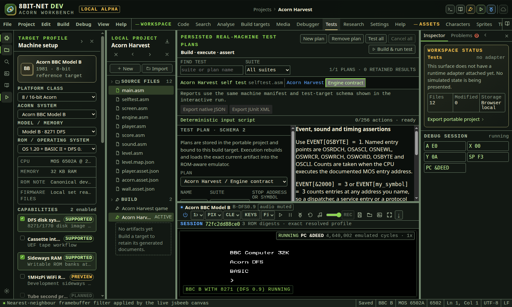

# Tests

<!-- Generated by scripts/generateGuides.mjs from src/help/helpTopics.ts. Edit the topics, not this file. -->

## 1. Create and run hardware test plans

Bind a stop condition, assertions and cycle budget to a build target, then execute it in a supported hardware adapter.

**Before you start**

- A supported current machine-code artifact
- Required ROMs imported

**Procedure**

1. Open Tests.
2. Create a target-bound schema-1 plan and give it a technical suite name.
3. Use Find test and Suite to narrow the current target plans and result history.
4. Use the target, entry-file and suite tree to select a plan without changing its build binding.
5. Choose a hard reset, soft reset or no-reset setup. Choose whether mounted media is retained or ejected. Use no reset when calling MOS entry points directly and the test depends on workspace initialised by the current boot.
6. Enter a stop address or symbol.
7. Add register assertions such as X = 5, symbol-relative memory assertions such as MEM[buffer] = A9 41 00, exact MOS character output such as OUTPUT = "HI", an exact output-call count such as EVENT[OSWRCH] = 2, or cycle assertions such as CYCLES <= 1000. Cycle operators are =, <= and >=.
8. For an exact display check, enter SCREEN[x,y,width,height] = FNV32:12345678. The coordinates address the adapter framebuffer, which is 1024 by 625 pixels. Each region is limited to 65,536 pixels.
9. Run once with a placeholder digest. Inspect the failed row and verify the named region visually, then copy its reported actual FNV32 value into the plan. This is an explicit golden-value approval, not an automatic update.
10. Set a bounded cycle timeout. This is the safety ceiling and is independent of a CYCLES assertion.
11. Open Deterministic input script to record key down/up pairs, add emulated-cycle delays or reset events, reorder actions and remove mistakes.
12. To add key-mapped controller input, choose Up, Down, Left, Right, Fire 1 or Fire 2, choose a maintained Acorn target and select Add gamepad press and release.
13. The pair is stored as two independent edges. Move the release down and insert a cycle delay between the edges when the guest must observe a held control.
14. For BBC or Master software that reads the analogue connector, enter ADC channels 0 through 3 from 0 through 65,535, select Fire 1 or Fire 2, then choose Add BBC analogue state.
15. Add a later centred state of 32,768 on all four channels with both fires clear when the test must release the native joystick before stopping.
16. To replay the mouse mapping, enter Pointer X and Pointer Y from 0 through 65,535. Zero is the left or top edge and 65,535 is the right or bottom edge. Select either mouse button and choose Add BBC mouse state.
17. The recorded pointer position is converted to the BBC inverted analogue convention during replay. A centred pointer therefore records 32,768 and produces ADC values close to 32,767 on channels 0 and 1. Channels 2 and 3 stay centred.
18. To prove media-removal handling, choose Eject drive 0, Eject drive 1 or Eject cassette and select Add media action. Move the action after any required cycle delay.
19. A media action operates on the live mounted controller state. It is safe when the selected drive or cassette is already empty.
20. To test media insertion, mount the required disk or cassette in the live machine before starting the test. Choose Mount initial drive 0 disk, Mount initial drive 1 disk or Mount initial cassette. An earlier eject action can then be followed by a deterministic remount.
21. Choose Wait for next video frame when later input or assertions must run only after the live video core advances one complete frame. Place it after the action whose displayed effect you need to observe.
22. Add one final register capture and any required symbol-relative memory captures. A plan may retain at most 16 captures and 4,096 memory bytes.
23. Choose pause or hard-reset teardown. Captures are taken before teardown.
24. Run the selected plan or use Test all for enabled plans in dependency order. Cancel all stops queued work and pauses the emulator.
25. Inspect exact observed values, captures, stop reason, elapsed core cycles, build fingerprint and applied teardown.
26. For a failed history row, choose Debug exact failed build. The action uses only a matching retained artifact and refuses if those exact bytes are no longer available.
27. Use Export native JSON for the versioned report or Export JUnit XML for CI result ingestion. Both exports include the selected machine manifest, test schema and build fingerprints.

**What should happen**

- Tests use the real emulator adapter and current artifact.
- Setup runs before artifact loading, captures use the stopped hardware state, and teardown runs only after the result is recorded.
- EVENT assertions count CPU execution at the documented OSRDCH, OSASCI, OSNEWL, OSWRCR, OSWRCH, OSWORD, OSBYTE or OSCLI entry address.
- EVENT[address] and EVENT[symbol] count entries at any address you name, so a dispatcher, a service entry or a protocol that is not the BBC MOS can be asserted without this build claiming to know what lives there.
- AUDIO[WRITES] compares an exact FNV-1a digest of SN76489 command bytes observed during execution and reports the write count. It does not require speakers or WebAudio.
- AUDIO[SPEAKER] counts the transitions a one-bit speaker made, for a machine that has one instead of a sound chip. It is refused on a sound-chip machine rather than answered with a zero that would read as a pass.
- CYCLES IN low..high asserts an elapsed range, alongside the single-bound CYCLES equals, at most and at least forms.
- Gamepad edges retain logical action, maintained Acorn key code and boolean edge in the portable plan, then use the same real keyDown and keyUp path as live gamepad input.
- BBC analogue actions retain four 16-bit channels and two boolean fires. Execution checks readback from the real jsbeeb ADC sources and System VIA PB4 and PB5 before continuing.
- BBC mouse actions retain normalized 16-bit pointer coordinates and two button booleans. Replay converts position to inverted ADC channels 0 and 1, centres channels 2 and 3, applies the buttons to System VIA PB4 and PB5, and reports exact hardware readback before continuing.
- Media actions call the live jsbeeb FDC, ACIA or Atom PPIA eject path and report the remaining mounted drives plus cassette state before execution continues.
- Initial-disk mount actions reattach a private in-memory copy of the exact named bytes present in that drive when the run started. The action fails before execution when its source drive was initially empty.
- Initial-cassette mount actions reattach the exact parsed transport object present at run start to the live BBC ACIA or Atom PPIA. The inventory acknowledgement confirms the tape is attached before execution continues.
- The next-video-frame event captures the current jsbeeb video frame counter, continues emulation until that counter advances, then reports both frame numbers before the following action or stop check.
- Malformed actions or target codes are rejected during project import and again by the runtime.
- Test completion or replacement clears held keys so an unmatched imported edge cannot leak into later operation.
- Timeout and unsupported assertions fail explicitly.
- Plans persist in project format 13 and are removed with their build target. Older plans migrate with hard-reset setup, no inputs or captures, and pause teardown.

**Limits**

- Register, symbol-relative memory, exact MOS character-output, MOS entry-point event-count, SN76489 write-digest, framebuffer-region and elapsed-cycle assertions are implemented for the qualified 6502 slice. Image tolerance/diff views, sampled waveform comparison, Atom speaker checks, non-MOS event sources and richer phase or range timing assertions remain open under TST-502 and TST-505.
- The screen digest hashes low-byte-first 32-bit framebuffer pixels in row order with FNV-1a. It is exact, includes borders inside the selected coordinates and does not apply colour tolerance.
- MOS output capture and OSWRCH event counting observe real execution at &FFEE. Direct MOS-call tests need valid MOS workspace, so do not hard reset immediately before loading them unless their startup path reinitialises that workspace.
- Keyboard, key-mapped gamepad, BBC analogue, BBC mouse-to-analogue, media eject and initial disk or cassette remount, next-video-frame, cycle-delay and reset input actions can be edited, reordered and replayed. Atom and Electron expansion joysticks and native guest mouse peripherals remain open under TST-503.
- Portable media actions deliberately store only bounded slot intent. Initial media bytes and parsed cassette state remain private to the current run and are not embedded in the project.
- BBC analogue actions are accepted only by the non-Atom jsbeeb runtime. They do not represent user-port digital joystick adapters or Archimedes input.
- Passing tests do not replace manual timing, audio, display or accessibility checks.

**If it goes wrong**

- If a capture address is rejected, use a current build symbol or a 16-bit numeric address.
- Increase the budget only after verifying the program is making progress.
- Correct stale symbols by rebuilding before rerunning.

*Deterministic input can combine exact pointer hardware state with a named video-frame boundary before the test evaluates its stop condition.*

In the IDE: Help → `#help/tests`

## 2. Run project tests in headless CI

Run enabled hardware test plans in an isolated container through the same workbench, build adapters, jsbeeb runtime and report exporters used interactively.

**Before you start**

- A portable project format 13 export with at least one enabled supported test plan
- Legally obtained ROM files stored outside version control
- The webide-acorn service running and healthy
- Docker Compose with profile support

**Procedure**

1. Copy ci/project.example.json to the ignored ci/project.json path and replace it with the portable project to test.
2. Copy ci/roms.example.json to the ignored ci/roms.json path.
3. Place ROM files under ignored ci/roms or another mounted private path.
4. For every ROM, set key to the exact browser-vault key required by the selected ROM profile and file to its container path. Do not put ROM bytes in the project export.
5. Run docker-compose --profile ci build headless-tests after changing the runner image or script.
6. Run docker-compose --profile ci run --rm headless-tests.
7. Read the JSON summary on standard output.
8. Collect ci/results/test-report.json and ci/results/test-report.junit.xml as CI artifacts.
9. Treat exit status 0 as all reported tests passing, 1 as a completed run containing failures, and 2 as runner, input, manifest or infrastructure failure.

**What should happen**

- The runner imports the same project schema and browser ROM records used by an interactive session.
- Test all rebuilds each supported enabled plan and executes it in the production ROM-aware adapter.
- The native report contains format 8bit-net-dev-test-report-1, the exact machine ID, model, ROM profile, test-target schema, cycles and build fingerprint.
- JUnit contains the same suite, case, outcome, cycle count, machine manifest and build fingerprint.
- The runner has no external network route and reaches the workbench through a loopback secure-context proxy on its internal Docker network.

**Limits**

- Current hardware assertions are qualified for 6502 and 65C12 assembly targets. Unsupported plans remain explicit rather than using the diagnostic CPU.
- ROMs are private CI inputs and are never copied into either application image.
- Debian Chromium is installed in the runner image and should be rebuilt when its base image security packages change.
- Audio and tolerant image assertions remain tracked work.

**If it goes wrong**

- For exit status 2, read the named stage and Page diagnostic before changing the test.
- If the ROM service reports a size error, verify both the vault key and the file path in ci/roms.json.
- If a machine manifest differs, correct the project target rather than overriding the report.
- Delete only the ignored ci/results files before rerunning if an external CI system made them unwritable.

In the IDE: Help → `#help/headless-ci`
